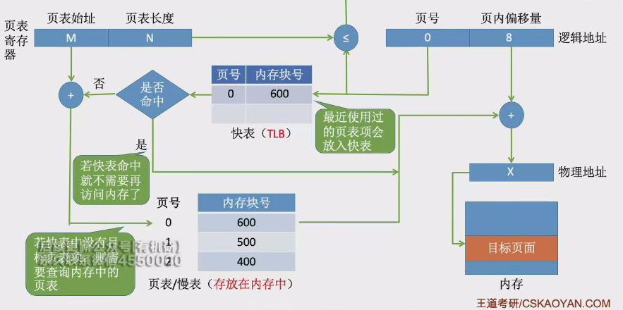

# 具有快表的地址变换机构 

* 快表又称**联想寄存器(TLB)** ，是一种访问速度比内存快很多的**高速缓存**
    * 快表中存放的是最近访问过的页表项的副本，设计目的是加快地址变换速度
    * 进程切换的时候, 快表的内容需要被清除
* 快表与慢表的区别
    * 快表的查询速度比慢表快很多，但造价更高，存储容量有限
    * 慢表虽然存取速度慢，但成本低，容量大
* 快表的地址变换过程
    * 
    * 快表命中的话将只需要进行一次访存
    * 首先第一步都是进行越界判断
    * 有些系统支持块表和慢表同时查询:
        * 假设查询快表需要 $$1us$$, 访存需要 $$100us$$, 快表命中率为 $$90\%$$
        * 如果不支持快慢表一起查询,那么平均查找时间为 $$0.1 \times (100 + 1) + 0.9 \times (1 + 100 + 100)$$
        * 如果支持快慢表一起查询,那么平均查找时间为 $$0.1 \times (100 + 1) + 0.9 \times (100 + 100)$$ , 即慢表查询时的快表耗时被优化了
* 局部性原理与快表效率
    * 局部性原理包括时间局部性和空间局部性，程序在某段时间内可能频繁访问某几个特定的页面
    * 快表通过存储最近访问过的页表项副本，利用局部性原理提高地址变换速度
