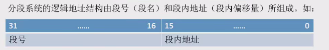
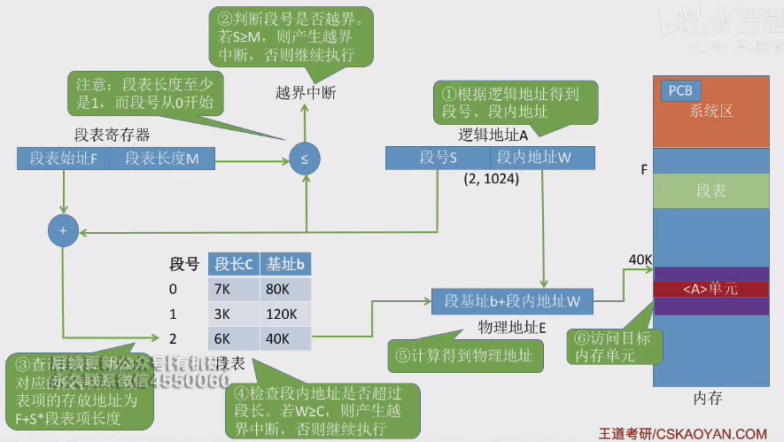

# 基本分段式存储结构

* 基本分段式存储结构
    * 与分页存储管理的主要区别在于地址空间的基本分配单位不同. 分页存储的基本单位式页,分段存储的基本单位是段
    * 进程的地址空间按照逻辑关系划分为若干个段，每个段代表一个完整的逻辑模块
    * 段名由程序员定义，每个段的地址从零开始编制
    * 操作系统以段为单位分配内存空间，各段之间可以不相邻
* 分段机制与编程便利性
    * 分段存储管理按逻辑功能划分各段，用户编程更加方便，程序可读性高
    * 用户使用段名操作各段，CPU根据段号区分各段
    * 逻辑地址结构由段号和段内地址组成
    * 
    * 段号位数决定进程最多可分的段数，段内地址位数决定每段的最大长度
* 段表的作用与结构
    * 段表记录各逻辑段在内存中的存放位置，作用类似于页表
    * 每个段表项由**段号、段长和段基址**组成(段号可以是隐含的,不需要占空间)
* 地址变换过程
    * 分段存储的地址空间是二维的(需要段长和段起始地址)
    * 在程序运行前, 段表起始地址和段表长度都放在 PCB 中, 上处理机后存放在段表寄存器中
    * 
* 分段与分页的对比
    * 分页管理只考虑页面物理大小，分段管理考虑信息的逻辑关系
    * 分段管理更易于实现信息的共享和保护，适用于多进程环境
    * 分段管理需要两次访存，与分页管理相似，也可以引入快表机构提高访问速度