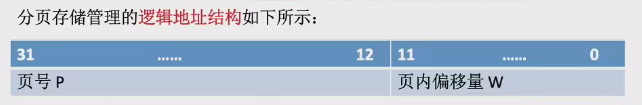

# 基本分页存储管理概念

* 分页存储管理 
    * 将**内存空间**划分为多个大小相等的区域叫做**页框/页帧/物理块/物理页面**
        * 每个页框都有一个编号，称为**页框号或页帧号**
    * 将**进程的逻辑地址空间**划分为与页框大小相等的一个个部分，称为**页面/页**
        * 每个页面都有一个编号，称为**页号**
    * 页面和页框之间存在一一映射的关系
    * 操作系统以页框为单位为各个进程分配内存空间
* 页表
    * 操作系统为每个进程建立一张页表，用于记录进程的各个页面和实际存放的内存块之间的映射关系
    * 页表存放在进程的控制块（PCB）中
    * 页表项包含页号和块号两个数据，其中块号对应内存中的页框号
    * 页号不占用存储空间（连续存储的，所以不需要存下标），通过页表在内存中的起始地址和页号计算页表项的地址
* 逻辑地址到物理地址的转换
    * 逻辑地址转换到物理地址的过程包括确定页号和页内偏移量
    * 通过页号查询页表，找到页面在内存中的起始地址，再加上页内偏移量得到物理地址
    * 页号 = 逻辑地址/页面长度（取除法的整数部分）
    * 页内偏移量=逻辑地址 % 页面长度
* 页面大小为2的整数次幂的优势
    * 如果页面大小是2的整数次幂，计算机硬件将逻辑地址拆分为页号和页内偏移量的速度更快
    * 
    * 如果页号部分有 $$M$$ 位， 那么说明最多允许有 $$2^M$$ 个页框, 如果页内偏移量有 $$N$$ 位, 那么一个页框最多有 $$2^N$$ 个 $$B$$
