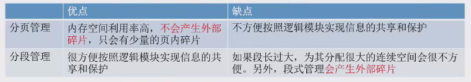
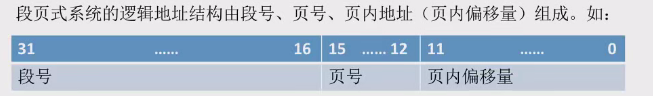
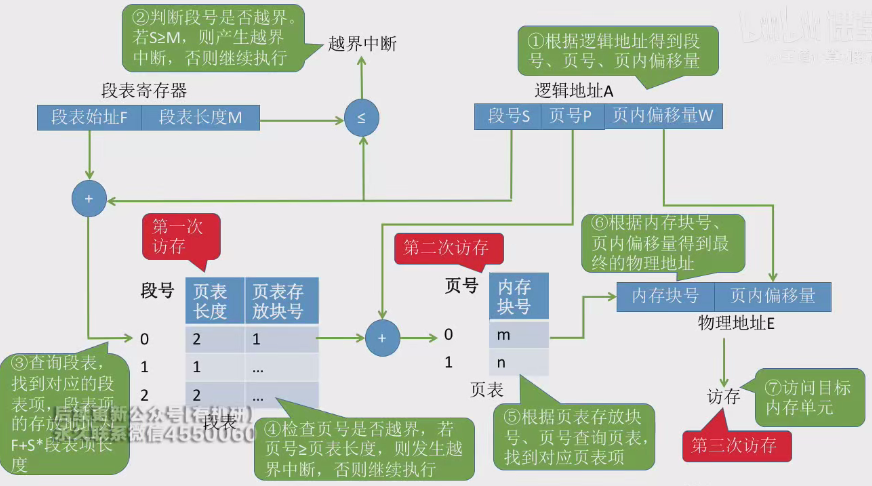

# 段页式管理方式

* 段页式管理方式
    * 段页式管理是分段和分页两种管理方式的结合
    * 
    * **按逻辑模块分段，各段再分页，提高内存空间利用率**
* 段页式管理的逻辑地址结构
    * 逻辑地址结构由段号、页号和页内偏移量组成
    * 段号决定进程最多可分几个段，页号决定每个段最多有多少页，页内偏移量决定页面大小
    * 
    * “分段”是对用户可见的， 程序员编程时需要显式地给出段号、段内地址。而将各段“分页”对用户是不可见的。系统 会根据段内地址自动划分页号 和页内偏移量
    * **段页式管理的地址空间是二维的**
* 段页式管理的段表和页表
    * 每个进程有一个段表，每个段有一个页表。
    * 段表记录段号、页表长度和该页表的基址。
    * 页表记录页号和物理块号
* 段页式管理的地址变换过程
    * 
    * 需要三次访存
    * 可以引入快表来实现快速转换
    * 用段号和页号作为快表的查询关键字