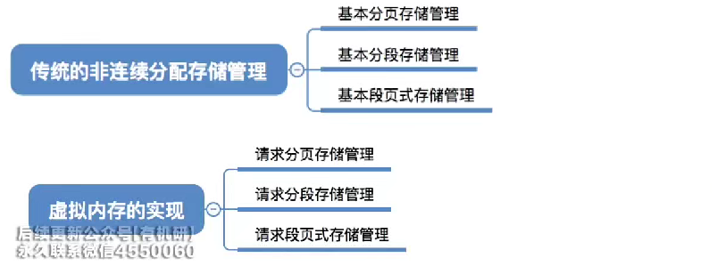
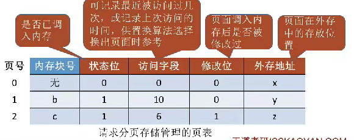
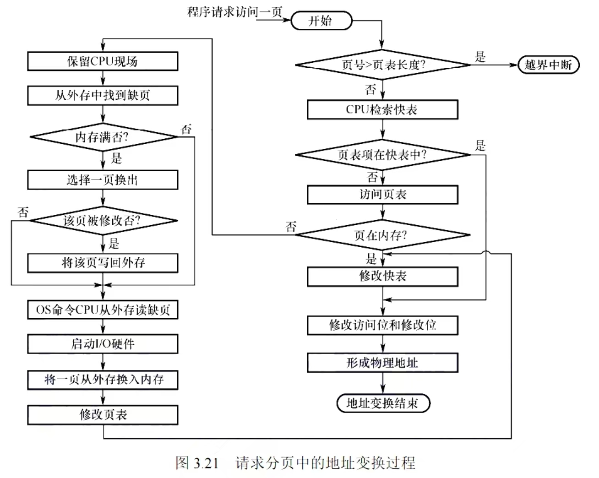

# 虚拟内存

* 传统存储管理方式的特征与缺点
    * 传统存储管理方式包括基本分页、基本分段、基本段页式、固定分区、动态分区和单一连续分配等
    * 两个明显特征：**一次性（作业必须一次性全部装入内存）和驻留性（作业数据一直驻留在内存）**
* 局部性原理
    * 见 [具有快表的地址变换机构](./具有快表的地址变换机构.md)
    * 虚拟存储技术基于局部性原理，允许程序在装入时只放入部分常用数据，不常用数据暂留在外存
    * 操作系统负责在程序执行过程中将所需数据从外存调入内存，并可换出暂时用不到的数据
* 虚拟内存的主要特征
    * **多次性**：作业运行时不需一次性全部装入内存，可分多次调入
    * **对换性**：作业运行过程中允许数据换入或换出内存
    * **虚拟性**：内存实际物理容量不变，但逻辑上扩充了容量
* 虚拟技术的实现：
    * 和之前讲的非连续分配方式是相对应的
    * 
* 请求分页管理方式
    * 页表机制
        * 页表记录每个页面的状态、访问信息、是否修改及在外存中的位置
        * 
    * 缺页中断机构
        * 缺页中断机构用于处理页面未调入内存的情况
        * 当访问一个逻辑地址时，如果对应的页面不在内存中，缺页中断机构会产生缺页中断信号(缺页异常【内中断/故障】)
        * 操作系统的缺页中断处理程序会负责处理中断，包括将页面从外存调入内存
        * 在调页过程中，可能需要将其他页面换出到外存（页面置换算法），以腾出内存空间
        * 执行 `copy A to B` 如果 AB对应的内存块都不在内存中，就会触发两次缺页异常
    * 操作流程
        * 
        * 注意， 快表命中的时候， 也需要修改快表里面的访问位和修改位，快表表项淘汰的时候，也需要同步修改慢表的内容