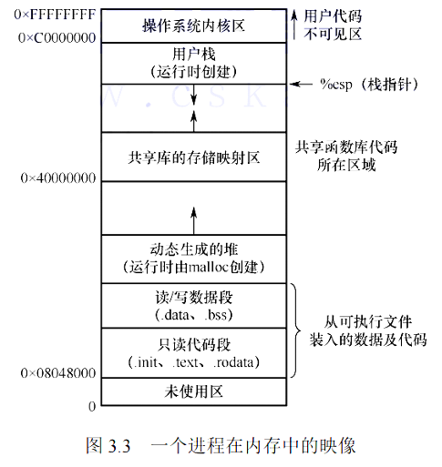

# 进程的内存映像

* 

> 操作系统内核区用来存储操作系统相关数据结构， 比如 PCB
>
> Stack 用来存储局部变量,并且给局部变量赋予地址
>
> 共享区存储映射区用来存储代码引用的库函数的相关信息
>
> 堆是`malloc` 函数跟配的区域
> 读/写区域是存储定义再函数外的全局变量和static常量(#define 的数据是直接在预编译的时候直接替换为内容, 所以不在这一个范畴内)
> 只读区域用来存储程序代码和 const关键字修饰的常变量