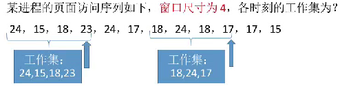

# 页面分配策略概述

* 页面分配策略涉及驻留级、页面调入时机、调入位置等概念
* 驻留级的概念和选择
    * 驻留级是指给进程分配的物理块集合，大小小于进程总大小
    * 驻留级选择过小会导致缺页频繁，系统处理缺页时间长
    * 驻留级选择过大则会降低并发度和资源利用率
    * **固定分配**和**可变分配**是两种常见的分配策略
* 页面置换策略(发生缺页之后， 选择哪里的物理块替换)
    * 局部置换是指只能选择进程自己的物理块进行置换
    * 全局置换是指可以选择空闲物理块或置换其他进程的物理块
    * 三种常见的分配和置换策略包括**固定分配局部置换**、**可变分配全局置换**和**可变分配局部置换**
* 页面调入时机
    * 预调页策略是在调入页面的时候，预测接下来可能也会被用到的页面，统一调入来减少I/O， 但是因为预测的正确率不高，所以一般在进程刚开始运行的时候采用
    * 请求调页策略是在进程运行期间发现缺页时才进行页面调入
* 页面调入位置
    * 对换区的读写速度更快，文件区的读写速度更慢
    * 有足够对换区空间时，页面调入调出在内存和对换区之间进行
    * 缺少足够对换区空间时，未修改数据从文件区直接调入，修改数据从对换区调入
* 抖动（颠簸）现象
    * 抖动现象是指页面频繁调度，导致系统大量时间处理页面换入换出，实际进程执行时间减少。
    * 产生抖动的主要原因在于进程频繁访问的页面数目高于可用的物理块数
    * 为进程分配足够的物理块可以防止抖动，但过多分配会降低系统并发度和资源利用率
* 工作集
    * 工作集是指进程在某段时间间隔内实际访问的页面集合
    * 工作集大小可能小于窗口尺寸，实际应用中窗口尺寸设置较大
    * 系统可以根据工作集大小决定进程的物理块分配，满足进程运行需要
    * 如果驻留集的大小小于工作集， 就有可能发生抖动
    * 