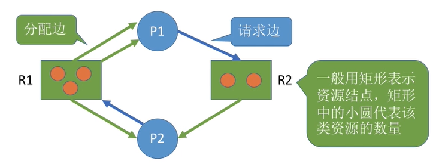
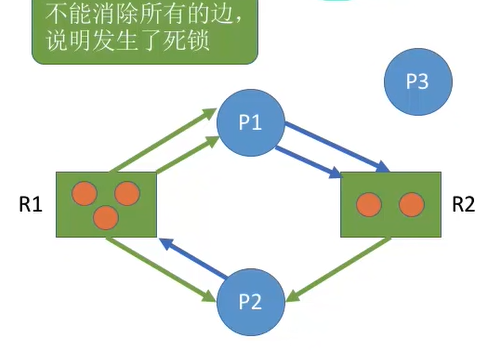

# 死锁

* 死锁
    * 死锁是指多个进程在竞争资源时，因互相等待对方释放资源而造成的一种阻塞现象，导致进程无法向前推进
    * 死锁产生的必要条件
        * **互斥条件**：进程对互斥使用的资源进行争抢，导致死锁
        * **不可剥夺条件**：进程在获得资源后，其他进程不能强行抢夺，只能由该进程自己释放
        * **请求和保持条件**：进程在持有资源的同时，请求其他资源，且这些资源被其他进程持有
        * **循环等待条件**：存在进程资源的循环等待链
    * 死锁发生的三种情况
        * 对不可剥夺的系统资源竞争时可能引起死锁
        * 进程推进顺序非法
        * 信号量使用不当
    * 死锁的处理策略
        * 预防死锁：破坏死锁的四个必要条件中的一个或多个
        * 避免死锁：使用某种算法检查防止系统进入不安全状态，如银行家算法
        * 检测和解除死锁：允许死锁发生，但操作系统负责检查并解除死锁
* 死锁的处理
    * 不允许死锁发生
        * 静态策略：预防死锁
            * 破坏死锁的四个必要条件中的某一个
            * 破坏互斥条件： SPOOLing技术：将独占设备逻辑上改造为共享设备
                * 适用的范围不广
            * 破坏不剥夺条件：
                * 进程暂时得不到资源时，必须立即释放所有资源
                * 操作系统协助强行剥夺资源，适用于优先级高的进程
                * 实现复杂、可能导致进程工作失效、增加系统开销、可能导致进程饥饿
            * 破坏请求和保持条件
                * 进程在运行前一次性申请完所需全部资源
                * 可能导致资源浪费、系统资源利用率低、可能导致进程饥饿
            * 破坏循环等待条件
                * 顺序资源分配法：给资源编号，进程按编号递增顺序申请资源
                * 只有拥有小编号资源的进程才能申请大编号资源
                * 优点：避免循环等待链、系统资源利用率高，缺点：系统资源编号不便、可能导致资源浪费、用户编程麻烦
        * 动态策略：避免死锁
            * 安全序列与不安全状态
                * **安全序列定义**：系统按照安全序列的顺序依次给各个进程分配资源，进程可以顺利完成并归还资源
                * **不安全状态定义**：系统找不到任何安全序列，可能发生死锁（不一定发生死锁）
            * **银行家算法**
                * 预先判断资源分配是否会导致系统进入不安全状态，避免死锁
                * ```c
                    struct SourceItems {
                        int sorces[N] = {a_1, a_2, a_3 ... a_N} // 有 N 个资源， 每个资源有 a_i 个
                    };
                    struct Process {
                        SourceItems maxNeed; // 最大需求
                        SourceItems ownedSources; // 已拥有的资源
                        SourceItems stillNeed; // 还需要多少资源
                    } processes[M]; // 有 M 个资源
                    
                    bool checkIfSave(SourcesItems OShaves) { // 传入系统还有多少资源
                        ...... // 更新 stillNeed (stillNeed 中的每一项是 maxNeed - owendSources)
                        bool tem[M] = {false} // 用来记录是否能满足这个进程
                        while( true ) {
                            bool ifAddSources = false; // 判断本轮循环中中是否有进程被满足
                            for(int i = 0 ; i < M ; i ++) {
                                if(tem[i] == ture) continue;
                                if(processes[i].stillNeed <=  OShaves) {// 如果当前系统存在的资源能完全满足这个进程， 把这个进程加入安全序列
                                    ifAddSources = true;
                                    tem[i] = ture
                                    OShaves += processes[i].ownedSources; // 假设这个进程已拥有的资源被释放， 检查是否能将新的进程纳入安全序列
                                }
                            }   
                            if(ifAddSources == false) {
                                bool all = true; // 判断是不是所有的进程都加入安全序列中了
                                for(int i = 0 ; i < M ; i ++) all &= tem[i];
                                return all;
                            }                         
                        }
                    }
                  ```
    * 允许死锁：死锁的检测和解除
        * 死锁的检测
            * 使用资源分配图记录系统资源情况，包括进程节点和资源节点， 通过算法检测系统是否进入死锁状态
            * 资源分配图
                * 
            * 如果系统中剩余的可用资源数满足进程的要求， 那么这个进程是不会被阻塞的，可用顺利完成， 这个进程执行完成后吧资源还给操作系统， 这时会激活等待的进程
            * 进程运行完成，那么会消除连接的资源边，如果不断有进程完成，最后能消除所有的边， 那么就叫这个图可以被简化，也就一定没发生死锁
            * 如果不能发生简化， 那么就发生了死锁
            * 
        * 死锁的消除
            * **资源剥夺法**：挂起死锁进程并抢占其资源
            * **撤销进程法**：强制撤销死锁进程并剥夺其资源
            * **进程回退法**：让死锁进程回退到避免死锁的状态
            * 选择牺牲进程的标准：优先级、执行时间、剩余时间、使用资源、批处理式进程优先

