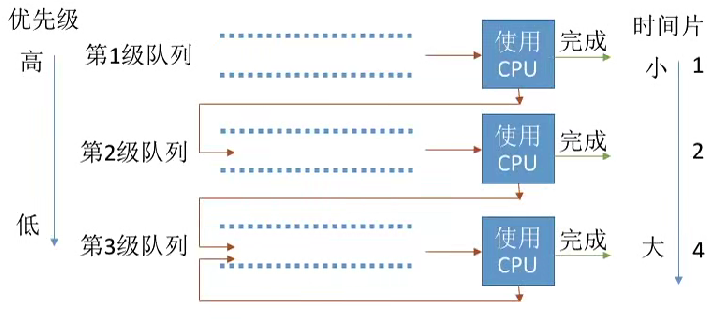
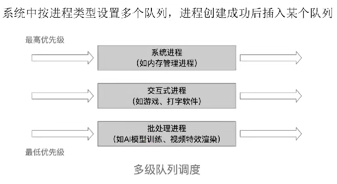

# 调度算法

* **先来先服务（FCFS）**
  * 按照进程或作业到达的先后顺序进行服务
  * 优点是公平，缺点是对短作业不利，可能导致长作业等待时间过长
* **短作业优先（SJF）**
  * 优先服务要求服务时间最短的作业或进程(每次调度选期望运行时间最短的)
  * 默认非抢占式，但也有抢占式版本SRTN(最短剩余时间优先)
  * 优点是减少平均等待时间和周转时间，缺点是对长作业不利，可能导致饥饿
  * 最短剩全时间优先算法(抢占式)：每当有进程加入就绪队列改变时就需要调度，如果新到的进程剩余时间比当前运行的进程剩余时间更短，则由新进程抢占处理机，当前运行进程重新回到就绪队列
  * 在所有进程同时可运行时(所有进程几乎同时到达的时候)，采用引SJF调度算法的平均等待时间、平均周转时间最短
  * SRTN(最短剩余时间优先)的平均等待时间、平均周转时间最短
* **最高响应比优先（HRRF）**
  * 综合考虑等待时间和要求服务时间，选择响应比最高的作业或进程
  * 非抢占式的算法。因此只有当前运行的作业/进程主动放弃处理机时，才需要调度
  * $$\small \text{相应比} = \dfrac{\text{等待时间+要求服务时间}}{\text{要求服务时间}}$$
  * 优点是避免长作业饥饿，缺点是计算响应比开销较大

> 上面三种一般使用在批处理系统中,接下来的方法才适合交互性操作系统等

* **时间片轮转调度算法**
  * 按到达就绪队列顺序轮流执行一个时间片，时间片长短可变
  * 时间片用完后强行剥夺处理机，重新放入就绪队列 (通过时钟中断来控制)
  * 进程主动放弃处理机的时候也会开始调度
  * 优点: 公平；响应快，适用于分时操作系統; 缺点: 高频率的进程切换，因此有一定丌销；不区分任务的紧急程度
* **优先级调度算法**
  * 为每个作业或进程设置优先级，选择优先级最高的进程调度
  * 非抢占式只需在进程主动放弃处理机时进行调度即可，而抢占式还需在就绪队列变化时，检查是否会发生抢占
  * 就绪队列可能不止一个,可能根据优先级
  * 静态优先级
    * 创建进程时确定，之后一直不变
  * 动态优先级
    * 创建进程时有一个初始值，之后会根据情况动态地调整优先级
  * 系统进程优先级高于用户进程, 前台进程优先级高于后台进程, 操作系统更偏好I/O型进程
  * 优点：用优先级区分紧急程度、重要程度，适用于实时操作系统。
  * 缺点：若源源不断地有高优先级进程到来，则可能能饥饿
* **多级反馈队列调度算法**
  * 一般是抢占式算法
  * 
  * 算法思想
    * 设置多级就绪队列，各级队列优先级从高到低，时间片从小到大当新进程到达时先进入第1级队列，按FIFS原则排队等待被分配时间片，若用完时间片进程还未结束，则进程进入下一级队列队尾, 如果此时己经是在最下级的队列，则重新放回该队列队尾
    * 只有第k级队列为空时，才会为k+1级队头的进程分配时间片
    * 在k级队列的进程运行过程中，若更上级的队列（1~k-1级）中进入了一个新进程，则由于新进程处于优先级更高的队列中，因此新进程会抢占处理机，原来运行的进程放回k级队列队尾
  * 对各类型进程相对公平, 每个新到达的进程都可以很快得到服务, 短进程只用较少的时间就可以完成,可以灵活的调整偏好
  * 会到导致饥饿
* **多级队列调度算法**
  * 
  * 操作系统将进程划分为不同的类别,,每个队列可以采取固定优先级或者时间片划分
  * 固定优先级(如果高优先级有进程那么低优先级不会执行), 时间片划分(100ms高优先级执行50%, 中优先级执行30%, 低优先级执行20%)
  * 每个队列可以采用不同的调度算法
