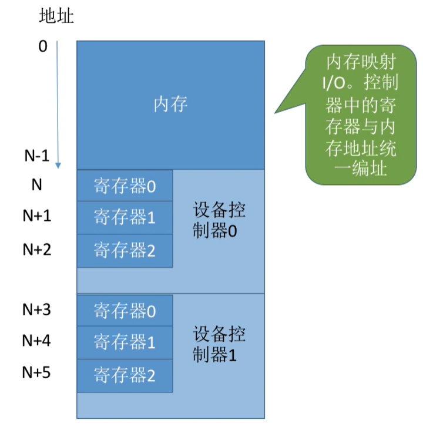
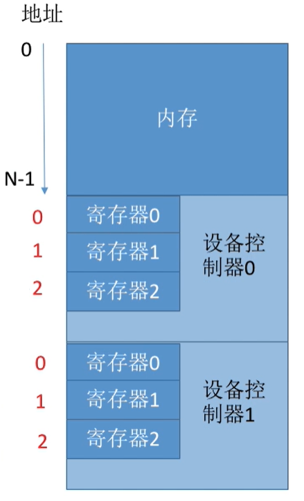
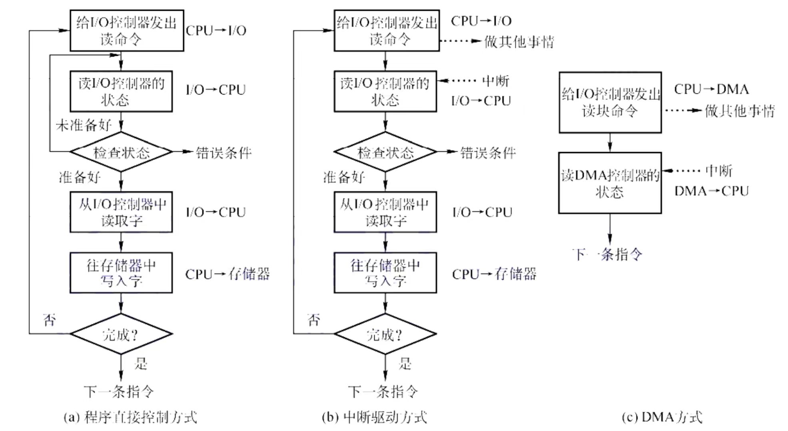
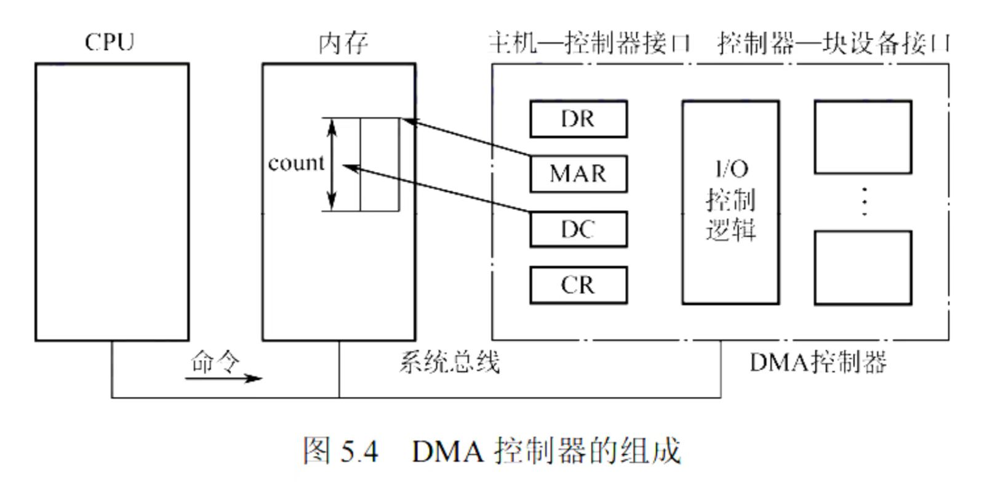
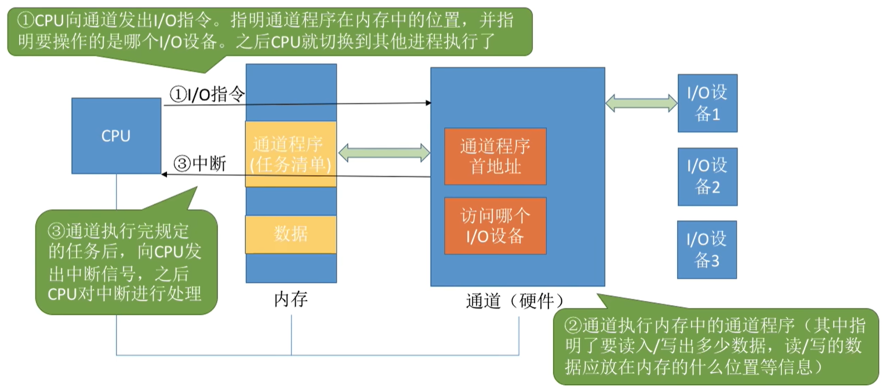

# IO控制器和控制方式

* IO控制器
    * IO控制器定义：用于实现CPU对IO设备的控制，是CPU和IO设备机械部件之间的中介
    * IO控制器功能：**接收和识别CPU命令**（设置相应的控制寄存器来存放命令和参数），**向CPU报告设备状态**（设置状态寄存器来记录IO设备的当前状态），**实现数据交换**（设置数据寄存器），**地址识别**
    * IO控制器组成：分为**CPU与控制器的接口**、**IO逻辑**、**控制器与设备之间的接口**三个部分
        * IO 逻辑： 处理CPU命令，实现地址识别，控制设备操作
        * 一个 IO 控制器可以控制多个设备
* 寄存器编制方式
    * IO 控制器控制多个设备， 那么就需要设置多个寄存器， 对这些寄存器进行编制有两种思路  ： 内存映像IO 和 寄存器独立编址
    * 内存映像IO ： 寄存器占用内存地址，与内存地址空间统一
        * 
    * 寄存器独立编址 ： 寄存器有独立的地址空间，与内存地址空间分离
        * 
    * 内存映像IO无需特殊指令，寄存器独立编制需设置专门指令
* IO控制方式
    * 
    * **程序直接控制方式**
        * 程序直接控制方式是最早期的一种IO控制方式
        * CPU发出读指令(向IO控制器发出指令)、IO控制器启动设备(同时将该设备的状态寄存器设置为忙碌)、设备准备数据、CPU轮询检查设备状态(在设备准备数据的时候, CPU不断检查状态寄存器)、数据传输(先传输到CPU上在传输到内存, 准备好了会把状态寄存器内容修改)、CPU读取数据并写入内存
        * 优点：实现简单，缺点：CPU干预频率高，数据传输效率低
        * CPU 和 IO 只能串行, 不能并行
    * **中断驱动方式**
        * 中断驱动方式引入了中断机构，允许CPU在发出IO指令后切换到其他进程。
        * 当IO完成时，IO控制器会向CPU发出中断信号，CPU会处理中断并继续执行其他进程
        * 优点：CPU干预频率低，缺点：**每次中断只能传输一个字的数据**，中断频繁时会影响系统性能
        * 数据需要通过 CPU 进行中转
    * **DMA方式**
        * DMA方式（直接存储器存取）用于快速设备的IO控制，数据传输单位为块
        * DMA控制器根据CPU的命令完成数据传输，传输完成后向CPU发出中断信号。
        * 优点：数据传输效率高，CPU干预频率低，缺点：**每次只能传输连续的数据块**
        * 
    * **通道控制方式**
        * 通道是一种硬件，可以识别并执行一系列通道指令，类似于弱化的CPU
        * CPU向通道发出IO指令并指明通道程序的位置和操作设备，然后切换到其他进程
        * 通道根据通道程序执行IO操作，完成后向CPU发出中断信号
        * 优点：CPU干预频率低，可以并行处理多个任务(可以读许多离散的块)，缺点：实现复杂，需要专门的通道硬件支持。
        * 