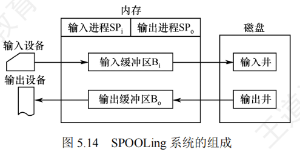

# 假脱机技术

* 脱机技术
    * 脱机技术解决的主要问题是数据输入输出速度慢，与CPU速度不匹配
    * 脱机技术最初使用磁带实现，通过外围控制机实现数据的预输入和缓输出，缓解了CPU与输入输出设备之间的速度矛盾
* 假脱机技术（SPOOLing）
    * 假脱机技术使用软件模拟脱机输入和输出过程，无需硬件磁带
    * 假脱机系统由输入井、输出井、输入进程、输出进程和多道程序技术组成。
    * 输入井和输出井用于模拟脱机输入和输出时的磁带功能。
    * 输入进程和输出进程模拟外围控制机的功能，实现数据的预输入和缓输出
    * **SPOOLing 技术只有在支持并发环境的程序中运行**
    * 
* 运行过程（打印机为例）
    * 当用户发出请求后， 假脱机处理程序会在输出井中为该进程分配一个缓冲区，将内容放在输出井中，并且填写打印请求表，然后挂在请求队列中
    * 依次处理这些队列中的内容： 会将输出井中的内容放在输出缓冲区中， 之后再给输出设备，输入缓冲区同理