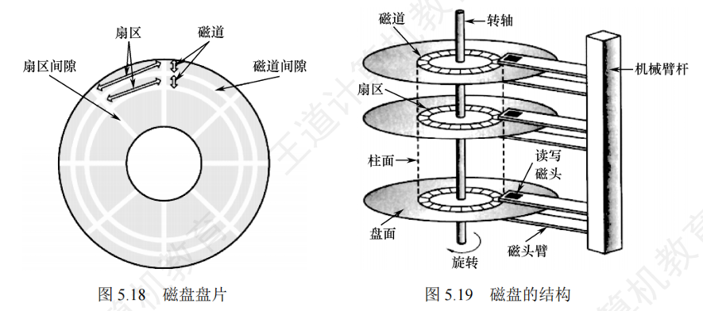

# 磁盘的相关结构
* 磁盘、磁道、扇区
    * 每一个扇区存放的数据量是相同的， 所以最内侧的磁道存储的数据密度最大
    * 一个扇区就是一个物理块，读写单位都是扇区
    * 
* 所有盘面中相对位置相同的磁道组成柱面
* 磁盘的物理地址用三元组表示：柱面号、盘面号、扇区号
* 磁盘的分类
    * 活动头磁盘：磁头可以移动，通过磁臂伸缩定位磁道。
    * 固定头磁盘：磁头不可移动，每个磁盘有对应的固定磁头
    * 可换盘磁盘：盘片可以更换。
    * 固定盘磁盘：盘片不可以更换。