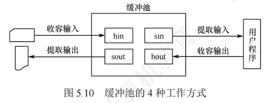

# 缓冲区管理

* 缓冲区的作用
    * 缓和CPU和IO设备之间的速度不匹配矛盾
    * 减少CPU的中断频率，放宽CPU对中断响应时间的限制
    * 解决数据力度不匹配的问题，如CPU每次生成一整块数据，而设备每次只能输出一个字符。
    * 提高CPU和设备之间的并行性
* 单缓冲区
    * 操作系统在主存中为用户进程分配一个与数据块大小相等的缓冲区
    * 特点：当缓冲区数据非空时，不能往缓冲区冲入数据，只能从缓冲区把数据传出；当缓冲区为空时， 可以往缓冲区冲人数据，但必须把缓区充满以后，才能从缓冲区把数据传出
* 双缓冲区的策略
    * 操作系统在主存中为用户进程分配两个与数据块大小相等的缓冲区
* 循环缓冲区的策略
    * 操作系统为用户进程分配多个与数据块大小相等的缓冲区，组成循环队列
    * 使用in指针和out指针分别指向下一个空缓冲区和满缓冲区
    * 适用于需要连续处理大量数据的场景
* 缓冲池的策略
    * 由一系列缓冲区组成，分为空缓冲队列、输入队列、输出队列
    * 分为 ： 收容输入数据、提取输入数据、收容输出数据、提取输出数据
    * 应用场景：适用于需要高效管理缓冲区的复杂系统
    * 