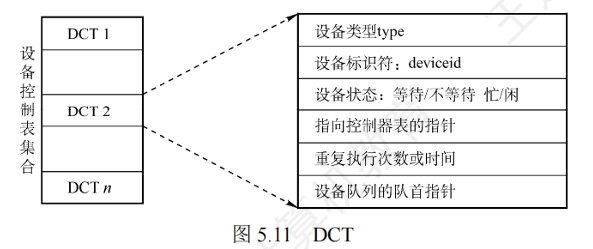
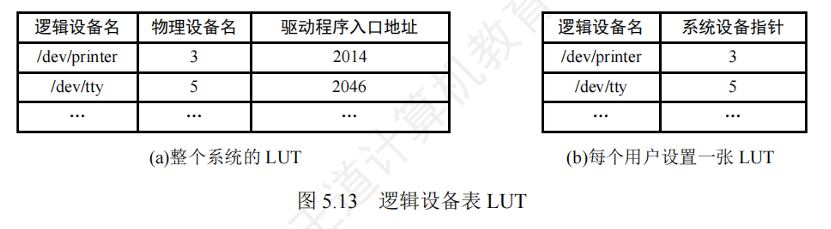

# 设备的分配和回收

* 设备分配时应考虑的因素
    * 设备的固有属性：独占设备、共享设备和虚拟设备
    * 设备的分配算法：先来先服务、优先级高者优先、短任务优先等
    * 设备分配中的安全性：安全分配方式和不安全分配方式
        * 安全分配
            * 一个时段内每个进程只能使用一个设备， 优点：破坏了“请求和保持”条件，不会死锁， 缺点：对于一个进程来说，CPU和IO设备只能串行工作
        * 不安全分配
            * 不安全分配方式：进程发出IO请求后，系统为其分配IO设备，进程可继续执行，之后还可以发出新的IO请求。只有某个IO请求得不到足时才将进程阻塞。优点：可以并行
* 设备分配方式
    * 静态分配：进程运行之前分配所需全部资源，运行结束后归还资源
    * 动态分配：进程在运行过程中动态申请设备资源
    * 静态分配方式不会发生死锁，但资源利用率低；动态分配方式效率高，但可能发生死锁
* 设备分配管理中的数据结构
    * **设备控制表（DCT）**：记录设备的使用情况，包括设备类型、标识符、状态、指向控制器表的指针、重复执行次数或时间、设备队列的对首指针
        * 
        * PS： 如果进程因为这个设备阻塞， 就会挂载这个设备的阻塞队列中
    * **控制器控制表（COCT）**：记录控制器的状态和所从属的通道，以及指向通道表的指针
    * **通道控制表（CHCT）**：记录通道的状态和所连接的控制器表，以及指向等待队列的指针
    * **系统设备表（SDT）**：记录系统中全部设备的情况，包括设备类型、标识符、设备控制表、驱动程序入口地址
* 设备分配的具体步骤
    * 查找系统设备表（SDT），根据物理设备名找到设备控制表（DCT）
    * 判断设备是否空闲，若空闲则分配设备，若忙碌则将进程挂到等待队列
    * 查找控制器控制表（COCT），判断控制器是否空闲，若空闲则分配控制器，若忙碌则将进程挂到等待队列
    * 查找通道控制表（CHCT），判断通道是否空闲，若空闲则分配通道，若忙碌则将进程挂到等待队列
    * 启动设备进行数据传送
* 逻辑设备名与物理设备名映射
    * 使用物理设备名的缺点
        * 用户编程时必须使用“物理设备名"，底层细节对用户不透明，不方便编程
        * 若换了一个物理设备则程序无法运行
        * 若进程请求的物理设各正在忙碌，则即使系统还有同类型的设各，进程也必须阻塞等待
    * 为了实现设备的独立性，进程中应使用逻辑设备名来请求某类设备。但是，系统只能识别物理设备名，因此在系统中需要配置一张逻辑设备表，用于将逻辑设备名映射为物理设备名
        * 逻辑设备表（LUT）记录逻辑设备名到物理设备名的映射关系，以及设备对应的驱动程序入口地址
        * 整个系统可以只有一张逻辑设备表，适用于单用户操作系统；每个用户也可以有各自的逻辑设备表，适用于多用户操作系统
        * 