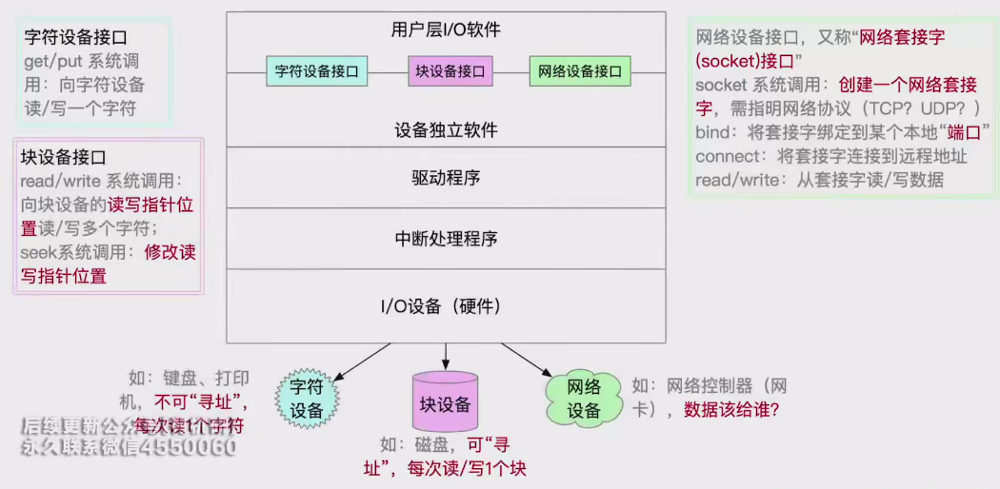
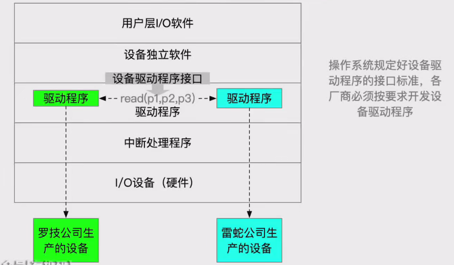

# 输入输出应用程序接口和驱动程序接口

* 输入输出应用程序
    * 输入输出应用程序接口分为字符设备接口、块设备接口和网络设备接口
    * 字符设备接口适用于不可寻址的设备，如键盘，使用get和put系统调用进行读写
    * 块设备接口适用于可寻址的设备，如磁盘，使用read和write系统调用进行读写，并支持seek操作
    * 网络设备接口使用socket系统调用创建网络套接字，通过bind和connect操作建立连接，使用read和write进行数据传输
    * 
* 阻塞IO和非阻塞IO
    * 阻塞IO指应用程序发出IO系统调用后需要等待IO完成，如键盘输入
    * 非阻塞IO指系统调用可以迅速返回，无需阻塞等待，如磁盘写操作
* 设备驱动程序接口
    * 操作系统会规定驱动程序接口的标准，如参数类型和数量，以确保兼容性
    * 设备厂商需要按照操作系统的标准开发驱动程序，以确保设备在不同操作系统上都能正常工作
    * 