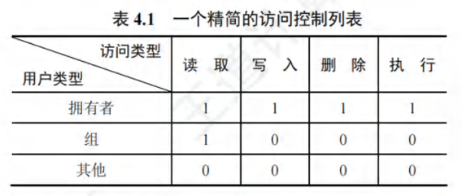

# 文件保护

* 口令保护
    * 用户为文件设置口令，其他用户需提供相同口令才能访问。
    * 口令存放在与文件相对应的FCB或索引节点中。
    * 操作系统验证用户提供的口令是否正确。
    * 口令保护的优点是开销小，缺点是口令存放在系统内部，不够安全。
* 加密保护
    * 使用密码对文件进行加密，用户需提供正确密码才能解密访问。
    * 举例说明最简单的加密算法异或加密。
    * 加密保护优点是保密性强，不需要存储密码。
    * 缺点是加密和解密过程需要花费时间。
* 访问控制系统
    * 在文件的FCB或索引节点中增加访问控制表（ACL）。
    * 访问控制表记录各个用户可以对文件进行的操作。
    * 访问控制可以精简为以组为单位标记用户的访问权限。
    * Windows操作系统通过访问控制实现文件保护。
    * 
    * 如果访问列表过长，就需要使用精简访问控制表，即对人员进行分组，对每个组进行权限管理