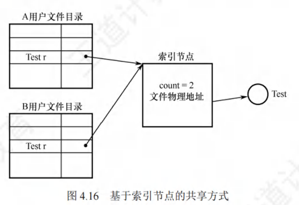
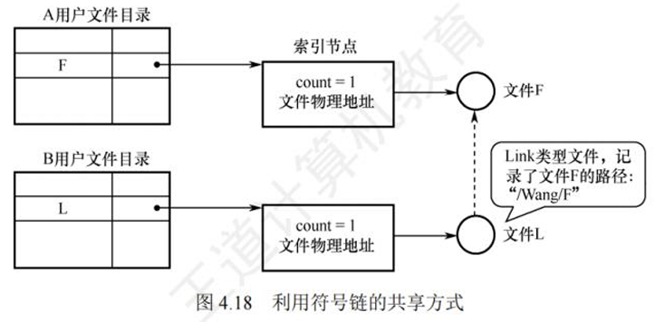

# 文件共享

* 基于索引节点的共享方式（硬链接）
    * 硬链接基于索引节点实现，允许不同用户的目录项指向同一个文件的索引节点。（不同用户的文件名可以不一样）
    * 索引节点中包含文件的物理地址和其他属性，链接计数用于记录指向该索引节点的目录项数量。
    * 删除文件时，系统仅删除用户对应的目录项，并减少链接计数。
    * 只有当链接计数变为零时，文件及其索引节点才能真正从系统中删除
    * 
* 基于符号链的共享方式（软链接）
    * 软链接通过创建指向目标文件的路径记录来实现共享。(相当于快捷方式)
    * 软链接文件记录了目标文件的存放路径，操作系统会根据路径查找目标文件。
    * 删除目标文件时，软链接文件仍然存在，但通过路径查找时会发生查找失败的情况。
    * 软链接访问速度较慢，因为每次访问都需要查询目录
    * 