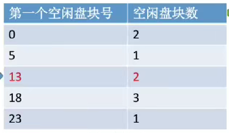
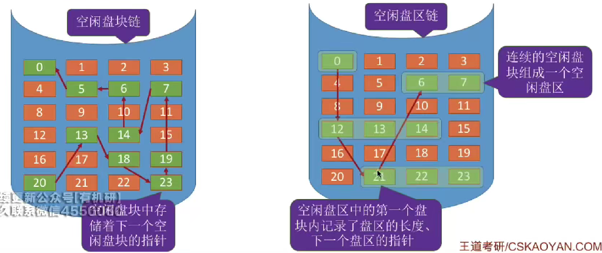
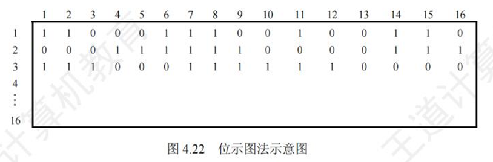
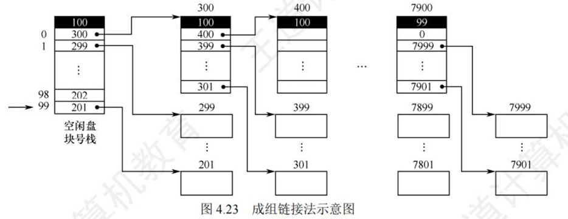

# 文件存储空间

* 文件存储空间管理包括对空闲磁盘块的管理，涉及存储空间的划分与初始化
* 存储空间的划分与初始化
    * 文件卷或逻辑卷是文件存放的地方，由目录区和文件区组成。
    * 目录区存放文件目录信息（FCB）和管理数据结构，如空闲表和位视图。
    * 文件区用于存放普通文件数据。
    * 多个物理磁盘可以组成一个文件卷
* 存储空间管理
    * 空闲表法
        * 空闲表法记录每个空闲区间的起始位置和长度
        * 适用于连续分配，可采用首次适应、最佳适应、最坏适应等算法分配磁盘块。
        * 回收磁盘块时需注意合并相邻的空闲区间
        * 
    * 空闲链表法
        * 空闲盘块链
            * 空闲盘块链以盘块为单位组成链表，每个盘块中包含指向下一个盘块的指针
        * 空闲盘区链
            * 空闲盘区链以盘区为单位组成链表，每个盘区包含多个连续的盘块
        * 
    * 位视图法
        * 位视图法用二进制位表示盘块是否空闲，零代表空闲，一代表不空闲。
        * 位视图数据通常存储为连续的字
        * 可通过字号和位号转换公式计算盘块号。适用于连续分配和离散分配场景
        * 
    * 存组链接法
        * 文件卷的目录区中专门用一个磁盘块作为“超级块”(空闲盘块号栈)，当系统启动时需要将超级块读入内存。并且要保证内存与外存中的“超级块”数据一致。
        * 
        * 每组（除了最后一组）的第一块作为索引块，然后将这些索引块链接起来。
        * 分配盘号：
            * 超级块中设置了一个指针， 初始的时候指向最后一个盘块，当要分配盘块的时候，将与之对应的盘块分配给用户，同时移动指针。若该指针指向的是最后一个盘块（即存储了索引记录的盘块），则要将最后一个盘块指向盘块的内容读入“超级块”中，作为新的空闲盘块号栈的内容，并将原“超级块”最后一个盘块分配出去
        * 回收盘号
            * 将回收的盘块号存入空闲盘块号栈的顶部，同时移动指针，并将栈中的空闲盘块数加1。当栈中的空闲盘块数己达100时，表示栈己满，将现有栈中的100个空闲盘块号存入新回收的盘块， 并将新回收的盘块号作为新栈底（即自己作为超级块），再将栈中的空闲盘块数置为1。