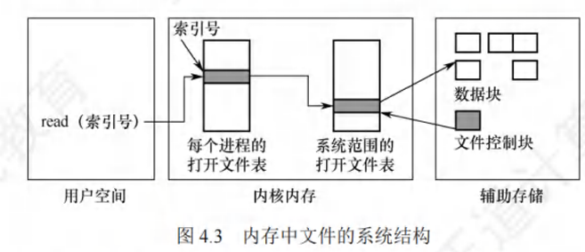

# 文件操作

重点只有两个：

当用户对一个文件实施多次读/写等操作时，每次都要从检索目录开始。为了避免多次重复地检索目录，大多数操作系统要求，当用户首次对某文件发出操作请求时，须先利用系统调用open 将该文件打开。系统维护一个包含所有打开文件信息的表，称为打开文件表。所谓“打开”，是 指系统检索到指定文件的目录项后，将该目录项从外存复制到内存中的打开文件表的一个表目中，并将该表目的索引号（也称文件描述符）返回给用户。当用户再次对该文件发出操作请求时， 可通过文件描述符在打开文件表中查找到文件信息，从而节省了大量的检索开销。当文件不再使用时，可利用系统调用close关闭它，则系统将会从打开文件表中删除这一表目

在多个进程可以同时打开文件的操作系统中，通常采用两级表：整个系统表和每个进程表。 整个系统的打开文件表包含与进程无关的信息，如文件在磁盘上的位置、访问日期和文件大小。 每个进程的打开文件表保存的是进程对文件的使用信息，如文件的当前读写指针、文件访问权限， 并包含指向系统表中适当条目的指针。一旦有进程打开了一个文件，系统表就包含该文件的条目。 当另一个进程执行调用open时，只不过是在其打开文件表中增加一个条目，并指向系统表的相应 条目。通常，系统打开文件表为每个文件关联一个打开计数器（OpenCount)，以记录多少进程打开了该文件。当文件不再使用时，利用系统调用close关闭它，会删除单个进程的打开文件表中 的相应条目，系统表中的相应打开计数器也会递减。当打开计数器为0时，表示该文件不再被使用，并且可从系统表中删除相应条目

