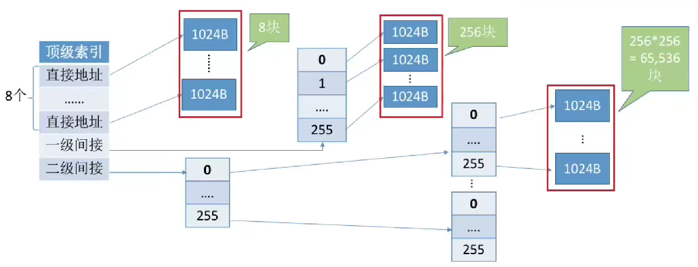

# 文件的物理结构

* 连续分配方式
    * 连续分配要求文件在磁盘上占用一组连续的块
    * 文件逻辑上相邻的块在物理上也必须相邻，并保持相对顺序（访问磁盘的速度块，磁盘响应的位置近）
    * 操作系统通过文件目录表实现逻辑块号到物理块号的映射（物理块号 = 起始块号+逻辑块号）
    * FCB 中要存储起始块号和长度
    * 连续分配支持顺序访问和直接访问，读写速度最快， 缺点包括对文件拓展不方便和存储空间利用率低， 会产生磁盘碎片
* 链接分配方式
    * 链接分配采用离散分配思想，文件可以分配离散的磁盘块（类似于链表）
    * 隐式链接
        * 隐式链接通过指针链接磁盘块，在FCB中记录文件的起始块号和结束块号
        * 指针存放在内存块中
    * 显式链接（默认）
        * 显式链接将链接指针显式存放在文件分配表（FAT）中， FAT 中表项记录着当前的物理块号和下一个块号
        * 显式链接查询速度快（读FAT 表常驻内存，不需要读磁盘），不会产生外部碎片，方便文件拓展
        * 显示链接支持顺序访问和随机访问
        * 一个磁盘只需要一张 FAT 表
* 索引索引分配方式
    * 索引分配方式为每个文件建立索引表，记录逻辑块和物理块之间的映射关系
    * 索引表存放的磁盘块称为索引块。文件数据存放的磁盘块称为数据块。
    * FCB 中存放的是索引块的块号，当需要地址转换的时候，将索引块的内容读入内存进行地址转换
    * 索引分配支持随机访问，且文件拓展容易实现
    * 索引分配方式的缺点是索引表占用存储空间
    * 索引表过大的解决方案
        * 链接方案
            * 将索引表拆分为多个索引块并用链接指针连接
            * 链接方案的缺点是访问某个逻辑块时可能需要多次读磁盘操作，效率低下
        * 多层索引
            * 多层索引类似于多级页表，建立多层的索引表，第一层索引块指向第二层索引块。
            * 多层索引可以支持更大的文件，通过增加索引层级来扩展文件的最大长度。
            * 访问目标数据块时，需要进行多次读磁盘操作，但比链接方案效率高
        * 混合索引
            * 混合索引结合了多种索引分配方式，顶级索引表中包含直接地址索引、一级间接索引和二级间接索引
            * 直接地址索引直接指向数据块，一级间接索引指向单层索引表，二级间接索引指向两层索引表
            * 混合索引提高了小文件的访问效率，减少了读磁盘次数
            * 