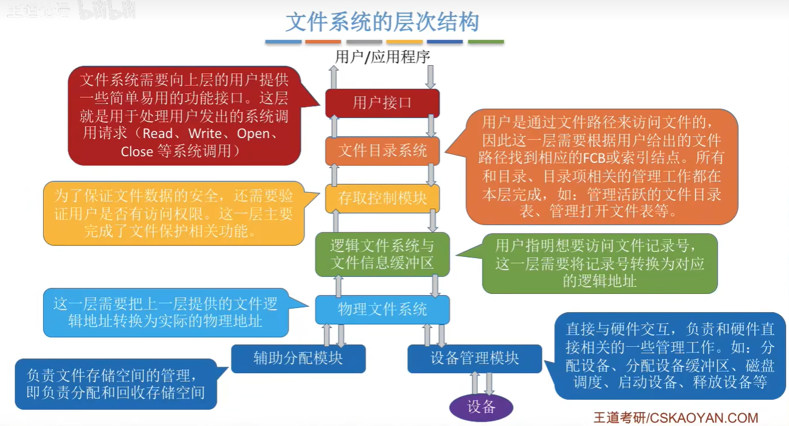

# 文件系统中的层次结构

每一个模块对应着我们之前学习的内容：

1. 用户接口： 对应文件操作的相关内容，包括读写文件，创建文件等等
2. 文件目录接口: 对应着之前的文件目录相关内容, 包括操作PCB, 查找目录,管理打开目录表等等
3. 存取控制模块: 对应着文件保护的模块, 对照访问控制表看用户是否有权限去访问这个文件
4. 逻辑文件系统与文件信息缓冲区: 这里实际上对应着文件的逻辑结构, 即如果文件的逻辑结构是索引文件结构, 那么在这一部分将会根据索引表来转换对应的逻辑块
5. 物理文件系统实际上对应着文件的物理结构中介绍的
6. 辅助分配模块对应着分配空闲的磁盘块
7. 设备管理模块对应的是磁盘管理