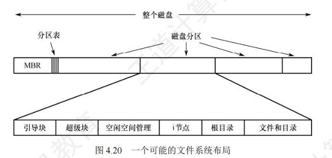
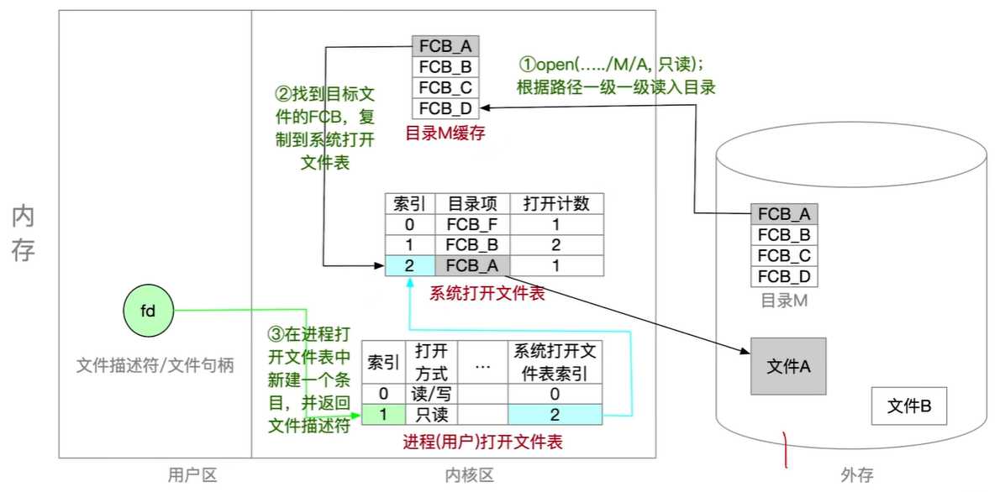

# 文件系统的布局

* 磁盘的物理格式化
    * 物理格式化是将磁盘划分为一个个扇区的过程。
    * 在物理格式化过程中，会检测磁盘中的坏扇区，并使用备用扇区进行替换。
    * 坏扇区对于操作系统是透明的，操作系统无法直接访问坏扇区
* 磁盘的逻辑格式化
    * 逻辑格式化将磁盘划分为多个分区（卷）。
    * 每个分区的大小和地址范围由分区表记录。
    * 在每个分区中可以建立独立的文件系统
* Unix文件系统的结构
    * Unix文件系统包括引导块、超级块、i结点区和根目录
    * 超级块记录磁盘分区中的空闲块，便于文件分配。
    * 位图用于标记磁盘块的空闲状态。
    * i结点区存储所有文件的索引结点，便于文件定位
    * 
* 文件系统在内存中的结构
    * 内存分为用户区和内核区，内核区包含目录缓存、系统打开文件表和用户打开文件表。
    * 目录缓存存储近期访问过的目录数据，加快目录检索速度。
    * 系统打开文件表记录整个系统打开的文件，用户打开文件表记录每个进程打开的文件
    * 