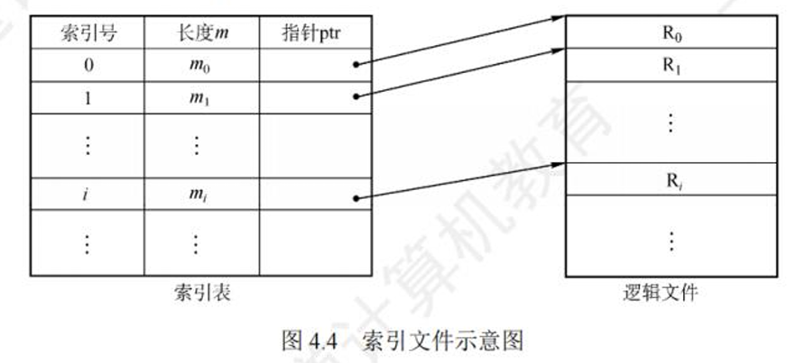
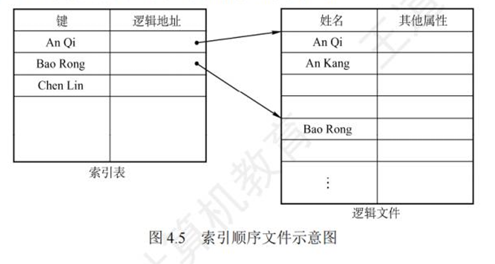

# 文件逻辑结构

* 无结构文件和有结构文件
    * 无结构文件由二进制流或字符流组成，又称流式文件
    * 有结构文件由相似记录组成，又称记录式文件
        * 每条记录由若干数据项组成，通常有一条关键字作为识别不同记录的ID
* 定长记录和可变长记录
    * 定长记录：每条记录的长度相等，数据项在记录中的位置相同
    * 可变长记录：每条记录的长度不等，数据项的长度不确定
* 顺序文件的逻辑结构
    * 顺序文件：记录按顺序排列，可以是定长或可变长记录。
        * 顺序存储：记录在物理上顺序存放，如果是可变长记录则不支持随机存取， 定长记录则支持随机存取。
        * 链式存储：记录在物理上链式存放，不支持随机存取。
        * 串结构：记录顺序与关键字无关，按存入时间先后顺序排列。
        * 顺序结构：记录按关键字顺序排列，支持快速检索。
        * 
* 索引文件的逻辑结构
    * 索引文件：为每个记录建立索引表项，索引表项在物理上连续存放
    * 索引表项大小相等，支持随机访问（定长记录的索引文件）。
    * 索引表按关键字顺序排列，支持折半查找。
    * 增加或删除记录时，需要相应地增加或删除索引表项。
    * 
* 索引顺序文件的逻辑结构
    * 索引顺序文件：按分组建立索引表项，每个分组对应一个索引表项。
    * 索引表项记录分组名字和分组位置，不按关键字顺序排列。
    * 索引顺序文件减少了索引表项的数量，提高了存储空间利用率。
    * 多级索引可以进一步提高检索性能
    * 