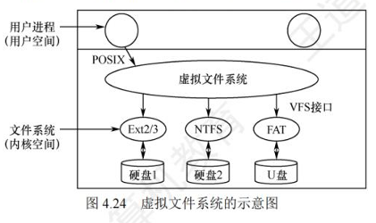
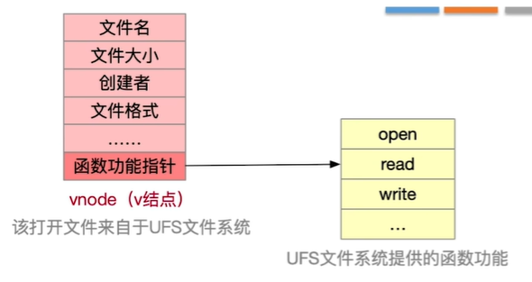

# 虚拟文件系统和文件系统的挂载

* 虚拟文件系统
    * 
    * 操作系统内核提供的抽象层，用于统一上层用户进程对底层文件系统的访问接口
    * 虚拟文件系统的目的：屏蔽底层文件系统的实现差异，提供统一标准的系统调用接口
* 虚拟文件系统的特性
    * 虚拟文件系统向上层的用户进程提供了统一标准的系统调用接口，如open、read、write等
    * 虚拟文件系统要求底层文件系统必须实现规定的函数接口，如open、read、write等
    * 虚拟文件系统在主存中为每个打开的文件新建一个vnode，用于统一表示不同文件系统的文件信息
* vnode的定义和作用
    * 虚拟文件系统中用于表示打开文件的内存数据结构，包含文件的各种信息
    * 每打开一个文件， VFS就在主存中新建一个vnode，用统一的数据结构表示文件，无论该文件存储在哪个文件系统
    * vnode与inode的区别：vnode只存在于主存中，而inode既存在于主存也存在于外存
    * 函数功能指针：vnode中包含函数功能指针，指向对应文件系统的函数功能列表，实现从上至下的函数调用
    * 
* 文件系统的挂载
    * 将一个文件系统挂载到操作系统上，使其能够被上层用户进程访问和使用
    * 挂载过程
        * 在VFS中注册新挂载的文件系统， 内存中的挂载表(mounttable)包含每个文件系统的相关信息，包括文件系统类型、容量大小等
        * 新挂载的文件系统，要向VFS提供 一个函数地址列表
        * 将新文件系统加到挂载点(mount point) (即你的挂载位置， Window系统是直接产生一个新的盘符)，也就是将新文件系统挂载在某个父目录下