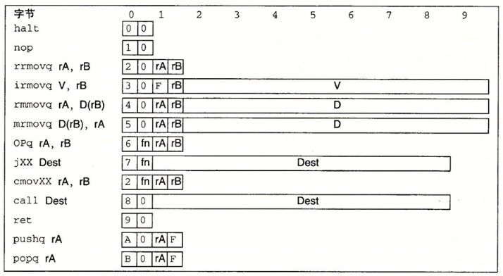

# 计算机硬件

### **冯 $$\cdot$$ 诺伊曼计算机的基本特点**

> **冯 $$\cdot$$ 诺伊曼机的基本工作方式是控制流驱动方式**

1. 由五大基本部件组成： 输入设备, 输出设备, 计算器, 控制器, 存储器 组成
2. 程序的代码和数据形式上没有什么区别,同等的存储在存储器中 但计算器能够识别他们的不同
    > CPU 根据取数据的时机不同来判断取得的类型, 在执行一条指令的时候, 通常先取指令,之后才会进行访存操作,即读数据
3. 程序的代码和数据都是由基本的 0/1 二进制数来组成的
4. 采用"存储程序"的方式来运行
    > 存储程序的意思就是: 将实现编制好的程序以及数据放入主存(内存)中程序才能运行,程序一旦开始操作,便不需要人为干预,机器会自动执行程序,直到程序结束运行
5. 指令由操作码和地址码组成, 操作码指出操作的类型,地址码指出要操作数的地址
    > 指令的形式上长这样: 
    >
    > 
    >
    > 每个指令都有对应的编号, 前面显示指令编号, 后面为地址码

### **计算机的五大功能部件**

1. **输入设备**

    输入设备的主要功能是将程序和数据以机器能够接受的形式传输给计算机, 最常用的输入设备莫过于键盘鼠标等等

2. **输出设备**

    输出设备的作用是将计算机的运行结果以人们能够接受的形式展现出来, 最常见的设备是显示器和打印机等等

3. **存储器**

    存储器分为主存储器(主存/内存) 和辅助存储器(辅存/外存), CPU 能直接访问的是主存, 辅助存储器主要是让计算机能够记住更多的信息, 有两个重要的寄存器 `MAR(Memory Address Register) 内存地址寄存器` 和 `MDR(Memory Data Register) 内存数据寄存器` 

    `MAR` 存储的是即将进行访存的数据块的地址(这种方式也叫做**按地址存取方式**), `MDR` 用来临时存储读取的内容
    > 值得一提的是: 如果是一个配置了虚拟地址的系统, 那么 `MAR` 中存储的实际上是一个虚拟地址, 还需要子啊 `MMU(虚拟地址翻译单元)` 进行翻译转化为真正的物理地址

    一个存储单元中包含了若干个存储元件, 每个存储元件只能存放一个 $$0$$ 或者 $$1$$ , 一个存储单元能够存放的二进制位数称为该存储器的字长, 这个位一般是 `8bit` 的整数倍, `MAR` 寄存器的位数代表着访存地址的位数, 代表可以寻址的范围, 如果有 $$p$$ 位, 则说明寻址的范围是 $$0\sim 2^p - 1$$ , 位数与 `PC` 的位数相同

4. **运算器**

    运算器是计算机的执行部件, 用于进行算数操作和非算数操作, 其核心部件为 `ALU(Arithmetic And Logic Union 算数和逻辑单元)` , 其中包含了多个寄存器, 如累加寄存器(`ACC`) , 乘商寄存器(`MQ`) , 操作数寄存器(`X`), 变址寄存器(`IX`), 基址寄存器(`BR`)
    > 进行乘商操作的时候, MQ 和 ACC 会配合使用, MQ会存放商，ACC会存放余数
    > 
    > 操作数寄存器实际上是通用寄存器, IX 和 BR 用于地址的计算, IX 用来存放地址的偏移量, BR 用于存放基址

    `PSW(程序状态寄存器)` 也叫标志寄存器, 里面存放着一些 ALU 的运算标志, 比如是否进位, 溢出, 负数 等等, 这些是 `CC` 标志位, `CC` 标志位集成在了 PSW 中, 同时 PSW 记录着整个CPU和当前程序执行的完整状态

5. **控制器**

    控制器是由程序计数器`PC` , 指令寄存器 `IR` 和控制单元 `CU` 组成
    > `IR` 用来存储读取的指令,  `CU` 主要职责是协调和控制计算机系统内所有部件的操作, 用来将指令进行译码,同时进行时序控制

 

