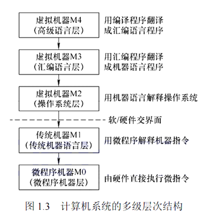

# 计算机系统的层次结构

层次结构如图所示：

我们从高到低依次解释每一层的内容:

1. 虚拟机器M4 (高级语言层) : 这一层就是我们平常使用的高级语言,如 C++, Java 等
2. 虚拟机器M3 (汇编语言层) : 这一层是高级语言需要转化为汇编语言才能进行下一步的运行
3. 虚拟机器M2 (操作系统层) : 哪怕是汇编语言, 也需要使用到操作系统提供的系统调用, 比如如果我们进行I/O的时候,需要调用系统的 `read` 指令
4. 传统机器M1 (机器语言层) : 计算机无法直接执行上面的所有指令, 需要转化为机器指令, 即纯二进制构成的指令
5. 微程序机器M0 (微程序机器层) : 机器指令序列由一个一个的机器指令构成, 这是一个实在的硬件层，它由机器硬件直接执行微指令

软硬件的交界面在 M1 和 M2 之间分割, 他们之间的交互通过 ISA(指令集体系结构) 来规定