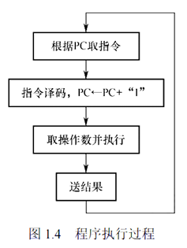
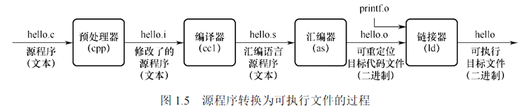

# 计算机系统的工作原理

### 采用 "存储程序" 的工作方式

程序执行前，需要将程序所含的指令和数据送入主存储器， 一旦程序被启动执行，就无须操作人员的干预，自动逐条完成指令的取出和执行任务

程序从 PC 所指向的主存地址中取出要执行的指令, 之后对指令进行译码, 同时 PC + "1", 这个 "1" 实际上是指令的长度，而不是简单的加1。不同的指令有不同的长度（例如，x86 指令长度从1字节到15字节不等），PC 每次会根据当前执行指令的实际长度来更新，指向下一条指令的起始地址

更具指令的前几个字节判断指令的类型, 根据类型判断是否有操作数, 之后进行上 ALU 上执行之后进行访存操作, 完成一条指令之后将会自动执行下一条指令



### 从源程序到可执行文件的四个过程:

更多详细内容见我的另一个博客 [CSAPP - 链接](https://yyym-y.github.io/2023/12/02/CSAPP_note5/)



我们详细说明一下着几个过程: (PS 下面的过程是在Linux系统下执行的)
1. 预处理器 `cpp`  $$\to$$ `hello.i`
    > 在这一阶段,将会将宏定义`#define`的内容直接替换掉, 同时将引入的库函数`#include<stdio.h>` 的内容直接替换成实际上 `stdio.h` 的内容, 同时将 `#if`、`#ifdef`、`#ifndef`、`#else`、`#elif` 和 `#endif` 这些条件指令按照条件判断替换
    > ```bash
      gcc -E -o main.i main.c
      ```
2. 编译器`ccl` $$\to$$ `hello.s`
    > 将上述生产的中间文件编译成汇编语言
    > ```bash
      gcc -S -o main.s main.i # 任选一个
      cc -S -o main.s main.i
      ```
3. 汇编器`as` $$\to$$ `hello.o`
    > 将汇编语言编译为可重定向文件, 将上面的汇编语言编译为机器语言指令
    >
    > ```bash
      as -o main.o main.s
      ```
    > 可重定向文件的的起始地址是从 $$0$$ 开始的, 在 Linux 中, 可重定向文件时使用 `ELF` 格式的, 
    > 
    > 
    > PS: 哪怕这个文件所有的符号都知道具体的地址，链接器不需要链接其他文件，链接后产生的可执行文件和这个可重定位文件也不一样, 通常情况下操作系统都是不能直接执行可重定向文件的
4. 链接器 `ld` $$\to$$ 可执行文件
    > 将多个可执行文件打包为一个完整的可执行文件
    > ```bash
        ld -static -o prog main.o sum.o
        /usr/lib/x86_64-linux-gnu/crt1.o
        /usr/lib/x86_64-linux-gnu/crti.o
        -L/usr/lib/gcc/x86_64-linux-gnu/7/crtbeginT.o
        -L/usr/lib/gcc/x86_64-linux-gnu/7 -L/usr/lib
        -L/usr/lib
        --static-group -lgcc -lgcc_eh -lc --end-group
        -L/usr/lib/gcc/x86_64-linux-gnu/7/crtend.o
        /usr/lib/x86_64-linux-gnu/crtn.o
      ```
    > 每个人的路径不一样，大家具体情况具体执行, 对于这些文件有兴趣的同学可以看《程序员的自我修养》一书

### 指令执行过程的描述

1. 取指令 $$\text{PC} \to \text{MAR} \to \text{M} \to \text{MDR} \to \text{IR}$$
    > 吧 `PC` 的地址放在 `MAR` 中(MAR 中存储着即将进行访存的地址), 之后会在主存中将这个地址的内容存储在 MDR 中(这个寄存器专门用来存储从内存中地区的数据) , 之后再将 MDR 寄存器的内容放置再 IR(指令寄存器) 中
2. 分析指令
    > 通过分析指令的操作码, 生成对应的控制信号, 同时判断是否存在的操作数以及操作数的类型和数量
3. 执行指令 $$\text{AD(IR)} \to \text{MAR} \to \text{M} \to \text{MDR} \to \text{ACC}$$
    > 拆解出指令中的操作数, 我们这里假设操作数是地址, 我们将操作的地址放在 MAR 中, 之后访存, 将读取的数据放在 MDR 中, 之后转在 ALU 中, 这里我们假设的是进行加法操作, 所以放在累加寄存器 ACC 中

