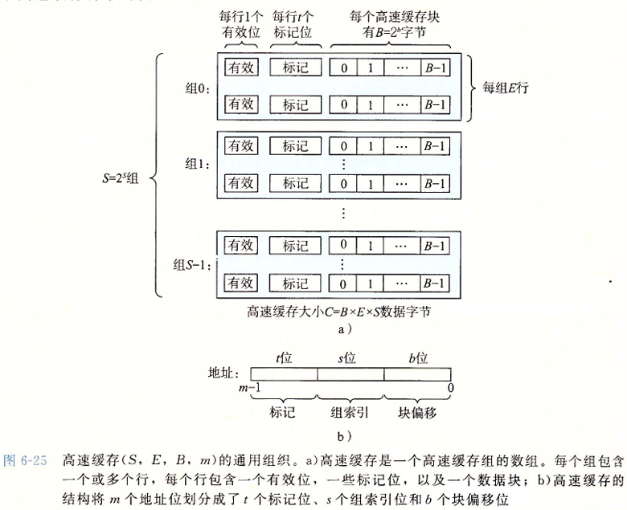
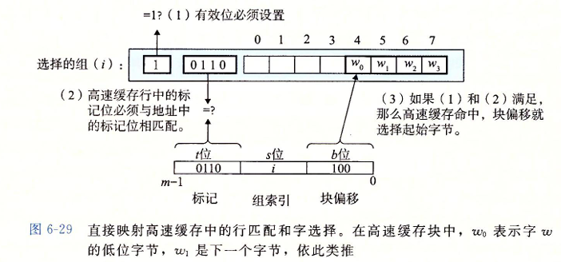

# Cache与主存的映射关系

> CSAPP 讲的很好, 直接把当时的笔记移过来

## 高速缓存存储器

### 通用的高速缓存存储器结构

考虑一个计算机系统, 其中的存储地址有 $m$ 位, 那么就会有 $M = 2^m$ 个不同的地址, 那么这个机器的高速缓存就会组织成一个有这 $S = 2^s$ 个高速缓存组的数组, 每个组包含 $E$ 个高速缓存行, 每个行是由一个 $B = 2^b$ 字节的数据块组构成, 同时还有一个有效位和 $t = m-(b+s)$ 哥标记位, 他们唯一标识在高速缓存中的行

高速缓存的结构可以用元组 $(S,E,B,m)$ 来描述。高速缓存的大小（容量）$C$ 值的是所有快的大小的和。标记为和有效位不包括在内。$C=S\times E \times B$

### 直接映射高速缓存

根据每个组的高速缓存行数 $E$，高速缓存被分为不同的类。每个组只有一行 $(E=1)$ 的高速缓存称为**直接映射**高速缓存。

高速缓存确定一个请求是否命中，然后抽取出被请求的字的过程，分为三步：**组选择**、**行匹配**、**字抽取**。

#### 直接映射高速缓存的组选择

举个简单的例子 : 对于地址 $010110101$ , $s = 3$ , 选择 $3\sim 5$ 位作为组索引

那么组索引为 $110_2$  转化为 $10$ 进制为 $6$ , 那么这个地址就是选择组 $6$

#### 直接映射高速缓存的行匹配

接下来就是要确定是否有字 $w$ 的一个副本存储在组 $i$ 包含的一个高速缓存行中。

当且仅当设置了有效位，而且高速缓存行中的标记与 $w$ 的地址中的标记相匹配时，这一行中包含 $w$ 的一个副本

#### 直接映射高速缓存的字选择

最后一步确定需要的字在块中是从哪里开始的。块偏移位提供了所需要的字的第一个字节的偏移。我们把块看称一个字节的数组，而字节偏移是到这个数组的一个索引。

简单来说就是如果我们有地址 $010110101$, $b = 3$ , 选取 $0 \sim 2$ 为块偏移

那么块偏移为 $101_2$ , 转化为 $10$ 进制为 $5$ , 那么就从第 $5$ 个字节读取

#### 直接映射高速缓存的行替换策略

每个组只包含有一行，替换策略非常简单：用新取出的行替换当前的行。

### 组相联高速缓存

**组相联高速缓存**中的每个组都保存有多于一个的高速缓存行

#### 组相联高速缓存的组选择和字选择

组相联高速缓存中的行匹配必须检查多个行的标记位和有效位，以确定所请求的字是否在集合中。

高速缓存必须搜索组中的每一行，寻找一个有效的行，其标记与地址中的标记相匹配。如果高速缓存找到了这样一行，那么我们就命中，快便宜从这个块中选择一个字，和前面一样。

同时如果确定了行, 那么字选择也和之前一样, 这里不做赘述

#### 组相联高速缓存的行匹配

组相联高速缓存中的行匹配必须检查多个行的标记位和有效位，以确定所请求的字是否在集合中。

高速缓存必须搜索组中的每一行，寻找一个有效的行，其标记与地址中的标记相匹配。如果高速缓存找到了这样一行，那么我们就命中，快便宜从这个块中选择一个字，和前面一样。

#### 组相联高速缓存行替换策略

- 如果有一个空行，则选择该空行。

- 如果没有空行：

- - 随机选择要替换的行。
  - 最近最少使用（LRU）策略会替换最后一次访问时间最久远的那一行。

除此之外, 还有许许多多的替换策略

### 全相连高速缓存

全相连高速缓存只有一个组 

全相连高速缓存没有了组选择, 因为就只有一个组 : 同时地址也被简单分成了两个部分

行匹配和字选择也和之前一样, 只不过规模不一样 :

因为高速缓存电路必须并行地搜索许多相匹配的标记，构造一个又大又快的相联高速缓存很困难，而且很昂贵。因此，全相联高速缓存只适合做小的高速缓存，例如虚拟内存系统中的翻译备用缓冲器(TLB)的缓存页表项