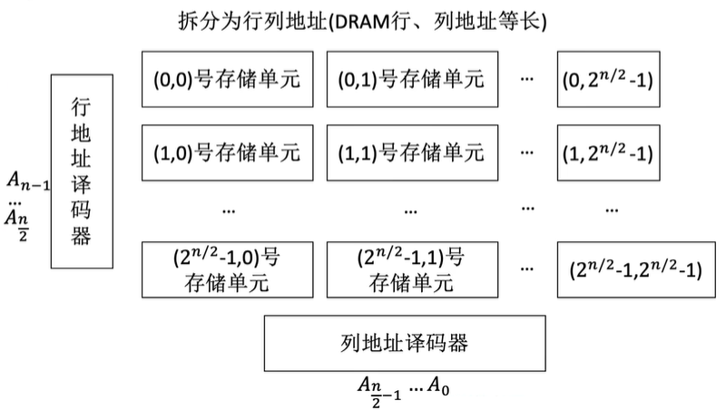
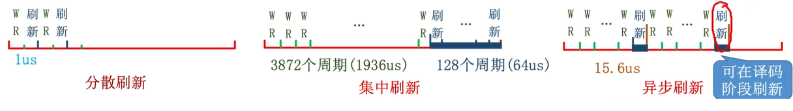

# SRAM, DRAM, ROM

RAM : 随机访问存储器，指定地址时读取速度不因物理位置改变

DRAM(Dynamic RAM)：动态随机存储器，用于主存; SRAM(Static RAM)：静态随机存储器，用于Cache

我们直接使用表格对比来进行

| 特性         | SRAM                         | DRAM                           |
| :----------- | :--------------------------- | :----------------------------- |
| **存储介质** | 双稳态触发器（6个MOS管）     | 栅极电容（1个MOS管 + 1个电容） |
| **读出特性** | 非破坏性读出                 | 破坏性读出（需重写/再生）      |
| **性能参数** | **速度更快**（无需刷新步骤） | **速度较慢** |
| **集成度** | **较低**（元件复杂）         | **较高**（元件简单）           |
| **功耗** | **较大**（6个MOS管持续工作） | **较小** |
| **成本** | **成本高** | **成本低** |
| **应用** | **高速缓存（Cache）** | **主存** |
| **易失性** | **两者均为易失性存储器** | **两者均为易失性存储器** |
| **刷新机制** | **不需要** | **需要**（约2ms周期）          |
| **地址传输** | 同时传送行、列地址(因为SRAM的容量较小, 所以可以直接全部传送)           | 分两次传送（地址线复用）(因为容量太大, 所以通过地址复用减少引脚数量)       |

### DRAM 的刷新策略

#### 刷新周期

* **刷新频率**：由于电容中的电荷最多只能保持约2ms，DRAM必须在**2ms**内对所有电容进行重新充电刷新。
* **默认周期**：题目未明确告知时，通常默认DRAM的刷新周期为**2ms**。

#### 行列地址的使用

* **刷新单位**：DRAM的刷新是以**行为单位**进行的，每次刷新一整行存储单元。
* **地址拆分**：DRAM的 $$n$$ 位地址会被拆分为**行地址**和**列地址**（通常DRAM的行、列地址位数等长）。
* **设计优势**：
    * **减少选通线数量**：例如，$$20$$ 位地址原本需要 $$2^{20}$$ 根选通线，通过拆分为10位行地址和10位列地址，可分别减少到 $$2^{10}$$ （1K）根选通线。
    * **工程简化**：1K根选通线（1024根）的实现比1M根更易实现。
* **地址译码**：
    * **行地址译码器**：用于选中一整行存储单元。
    * **列地址译码器**：用于选中行中特定的列（用于读写操作）。
    * **读写条件**：只有当行选通信号和列选通信号同时有效时，才能进行数据的读写操作。

#### 刷新操作

* **操作原理**：刷新电路会**读出一整行信息后立即重新写入**（即给对应的电容重新充电）。
* **耗时**：一个刷新操作的耗时通常与一个读写周期相同（例如约0.5μs）。
* **硬件支持**：需要专门的**刷新电路**来支持自动刷新。

#### 刷新策略

* **分散刷新**：
    * **方式**：每次CPU对存储器进行读写操作后，立即刷新一行。
    * **影响**：存储器的存取周期会从0.5μs延长到1μs（因为增加了一个刷新周期）。
    * **效率**：在2ms内可完成2000次刷新（通常远超过DRAM所需刷新行数，如128行）。
* **集中刷新**：
    * **方式**：在每2ms周期的末尾，集中进行所有行的刷新（例如，刷新128行）。
    * **影响**：会产生一个“死区”（或称死时间），在此期间CPU无法访问存储器。例如，$$128$$ 行刷新可能占用 $$128 \times 0.5 \mu s = 64 \mu s$$ 的时间。
* **异步刷新（最优）**：
    * **方式**：将2ms的总刷新时间分散到整个周期内，例如每隔 $$2 \text{ms} / 128 \text{行} = 15.6 \mu s$$ 刷新一行。
    * **影响**：每次刷新只会产生0.5μs的短时死时间。
    * **优势**：在实际应用中，可以利用CPU进行译码等操作的空闲时间进行刷新，从而减少对CPU访问存储器造成的干扰。

### ROM 

* **易失性区别**：
    * RAM 芯片具有**易失性**，断电后数据**消失**。
    * ROM 芯片具有**非易失性**，断电后数据**不会丢失**。
* **主要类型**：MROM、PROM、EPROM、EEPROM、闪存（Flash Memory）、SSD等。

#### 各种芯片总结

### MROM (Mask Read-Only Memory)

* **全称**：掩模式只读存储器（Mask Read-Only Memory）。
* **写入方式**：由厂家在生产过程中，根据客户需求直接写入数据，使用**掩膜技术**。
* **特性**：
    * **可靠性**：高。
    * **灵活性**：差（写入后不可更改）。
    * **生产周期**：长。
* **适用场景**：适合**批量定制**的应用。
* **本质**：**纯粹的只读存储器**，只能读取不能写入。

### PROM (Programmable Read-Only Memory)

* **全称**：可编程只读存储器（Programmable Read-Only Memory）。
* **写入方式**：用户可以使用**专用PROM写入器**（编程器）写入信息。
* **特性**：
    * **写入次数**：**仅能写入一次**，之后不可更改。
* **优势**：相比MROM，**灵活性大大提高**，允许用户个性化定制数据。
* **本质**：仍为**纯粹的只读存储器**。

### EPROM (Erasable Programmable Read-Only Memory)

* **全称**：可擦除可编程只读存储器（Erasable Programmable Read-Only Memory）。
* **核心特性**：**允许擦除后重新写入**，突破了“只读”的限制。
* **分类**：
    * **UVEPROM**：使用**紫外线**擦除。 **全片擦除**，不能选择性擦除部分数据。**灵活性**：相对较低。
    * **EEPROM**：使用**电**擦除。可以**擦除特定字**（支持选择性擦除）,修改次数**有限**。写入时间**较长**。

###Flash Memory (闪存)

* **特点**：
    * 在EEPROM基础上发展而来。
    * **断电后信息仍能保存**。
    * 支持**多次快速擦除重写**。
* **应用实例**：U盘、SD卡。
* **性能特点**：
    * **写速度比读速度慢**（因为写入前需要先进行擦除操作）。
    * 存储单元体积小（通常是**单个MOS管**）。
    * **位密度高**（相同体积下存储容量大于RAM）。
* **技术发展**：手机存储使用集成度更高的闪存芯片，体积更小、功耗更低但价格更贵。

### SSD (Solid State Drive)

* **构成**：主要由**闪存芯片 + 控制单元**组成。
* **与U盘区别**：主要在于**控制单元**的不同，SSD的控制器更复杂、更强大。
* **优势**：
    * **速度快**。
    * **功耗低**。
* **应用现状**：逐步**取代机械硬盘**成为主流存储介质。
* **注意**：云存储目前仍主要使用机械硬盘（基于成本考虑）。

BIOS芯片

* **存储内容**：主要存储**自举装入程序**（Bootstrapper / Bootstrap Loader）。
* **功能**：在计算机开机时，负责**引导装入操作系统**。
* **特性**：**非易失性**。
* **主存构成**：在逻辑上，计算机的主存包含RAM（内存条）和ROM（如BIOS芯片）。它们通常进行**统一编址**（ROM的地址通常在RAM地址之前）。