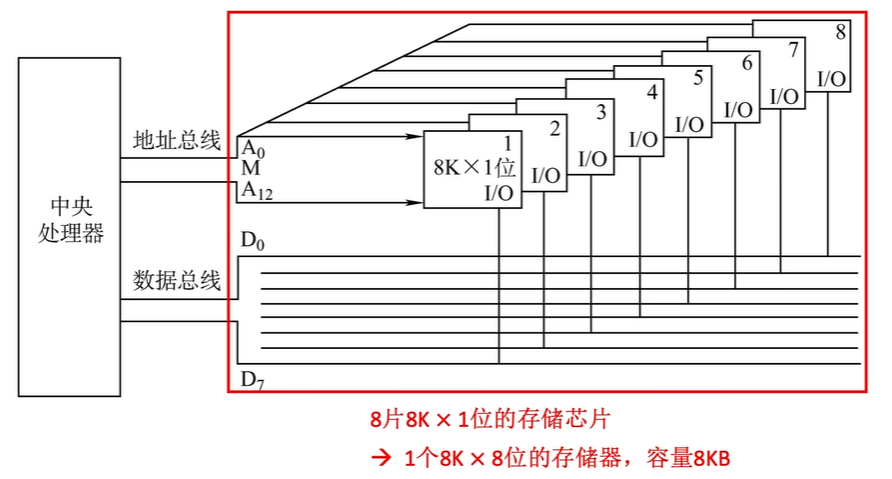
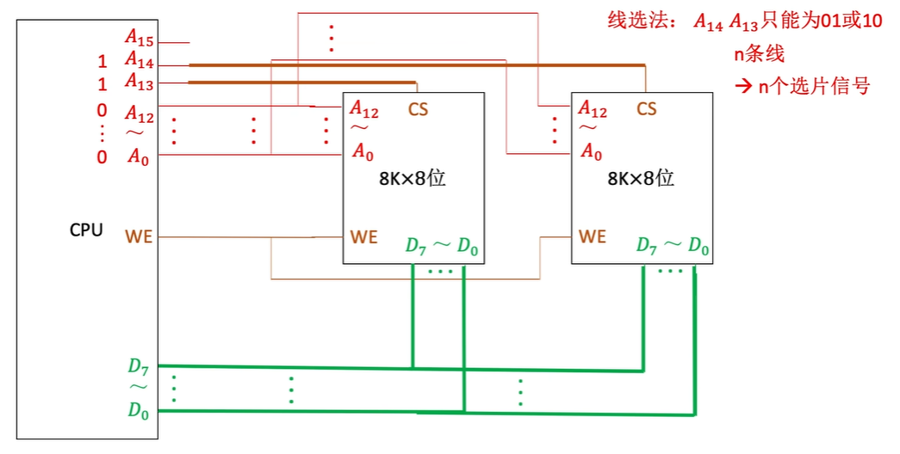
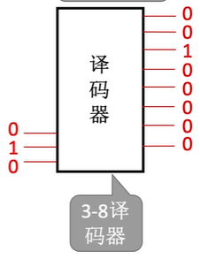
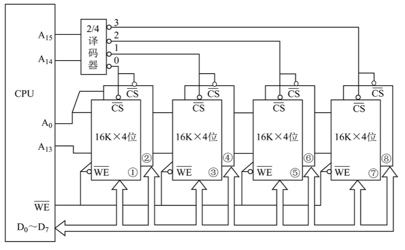
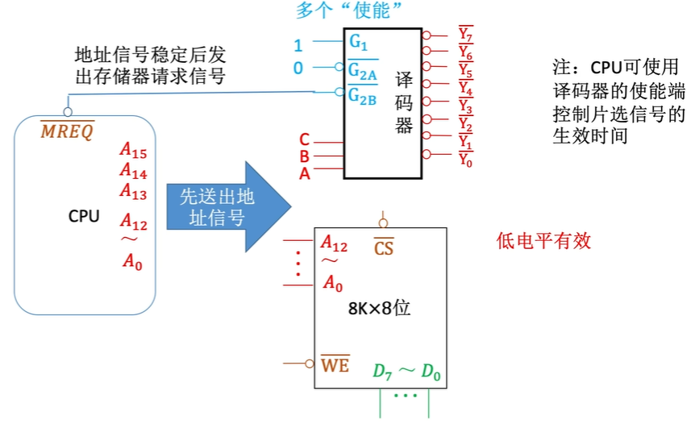

# 主存储器与CPU的连接

## 1. 知识总览

### 1.1 单块存储芯片与CPU的连接

存储芯片与CPU之间的连接是计算机体系结构中的基础。这种连接确保了CPU能够高效地访问和操作存储器中的数据。

**接口类型：**

* **数据接口（Data Interface）：** 通过**数据总线**与CPU连接，负责传输CPU与存储器之间的数据。数据总线的宽度决定了每次传输的数据量（例如，8位、16位、32位或64位）。
* **地址接口（Address Interface）：** 通过**地址总线**与CPU连接，传输CPU希望访问的存储单元的物理地址。地址总线的宽度决定了CPU能够寻址的存储空间大小（例如，13位地址线可以寻址 $2^{13}$ = 8K个单元）。
* **控制接口（Control Interface）：** 包含多种控制信号，用于协调CPU和存储器之间的操作。
    * **片选线 (CS - Chip Select / CE - Chip Enable)：** 这是存储芯片的使能信号。只有当CS信号有效时，存储芯片才会被选中并响应CPU的读写请求。CS信号通常由CPU的地址译码逻辑产生。
    * **读写控制线 (WE/WR - Write Enable / OE - Output Enable)：** 这条线控制着存储器的操作方向。
        * **WE/WR（写使能）：** 当该信号有效时，存储器执行写入操作，CPU将数据写入存储单元。
        * **OE（读使能）：** 当该信号有效时，存储器执行读取操作，存储单元的数据被读出到数据总线上。

**典型配置：**

笔记中以一个“8×8位”的存储芯片为例。这意味着该芯片内部有8个存储字，每个字可以存储8位数据。现代计算机中，**存储器地址寄存器（MAR）**和**存储器数据寄存器（MDR）**通常集成在CPU内部，而不是存储器芯片内部。存储器芯片内部通常只包含普通的存储单元阵列。

---

### 1.2 多块存储芯片与CPU的连接

为了满足计算机系统对更大存储容量和更宽数据总线的需求，通常需要将多块存储芯片组合起来。主要有三种扩展方法：位扩展、字扩展和字位同时扩展。

#### 1.2.1 位扩展法

**目的：** 扩展存储器的字长，使其与CPU的数据总线宽度相匹配。例如，如果CPU的数据总线是8位，而你只有8K×1位的存储芯片，你需要进行位扩展来组成8K×8位的存储器。

**实现方法：**

* 使用多块**相同规格**的存储芯片（例如，8片8K×1位芯片）。
* 所有芯片**共享相同的地址线和控制线**（WE和CS通常并联到所有芯片）。
* 每块芯片负责数据总线上的**不同位**（例如，第一片芯片处理D0位，第二片处理D1位，以此类推，直到D7位）。

**连接特点：**

* **地址总线：** 例如，对于8K容量的芯片，$$8K = 2^{13}$$，因此需要13根地址线（A0-A12）连接到所有8片芯片。
* **数据总线：** CPU的D0-D7数据线分别连接到这8片芯片的各自数据输出引脚上。
* **控制信号：** **WE**和**CS**信号并联连接到所有芯片，确保它们同时进行读写操作或同时被选中。

**效果：** 通过这种方法，可以将8块8K×1位的芯片组合成一个8K×8位的存储器，总容量为8KB。

#### 1.2.2 字扩展法

**目的：** 扩展存储器的字数(地址总线数量大于存储器寻址的位数)，以充分利用CPU的寻址能力，增加总的存储容量。

**两种实现方法：**

* **线选法 (Linear Selection)：**
    * **原理：** 直接使用CPU多余的地址线作为各个存储芯片的片选信号。例如，如果有N条多余的地址线，就可以直接作为N个片选信号来选择N块存储芯片。
    * **优点：** 电路连接非常简单，不需要额外的译码器。
    * **缺点：** 寻址空间不连续，存在地址冗余，浪费地址空间。例如，如果用A13选第一块，A14选第二块，则这两块芯片的地址范围可能不相邻。
    * 

* **译码片选法 (Decoded Selection)：** 
    * **原理：** 使用译码器（如2-4译码器、3-8译码器）将CPU的高位地址线进行译码，生成多个互斥的片选信号，每个信号选择一块存储芯片或一组芯片。**CPU 给出 $$n$$ 位信号, 译码器转化为 $$2^n$$ 个信号**
    * **优点：** 能够实现**连续的地址空间**，更有效地利用地址资源。
    * **缺点：** 需要额外的译码器芯片，电路相对复杂。
    * 

**典型连接：**

笔记中以使用4片8K×8位芯片为例。

* **片内地址：** 每片8K×8位芯片需要 $$2^{13}$$ 个地址，因此A0-A12（13位）作为片内地址线连接到所有4片芯片。
* **片选地址：** CPU的更高位地址线，例如A13-A14，作为译码器的输入。一个2-4译码器将这两位地址译码，产生4个片选信号，分别连接到4片8K×8位芯片的CS引脚。这样，通过A13和A14的不同组合，可以唯一选择其中一片芯片。

#### 1.2.3 字位同时扩展法

**应用场景：** 当需要同时扩展存储器的字长和字数时。

**实现方法：**

通常是**先进行位扩展，再进行字扩展**。

1.  **位扩展：** 将多块容量较小、字长较短的芯片组合成一个字长符合要求的“逻辑模块”。例如，使用2片16K×4位芯片进行位扩展，组成一个16K×8位的逻辑存储器单元。
2.  **字扩展：** 将多个这样的“逻辑模块”再进行字扩展，以增加总的存储字数。例如，将4个16K×8位的逻辑模块通过译码器进行字扩展，最终实现64K×8位的存储器。

**地址分配：**

* **片内地址：** 用于寻址每个逻辑模块内部的存储单元。例如，对于16K容量的逻辑模块，$16K = 2^{14}$，因此A0-A13（14位）作为片内地址。
* **片选地址：** 用于选择不同的逻辑模块。例如，A14-A15通过一个2-4译码器，产生4个片选信号，分别连接到4个16K×8位的逻辑模块上。

---

### 1.3 信号命名规范

为了清晰地表示各种信号，通常采用一套标准的命名规范：

* **地址线：** 通常用**A**表示，后接数字表示位序。例如，**A0**表示最低位地址线，**A7**表示较高位地址线。
* **数据线：** 通常用**D**表示，后接数字表示位序。例如，**D0**表示最低位数据线，**D7**表示较高位数据线。
* **控制信号：**
    * **片选信号：** **CS** (Chip Select) 或 **CE** (Chip Enable)。
    * **读写信号：** **WE/WR** (Write Enable / Write) 用于写操作，**OE** (Output Enable) 用于读操作。
* **电平有效性：**
    * 信号名称上方带**横线**（或加前缀“/”或“_”）表示**低电平有效**。这意味着当该信号为低电平（逻辑0）时，它才处于有效状态。例如，$$\overline{CS}$$ 表示低电平片选有效。
    * 信号名称**无横线**表示**高电平有效**。这意味着当该信号为高电平（逻辑1）时，它才处于有效状态。

---

### 1.4 译码器知识补充

译码器在存储器扩展，特别是字扩展中扮演着核心角色。

#### 1.4.1 译码器的基本特点

**类型：**

* **1-2译码器：** 1个输入端，产生2种输出状态。
* **2-4译码器：** 2个输入端，产生4种输出状态。
* **3-8译码器：** 3个输入端，产生8种输出状态。

**工作原理：**

译码器根据输入的二进制编码，将其“翻译”成唯一的输出信号。通常，只有与输入编码对应的输出线变为**有效**状态（高电平或低电平），而其余输出线则保持**无效**状态。

**典型应用：** 与位存储芯片配合使用，将CPU的高位地址线译码，产生相应的片选信号。

#### 1.4.2 译码器输出信号的有效性

* **高电平有效：** 译码器输出端**没有小圆圈标记**。当输出有效时，信号为逻辑1。这种译码器适合连接那些需要高电平有效片选信号的存储芯片。
* **低电平有效：** 译码器输出端**带有小圆圈标记**（或表示非门）。当输出有效时，信号为逻辑0（本质上是对内部逻辑的取反）。这种译码器需要与那些需要低电平有效片选信号的芯片配合使用。

#### 1.4.3 译码器的使能端 (Enable Input)

**基本功能：** 使能端（通常用G或EN表示）类似于存储芯片的CS信号，它控制着译码器的工作状态。只有当使能条件满足时，译码器才会正常工作并产生有效输出；否则，所有输出都将保持无效状态。

**使能条件：**

* **无小圆圈标记：** 高电平有效。使能端为高电平时，译码器被使能。
* **带小圆圈标记：** 低电平有效。使能端为低电平时，译码器被使能。

**多使能端：** 某些复杂的译码器（如74LS138）可能有多个使能端，并且需要同时满足所有使能条件才能工作。例如，74LS138需要G1=1（高电平有效）且G2A=0，G2B=0（低电平有效）时才被使能。

#### 1.4.4 74LS138译码器实例

**典型型号：** 74LS138是一款常用的3-8线译码器，通常采用DIP16封装。

**使能逻辑：**

* G1必须为高电平（逻辑1）。
* G2A和G2B必须同时为低电平（逻辑0）。
    只有当这些条件都满足时，74LS138才会被使能并根据A、B、C输入产生相应的低电平有效输出。

**工作状态：**

* 当译码器**使能无效**时（即不满足使能条件），所有输出端通常为高电平（逻辑1）。
* 当译码器**使能有效**时，它根据输入地址（A、B、C）选择对应的输出端，使其变为低电平（逻辑0），而其他输出端保持高电平。

#### 1.4.5 译码器使能端控制片选信号的应用

**控制原理：** CPU通常会通过一个专用的控制信号，如**MREQ**（Memory Request，存储器请求，通常为低电平有效），来控制译码器的使能端。

**时序优势：** 这种连接方式利用了CPU访问存储器的时序特性：
1.  CPU首先输出稳定的地址信号（A0-A15等）。
2.  经过一段**地址建立时间**，确保地址信号在总线上稳定。
3.  然后，CPU发出**MREQ**信号（将其置为低电平），通过连接到译码器的使能端，从而使能译码器。
4.  译码器在地址稳定且被使能后，才产生有效的片选信号给目标存储芯片。

这确保了存储芯片在收到片选信号时，地址信号已经是稳定和有效的，避免了读写错误。

**典型连接：** 将CPU的$$\overline{MREQ}$$输出信号连接到74LS138的低电平有效使能端（如$$\overline{G2B}$$）。

#### 1.4.6 CPU与主存的配合工作原理

CPU访问主存储器的过程是一个严格的时序控制过程：

1.  **CPU输出地址信号：** CPU首先将要访问的存储单元的地址放到地址总线上（例如A15-A0）。
2.  **等待电信号稳定：** 需要等待一个关键时间参数，确保地址信号在总线上达到稳定状态。
3.  **发出MREQ信号使能译码器：** 在地址信号稳定后，CPU发出存储器请求信号（MREQ），该信号通常会使能地址译码器。
4.  **存储芯片接收稳定地址并响应：** 被选中的存储芯片接收到稳定的地址和有效的片选信号后，根据读/写控制信号执行相应的操作（读出数据到数据总线或从数据总线写入数据）。

**信号关系：** 关键在于**地址信号的稳定时间要早于片选信号的有效时间**。这被称为“地址建立时间”，对于确保正确的数据访问至关重要。

#### 1.4.7 RAM读写周期与时序图的理解

理解RAM的读写周期和时序图对于设计和分析存储器系统至关重要。时序图通过波形来表示不同信号在时间上的变化关系。

**时序要素：**

* **地址建立时间 (t1 - Address Setup Time)：** 从地址信号稳定到片选信号有效的这段时间。确保存储器在被选中前有足够的时间解析地址。
* **存取时间 (t2 - Access Time)：** 从片选信号有效或地址信号稳定（取决于两者中较晚的一个）到数据在数据总线上有效的这段时间。这是存储器读取数据的关键性能指标。
* **数据保持时间 (t3 - Data Hold Time)：** 数据在数据总线上保持有效的最短时间，即使控制信号或地址信号已经改变。确保CPU有足够的时间采样数据。

**波形特征：**

* **地址/数据线：** 在时序图中通常用高低变化的波形表示，代表逻辑0和逻辑1的交替状态。
* **片选信号（CS）：**
    * 当片选信号**无效**时，通常用**高电平**表示（在某些图中可能用黑色填充表示不确定状态或高阻态）。
    * 当片选信号**有效**时（例如，低电平有效），波形会从高电平变为**低电平**（通常用白色斜坡段表示变化过程，然后是稳定的低电平）。

---

## 二、知识小结

| 知识点              | 核心内容                                                                                                                                              | 考试重点/易混淆点                                                                                                                                                                                                                                           | 难度系数 |
| :------------------ | :---------------------------------------------------------------------------------------------------------------------------------------------------- | :---------------------------------------------------------------------------------------------------------------------------------------------------------------------------------------------------------------------------------------------------------- | :------- |
| **主存储器与CPU连接** | 单块存储芯片与CPU的接口（数据线、地址线、片选线、读写控制线）及其连接方式。理解各接口的功能。                                                      | **片选信号**（CS）的高低电平有效区分（**CS信号上方横线**表示低电平有效，无横线表示高电平有效）。理解CPU与存储器之间的信息流向。                                                                                                                    | ⭐⭐      |
| **位扩展法** | 通过并联多块存储芯片来扩展存储器的**字长**，使其与CPU的数据总线宽度匹配。例如，将8块8K×1位芯片组合成一个8K×8位存储器。                             | 理解数据总线宽度与存储字长之间的**匹配关系**。掌握位扩展时，地址线和控制线并联，数据线分别连接的特性。                                                                                                                                              | ⭐⭐⭐     |
| **字扩展法** | 通过使用译码器（或线选法）连接多块芯片来扩展存储器的**字数**，以增加总的存储容量。例如，将多片8K×8位芯片组扩展为32K×8位。                         | 区分**线选法**和**译码器片选法**的优缺点，特别是它们在**地址空间连续性**上的差异（译码片选法地址空间连续，线选法不连续）。掌握如何根据地址位数计算译码器类型和芯片数量。                                                                             | ⭐⭐⭐⭐    |
| **字位同时扩展法** | 结合位扩展和字扩展，同时增加存储器的字长和字数。例如，使用16K×4位芯片组扩展为64K×8位。                                                              | 理解**芯片分组逻辑**：通常是先进行位扩展形成逻辑块，再对逻辑块进行字扩展。掌握复杂的**地址分配计算**，包括确定片内地址和片选地址的位数。                                                                                                       | ⭐⭐⭐⭐    |
| **译码器应用** | 理解三八译码器（如74LS138）的工作原理，如何将CPU的高位地址转换为互斥的片选信号，从而控制多块存储芯片的工作。                                        | 掌握**译码器使能端的作用**（例如，CPU通过MREQ信号确保地址稳定后才选通译码器，进而产生片选信号），以及不同使能端的有效电平。                                                                                                                    | ⭐⭐⭐     |
| **时序控制** | CPU访问存储器的严格时序过程：地址稳定 → 片选有效 → 数据读写 → 信号撤销。                                                                          | 深入分析**读写周期时序图**，理解地址建立时间、存取时间和数据保持时间等关键参数。识别时序图中地址、片选和数据信号的波形变化关系，并理解这些信号的时序逻辑。特别注意片选信号（CS）的有效时间通常在地址信号稳定之后。                               | ⭐⭐⭐⭐    |
| **存储芯片参数** | 理解存储芯片规格（如8K×1位、8K×8位）的含义：前一个数字表示字数，后一个数字表示字长。                                                              | **地址线数量的计算**：例如，8K = $$2^{13}$$，因此需要13根地址线。能够根据给定的存储容量和字长，推断所需的芯片数量和地址线配置。                                                                                                                       | ⭐⭐      |