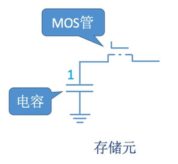
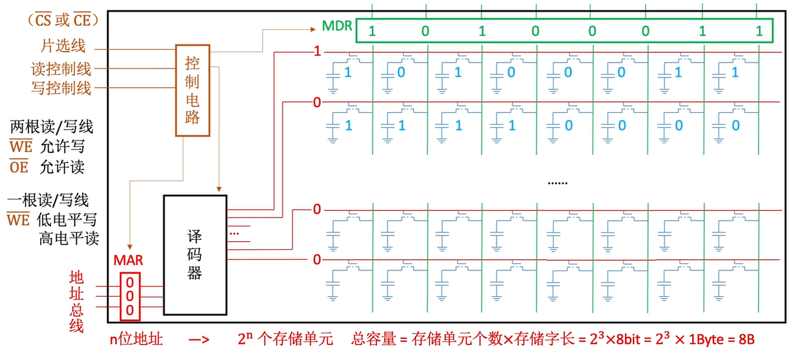
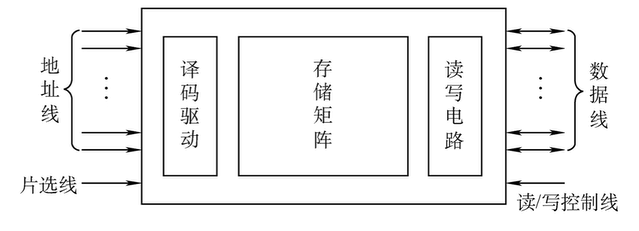

# 主存储器的基本组成

### 半导体元器件的基本原理

我们这里演示的是 DRAM 的元器件, 他的基本构成是由栅极电容组成的

MOS 管如果上端被施加高电压, 那么下面的导线将被导通, 如果电容里面存放了电荷, 那么就会释放电流, 此时如果监测到有电流, 那么代表这个存储元件存储了 $$1$$ , 如果没有电流产生, 那么这个存储单元就存储 $$0$$

### 存储芯片原理

存储芯片中是由一行行存储元器件构成的, 其中连接译码器的红色线是地址线, 而绿色的线是数据线

当译码器接受到地址信号后(这个地址实际上就是在 MAR 中), 会根据给定的地址再对应的地址线中通如高电平, 之后对应的这一行存储单元将会一起放电, 放电的数据通过数据线传送到 MDR 中

这也解释了为什么计算器内存只能一个字一个字的读取了, 这一行存储单元的个数实际上就是计算机的字长

控制电路用来控制这次访问内存时进行写操作还是进行读操作, 同时片选线的作用是: 如果片选线的的电平是低电平,那么就是对这个芯片进行操作, 如果不是,就忽略这次操作
> 如果型号上面有一个横杠, 那么说明是低电平才有效, CE(chip enable 芯片写使能) = (CS chip select 芯片选择)
> 
> 片选信号的作用是 : 一个内存条上可能有很多的存储芯片, 片选信号的作用是为了指定对应的芯片

驱动: 这里的驱动实际上是为了保证稳定读取, 因为电信号不稳定, 驱动的作用便是让其稳定之后在进行操作
> 译码器输出的信号可能需要经过驱动电路进行放大，以确保能有效地选通存储单元的行。读取到的微弱电流信号也需要“读写电路”中的灵敏放大器进行放大和整形，才能稳定地传输到MDR

芯片的常见描述位 : $$8K \times 8 \text{位}$$ : 这代表存储单元为 $$8K$$ , 一个存储单元有 $$8 \text{bit}$$

