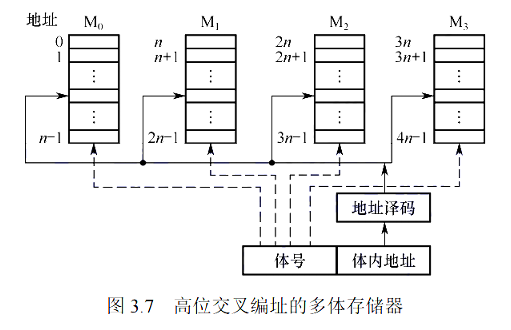
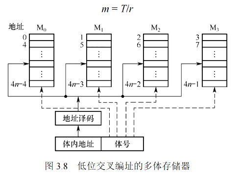
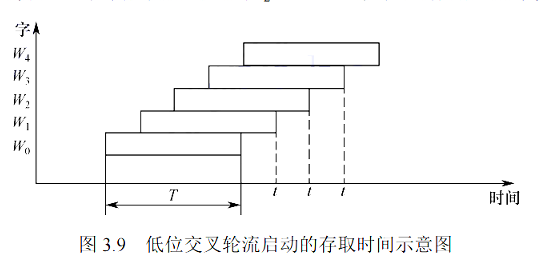

# 多模块存储器

## 多体并行存储器

有多个存储模块, 每个模块有独立的数据寄存器和地址寄存器以及控制电路

### 高位交叉编址

* **特点**：相当于单纯扩容，实际访问仍为串行模式。
* **地址格式**：地址的**高位**部分表示**存储体号**，地址的**低位**部分表示**体内地址**。

### 低位交叉编址

* **特点**：实现**流水线式并行存取**，显著提高访问速度。
* **地址格式**：地址的**低位**部分表示**存储体号**，地址的**高位**部分表示**体内地址**。

## 性能分析

* **连续取N个字耗时**：
    * 在低位交叉编址下，连续读取 $$N$$ 个字的总耗时可以表示为：$$T_{total} = T_c + (N - 1) \times \frac{T_c}{m}$$
        其中，$$T_c$$ 为单个存储模块的存取周期，$$N$$ 为连续读取的字数，$$m$$ 为存储模块的数量。
    * **理想情况**：当存储模块数 $$m$$ 等于读取的字数 $$N$$ 时，可实现**不间断的流水线**操作，即每个时钟周期都能输出一个字。
* **微观机制**：每个存储模块（体）内部是**串行工作**的，但由于多个模块可以同时开始不同的存取操作，从宏观上看则表现为**并行存取**。

## 单体多字存储器

* **特点**：
    * 每次并行读出 $$M$$ 个**连续的字**。
    * **总线宽度**需要扩展为 $$M$$ 个字的宽度。
    * **要求**：指令或数据必须是连续存放的。
* **限制**：由于是并行读取多个字，无法单独读取某个字（即每次读取操作都会带回一个字块）。