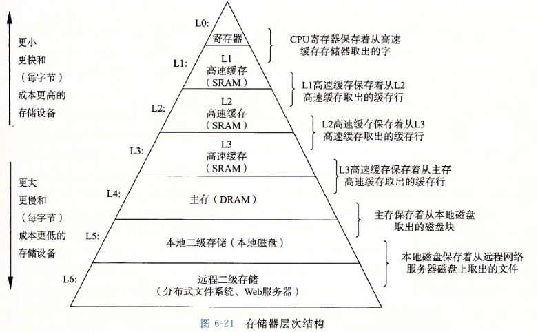
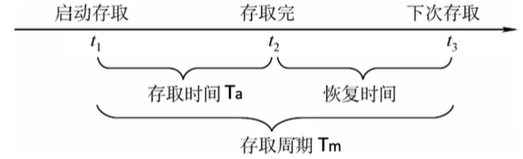

# 存储系统基本概念

### 存储器的层次结构

存储器可以分为下面的几层, 从高层往底层走，存储器变得更慢、更便宜和更大

我们需要知道的一点是: 缓存和主存是 CPU 可以直接进行读写的, 而辅存是不可以直接进行读写的

主存与辅存之间的信息交换主要靠的是操作系统, 操作系统通过虚拟内存以及页相关的置换来进行数据交换, 这个过程对操作系统软件工程师是可见的, 而缓存与主存之间的数据交换是硬件进行的, 由硬件工程师负责, 对软件工程师是透明的

### 存储器的分类

* **按层次进行分类**
    * 见上图
* **按存储介质进行分类**
    * 分为半导体介质(SSD, 闪存芯片, DRAM...) , 磁性介质(软盘, 磁盘..) , 光介质(光盘)
* **按存取方式进行分类**
    * 随机存取方式RAM(可以随机存取地址中的数据, 如 SRAM, DRAM..); 顺序存取方式SAM(只能依次的读取信息, 如磁带); 直接存取方式DAM(是随机存取和顺序存取的结合, 如磁盘:可以随机选取任意的磁道, 但是要顺序的读取磁道上的内容)
* **按信息是否可更改进行分类**
    * 分为 ROM(read only memory) 只读存储器(实际上有些ROM 也可以进行读写) 和 读写存储器
* **按断电后是否能保存信息进行分类**
    * 分为易失性存储器(内存, 缓存)和非易失性存储器(磁盘, 闪存)
* **按信息读取后是否被破坏进行分类**
    * 破坏性读出(DRAM) 和非破坏性读出(SRAM)

### 存储器性能指标

1. 存储容量: 存储字字长 $$\times$$ 存储字个数
2. 单位成本: 每位价格 = $$\frac{\text{总成本}}{\text{总容量}}$$
3. 存储速度: 数据传输率 = $$\frac{\text{数据的宽度(字长)}}{\text{存储周期}}$$

为什么会有恢复时间呢, 因为有些存储单元读出数据时候里面的数据就会被破坏, 所以就需要进行恢复

