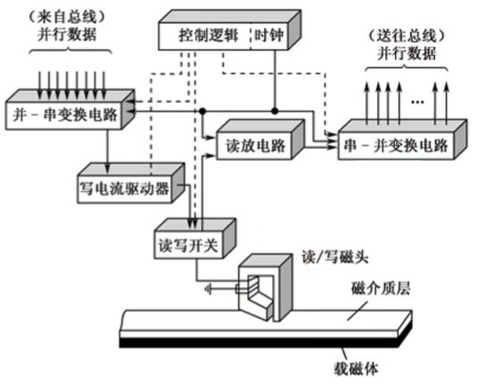
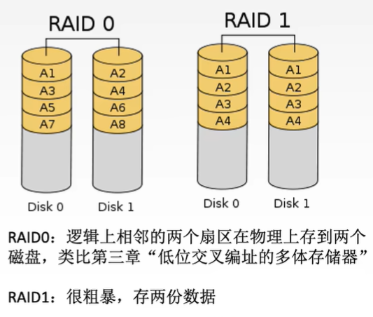
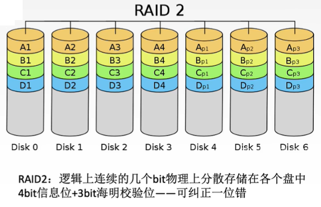

# 一、外存储器

## 1. 磁盘存储器

### 1.1 磁盘设备的组成

磁盘存储器，作为计算机的主要外存储设备之一，由精密机械部件和复杂的电子控制部分协同工作。

**机械部分：**

* **驱动轴（Spindle）：** 由高速马达带动，是所有盘片围绕其旋转的核心部件。其转速（RPM）是衡量硬盘性能的关键指标之一。
* **盘片组件（Platters）：** 硬盘通常由多个圆形盘片堆叠而成。每个盘片表面都涂有特殊的磁性材料，用于记录二进制数据。数据以磁化状态（代表0或1）的形式存储在这些表面上。
* **磁头组件（Read/Write Heads）：** 包括读写磁头和磁头臂。磁头臂由步进电机或音圈电机驱动，使磁头能够沿着盘片的径向（从内圈到外圈）精确移动，以定位不同的磁道。

**电子部分：**

* **磁盘控制器（Disk Controller）：** 通常位于硬盘背面的电路板上。它是硬盘与主机（CPU和内存）之间的接口，负责将主机发来的指令和数据转换为硬盘能够理解和执行的信号，并管理数据的读写操作。
* **主流接口标准：** 随着技术发展，硬盘接口经历了多次演变：
    * **IDE (Integrated Drive Electronics) / ATA (Advanced Technology Attachment)：** 早期主流接口，并行传输。
    * **SCSI (Small Computer System Interface)：** 高性能、多设备连接接口，常用于服务器和工作站。
    * **SATA (Serial ATA)：** 目前主流的个人电脑和服务器硬盘接口，采用串行传输，具有更高的速度和更简洁的线缆。

---

### 存储区域

磁盘的物理结构决定了数据的组织方式和寻址机制。

**盘片结构：**

* 硬盘通常由**多个盘片**（Platters）堆叠组成，每个盘片通常有两个**记录面**（Recording Surfaces），即盘片的正反面都可以用于数据记录。
* 通常，除了最上层的盘面可能不使用，每个记录面都对应一个专用的**读写磁头**。这意味着一个多盘片的硬盘会有多个磁头，但它们通常同步移动。

**磁道与柱面：**

* **磁道（Tracks）：** 盘面上以盘片中心为圆心的同心圆状磁性材料环。数据就按照这些“圈”的形式存储在磁道上。每个磁道都有一个唯一的编号。
* **柱面（Cylinders）：** 由所有盘片上**相同半径的磁道**组成的虚拟圆柱体。例如，所有盘片上最外圈的磁道组成一个柱面，所有盘片上第二圈磁道组成另一个柱面，以此类推。
    * **柱面数 = 单盘面磁道数**。寻道操作（磁头径向移动）的目标就是定位到特定的柱面。

**扇区划分：**

* **扇区（Sectors）/ 块（Blocks）：** 每条磁道被划分为若干个扇形区域，每个区域就是一个扇区。
* **最小读写单位：** 扇区是磁盘读写的最小单位。主机对磁盘的所有存取操作都必须以扇区为单位进行，即使只读写一个字节，也需要读取整个扇区的数据。
* **典型参数：**
    * **磁头数 = 记录面数**
    * **柱面数 = 磁道数** (指单盘面的磁道数)
    * **扇区数/磁道** (指每条磁道上的扇区数量，通常固定)

**读写原理：**

要读写数据，首先磁头组件通过**寻道**操作移动到目标数据所在的**柱面**位置。然后，通过**旋转延迟**，等待盘片旋转，使得目标**扇区**精确地划过当前磁头下方，最后由磁头完成数据的读写。

**寻址方式：**

数据在磁盘上的寻址是**三级定位**：
1.  **柱面号（Cylinder Number）：** 确定数据所在的磁道位置。
2.  **磁头号（Head Number）：** 选择数据所在的具体盘面。
3.  **扇区号（Sector Number）：** 确定数据在磁道上的具体起始位置。

---

### 硬盘存储器

**磁盘驱动器（Hard Disk Drive - HDD）：**

* **核心部件：** 可移动磁头组件（包含读写磁头）和固定盘片组件。
* **温彻斯特技术（Winchester Technology）：** 现代硬盘普遍采用此技术，特点是磁头在盘片上空**悬浮**飞行，不接触盘面，且内部环境**密封防尘**，极大地提高了硬盘的可靠性和存储密度。
* **功能：** 控制盘片的高速旋转（常见转速有5,400 RPM, 7,200 RPM, 10,000 RPM, 15,000 RPM），并精确控制磁头在盘片径向的移动。

**磁盘控制器：**

* **接口功能：** 作为主机与硬盘之间的桥梁，负责实现主机总线（并行）与硬盘内部（串行）的数据和控制信号转换。
* **标准演变：** 从早期的IDE (ATA) 发展到SATA（串行ATA），它们主要用于消费级和桌面级市场。SCSI则因其高性能、高可靠性和支持多设备连接的特性，广泛应用于服务器和企业级存储系统。
* **工作流程：**
    1.  接收主机发出的指令（如读、写）。
    2.  根据指令进行数据定位（寻址）。
    3.  完成并行到串行（写入时）或串行到并行（读取时）的数据转换。
    4.  进行数据编解码（如曼彻斯特编码），确保数据在磁性介质上可靠存储和读取。

**关键参数关系：**

* **存储容量 = 磁头数 × 柱面数 × 扇区数/磁道 × 扇区大小**（扇区大小通常为512字节或4KB）。
* **性能影响：**
    * **柱面数：** 直接影响**寻道时间**，柱面越多，磁头移动范围越大，寻道时间可能越长。
    * **转速：** 影响**旋转延迟**和**数据传输率**。转速越高，旋转延迟越短，数据传输越快。
    * **扇区数/磁道：** 影响**数据传输率**。每磁道扇区数越多，转一圈能传输的数据量越大。

**设计特点：**

* **双面磁头：** 大多数盘片的正反面都设置有读写磁头，但最上层盘面通常不用于记录数据。
* **磁道密度：** 尽管外圈磁道的物理长度大于内圈磁道，但为了简化设计和提高效率，通常所有磁道上的**扇区数量相同**。这意味着内圈磁道的**位密度**（每单位长度存储的比特数）会高于外圈，这是硬盘设计的一个挑战和限制。

---

### 1.2 磁盘的性能指标

评估磁盘性能需要关注容量、记录密度、存取时间和数据传输率等多个方面。

#### 1.2.1 磁盘容量

**两种容量区分：**

* **非格式化容量（Unformatted Capacity）：** 指磁盘物理上能够存储的二进制比特位的上限。这是磁盘介质本身所能提供的总磁化单元数量。
* **格式化容量（Formatted Capacity）：** 指按照特定的记录格式（包括扇区头、校验码、间隔等）能够存储的信息总量。由于需要预留用于格式化信息、坏块管理（如备用扇区）以及其他开销，格式化容量通常**小于**非格式化容量。
* **典型场景：** 当你购买移动硬盘或固态硬盘时，标注的容量（如1TB、2TB）就是其**格式化容量**，即实际可用容量。

#### 1.2.2 记录密度

记录密度衡量了磁盘存储数据的紧密程度，是决定容量的关键因素。

* **道密度（Track Density）：** 沿磁盘半径方向单位长度上的磁道数。例如，60道/厘米。道密度越高，盘片上可以刻录的磁道越多。
* **位密度（Bit Density）：** 磁道单位长度上能够记录的二进制位数。例如，最外圈600比特/厘米。
    * **重要特性：** 由于所有磁道（无论内圈还是外圈）上的**扇区存储数据量相同**，而外圈磁道的周长更长，因此内侧磁道的**位密度会更高**。内侧磁道的高位密度往往是磁盘工艺的限制瓶颈，影响了整个盘片的容量。
* **面密度（Areal Density）：** 位密度与道密度的乘积，反映了盘片单位面积上可以存储的二进制比特数。面密度是衡量磁盘技术进步的重要指标。

#### 1.2.3 平均存取时间

平均存取时间是指从CPU发出读写指令到数据传输开始的平均时间，是衡量磁盘响应速度的重要指标。

**计算公式：**
**平均存取时间 = 寻道时间 + 旋转延迟时间 + 传输时间 + 控制器延迟（可选）**

* **寻道时间（Seek Time）：** 磁头从当前磁道移动到目标磁道所需的机械移动时间。这是磁盘存取时间中**最主要且耗时最长**的部分，通常需要几十毫秒。
* **旋转延迟时间（Rotational Latency）：** 磁头到达目标磁道后，等待盘片旋转，使目标扇区转到磁头下方所需的时间。平均情况下，可以取**转半圈**的时间作为平均旋转延迟时间（数学期望值）。它与磁盘转速密切相关：转速越快，旋转延迟越短。
* **传输时间（Transfer Time）：** 数据从目标扇区读出或写入所需的时间，即目标扇区划过磁头下方所需的时间。它与磁盘转速和扇区大小（或每磁道字节数）成正比。
* **控制器延迟（Controller Overhead）：** 磁盘控制器处理命令、进行数据转换等操作所产生的延迟。在某些题目中可能需要考虑。

#### 1.2.4 数据传输率

**定义：** 单位时间内磁盘向主机传送的字节数，反映了磁盘的读写速度。

**理论最大值计算：**
$$\text{数据传输率} = \text{转速 (转/秒)} \times \text{每条磁道字节数}$$

**计算要点：**
* 注意**转速单位转换**：如果转速以“转/分钟”给出，需要转换为“转/秒”。
* **每条磁道数据量**：需要包含该磁道上所有扇区的数据总量。

---

### 1.3 磁盘地址

为了在巨大的磁盘容量中精确地定位到每一个扇区，磁盘采用多级寻址方式。

**地址组成：**
磁盘地址由以下四部分组成：
$$\text{磁盘地址} = \text{驱动器号} | \text{柱面(磁道)号} | \text{盘面号} | \text{扇区号}$$

* **驱动器号（Drive Number）：** 用于选择计算机系统中连接的特定硬盘驱动器。一台计算机可能连接多个物理硬盘，此字段用于区分它们。
    * **示例：** 如果2位二进制位用于驱动器号，则可以表示00-11，支持4个不同的驱动器。
* **柱面号（Cylinder Number）：** 控制读写磁头在径向上的移动位置，从而确定数据所在的磁道（即柱面）。
    * **示例：** 如果8位二进制位用于柱面号，则可以表示0-255，支持256个不同的磁道/柱面。
* **盘面号（Head Number）：** 激活对应盘面的读写磁头。在多盘片结构中，用于选择要操作的具体盘面。
    * **示例：** 如果4位二进制位用于盘面号，则可以表示0-15，支持16个不同的盘面（或磁头）。
* **扇区号（Sector Number）：** 确定最终要读写的最小存储单位——扇区。当磁盘旋转时，用于定位到磁道上的特定扇区。
    * **示例：** 如果4位二进制位用于扇区号，则可以表示0-15（或1-16），支持16个不同的扇区。

**地址编码示例：**

* **典型配置：**
    * 4个驱动器（需要2bit）
    * 256个磁道（需要8bit）
    * 16个盘面（需要4bit）
    * 16个扇区（需要4bit）
* **总位数：** $$2 + 8 + 4 + 4 = 18\text{位二进制}$$。
* **可唯一定位扇区数：** $$2^{18}$$ 个扇区。

---

### 1.4 硬盘的工作过程

**基本操作流程（三阶段）：**

1.  **寻址：** 根据主机提供的地址（驱动器号、柱面号、盘面号、扇区号），磁盘控制器指挥磁头组件移动到目标**柱面**，并激活对应的**盘面磁头**。
2.  **读盘：** 当目标扇区旋转到被激活的磁头下方时，磁头读取磁性信号，并将其转换为电信号，经控制器处理后传输给主机。
3.  **写盘：** 当目标扇区旋转到被激活的磁头下方时，主机数据经控制器转换为磁性信号，磁头改变盘面磁化状态，完成数据写入。

**控制字机制：**

* 每个操作（如读、写、寻道）都对应特定的**控制字**。
* 主机通过向磁盘控制器发送相应的控制字来发出指令。
* 磁盘控制器接收并解析控制字，然后执行对应的操作。

**数据传输特性：**

* **串行特性：** 硬盘的机械部件（磁头移动和盘片旋转）限制了操作的**串行性**。
    * 磁盘不能同时进行读和写操作。
    * 磁盘在同一时间通常只能处理一组数据（一个扇区）的读写，不能并发处理多个扇区的数据。
* **数据转换：** 由于主机总线通常是并行传输，而磁盘内部是串行存储和读取数据，因此需要进行数据转换：
    * **写入过程：** 主机并行数据通过**并串变换电路**转换为串行数据，写入磁道。
    * **读取过程：** 磁头读取的串行数据通过**串并变换电路**转换为并行数据，传输给主机。
    * 这种转换是为了**适配总线传输与磁盘存储的特性差异**，确保数据能够正确地在不同介质之间流动。

---

## 2. 磁盘阵列 (RAID - Redundant Array of Independent Disks)

RAID技术将多个独立的物理磁盘组合起来，形成一个逻辑上的大容量存储单元，以提高存储性能、数据可靠性或两者兼顾。

### 2.1 RAID0 (Striping - 条带化)

RAID0是一种纯粹为了提高性能而设计的阵列方案，不提供数据冗余。

* **基本原理：** 将逻辑上连续的数据块（例如A1, A2, A3...）**交替地**（或称为“条带化”）存储在不同的物理磁盘上。例如，A1存储在Disk0，A2存储在Disk1，A3又回到Disk0，A4又回到Disk1，以此类推。
* **并行访问：** 通过数据分块交叉存储，实现了多个磁盘的**并行读写**。这类似于计算机内存中的“**低位交叉编址的多体存储器**”设计思想，可以显著提高IO吞吐量。
* **性能优势：** 在连续读取逻辑相邻数据时，可以由多个磁盘同时提供数据服务，从而**显著提高IO吞吐率**。写入操作也能受益于并行性。
* **缺陷：**
    * **无冗余：** RAID0**不提供任何冗余**。只要阵列中任一磁盘损坏，部分数据（例如Disk0损坏会导致A1, A3等数据永久丢失）就会永久丢失，整个阵列的数据完整性受到威胁。
    * **无校验：** RAID0无法检测或纠正单个扇区内的比特错误（例如由电磁干扰导致的位翻转）。

---

### 2.2 RAID1 (Mirroring - 镜像)

RAID1是一种纯粹为了提高数据可靠性而设计的阵列方案，以牺牲存储空间为代价。

* **镜像机制：** 所有数据会同时在两个（或更多）磁盘上存储**完全相同**的副本。例如，Disk0和Disk1都存储A1-A4的完整数据。
* **可靠性：** 当阵列中一个磁盘发生故障时，仍可以从其镜像盘上读取完整的数据，实现了**数据冗余**和**高可用性**。
    * 通过对比两个镜像盘上的数据，还可以在一定程度上**检测比特错误**（例如对比Disk0和Disk1上A1的数据是否一致）。
* **性能特点：**
    * **读操作：** 仍可并行。例如，系统可以从Disk0读取A1和A3，同时从Disk1读取A2和A4，从而提高读取性能。
    * **写操作：** 必须同时更新两个磁盘上的数据副本，因此写性能会受到一定影响，通常不如单盘或RAID0。
* **存储代价：** 实际可用容量仅为总物理容量的**50%**。例如，如果你有两块2TB的硬盘组成RAID1，实际可用存储空间只有1TB。这是其最大的缺点。

---

### 2.3 RAID2 (Hamming Code Parity - 海明校验)

RAID2是一种早期的RAID级别，它引入了海明校验码来提供错误检测和纠正能力，但实际应用较少。

* **比特级分布：** 数据被拆分为**比特位**（而非数据块或扇区）分散存储在多个数据盘上。例如，4位数据A1-A4分别存储在4个不同的磁盘上。
* **海明校验：** RAID2采用**海明码**进行错误校验。每N位信息位会对应M位校验位。例如，4位数据信息（信息位）对应3位校验位（4:3的比例）。
    * 海明码可以**纠正单比特错误**（Single-bit Error Correction）并**检测双比特错误**（Double-bit Error Detection）。
* **故障恢复：**
    * 当单磁盘损坏时，可以通过剩余的数据位和校验位**重建**丢失的比特数据。
    * 当单个比特发生跳变（错误）时，可以通过海明校验码**检测并纠正**。
* **成本优势：** 相比RAID1的1:1冗余（50%可用容量），RAID2的冗余比例降低，例如4数据位对应3校验位，冗余比例降至3/7（约42.8%）。这意味着在提供错误纠正能力的同时，存储成本相对更优。
* **适用场景：** 理论上适合对数据可靠性要求极高且需要优化存储成本的场景。但由于其复杂性（需要位级访问和海明码计算）和SCSI控制器已内置校验功能，RAID2在商业上并未广泛应用。

---

## 三、知识小结

| 知识点                 | 核心内容                                                                                                                       | 考试重点/易混淆点                                                                                                                                                                             | 难度系数 |
| :--------------------- | :----------------------------------------------------------------------------------------------------------------------------- | :-------------------------------------------------------------------------------------------------------------------------------------------------------------------------------------------- | :------- |
| **磁盘存储器工作原理** | 磁表面存储器通过电磁铁改变磁性涂层状态存储二进制数据（0/1），读写过程串行且不可同时进行。                                    | **读写原理**（电磁铁电流方向决定磁性状态，磁头感知磁场变化）、**串行特性**（需要并行/串行转换电路来适应总线传输）。                                                                        | ⭐⭐⭐     |
| **磁盘组成与结构** | 盘片、磁道、柱面、扇区划分；驱动器（机械部件）与控制器（电子部件）协同工作。                                                   | **柱面概念**（所有盘面相同半径的磁道集合）、**扇区是读写最小单位**（主机操作磁盘必须以扇区为单位）。                                                                                        | ⭐⭐      |
| **磁盘性能指标** | 容量（格式化/非格式化）、记录密度（道/位/面密度）、平均存取时间（寻道+旋转延迟+传输）、数据传输率。                         | **平均存取时间计算**（寻道时间 + 平均半圈旋转延迟 + 扇区传输时间）、**数据传输率公式**（转速 $$\times$$ 每磁道字节数）。这是计算类考点的重中之重。                                         | ⭐⭐⭐⭐    |
| **磁盘地址结构** | 驱动器号→柱面号→盘面号→扇区号，通过二进制编码唯一定位扇区（例如：18位地址分配）。                                               | **地址字段含义**（柱面号等同于磁道号，盘面号用于选择磁头/记录面）。                                                                                                                          | ⭐⭐      |
| **磁盘阵列（RAID）** | RAID 0（条带化提速无冗余）、RAID 1（镜像冗余高成本）、RAID 2（海明校验纠错）。                                                  | **RAID 0 vs RAID 1**的对比（RAID 0侧重速度，RAID 1侧重容错，但代价是空间效率低）。理解RAID 2如何使用海明码降低冗余成本同时提供错误纠错。                                                     | ⭐⭐⭐⭐    |
| **RAID方案对比** | RAID等级编号越大，通常意味着**冗余信息占比越低**（存储效率更高），但**容错能力越强**（通过更复杂的校验技术）。               | 区分不同RAID级别在**性能、容错能力和存储成本**上的权衡。例如，RAID 5比RAID 1在存储效率上更廉价，但仍提供容错。理解商用场景（如云存储）如何选择合适的RAID级别来平衡成本与可靠性。 | ⭐⭐⭐     |