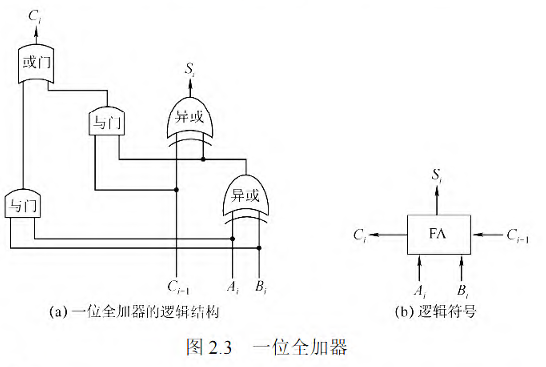
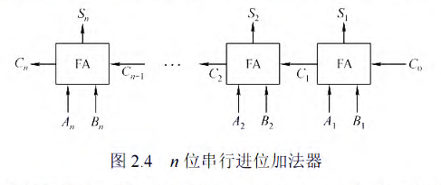
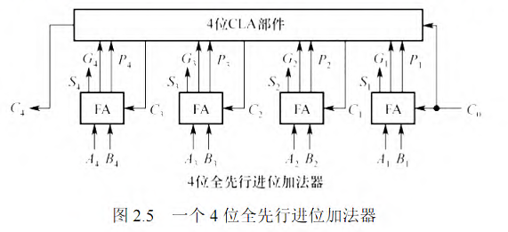
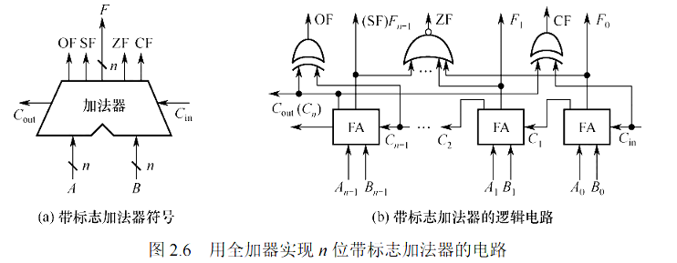
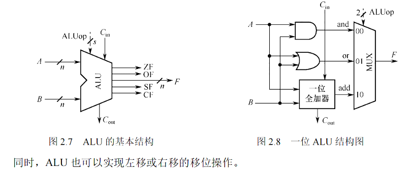

# 基本运算部件

CPU 中的核心组件时 LRU, LRU 中的核心组件是加法器

### 一位加法器

一位加法器(FA)顾名思义时只考虑一个比特位的加法, 我们假设对 $$A, B$$ 两个数位进行加法, 同时 $$C$$ 表示进位

发现, 如果 $$A, B, C$$ 中有奇数个 $$1$$ 的时候, 产生的结果为 $$1$$ , 否则为 $$0$$

如果 $$A,B$$ 全为 $$1$$, 或者 $$A, B$$ 有一个为 $$1$$, 进位 $$C$$ 为 $$1$$ , 那么相加之后也会产生进位

所以有下面的结果 : 

$$S_i = A \otimes B \otimes C$$         $$C_i = AB + (A \otimes B)C$$

### 串行进位加法器

把 $$n$$ 位全加器穿在一起即可得到串行进位加法器

在串行进位加法器中，低位运算产生进位所需的时间将影响高位运算的时间。因此，串行进位加法器的最长运算时间主要是由进位信号的传递时间决定的，位数越多，延迟时间就越长，所以加快进位产生和提高传递的速度是关键。

同时, 由于输入的两个数字是并行输入的, 所以也叫串行进位的并行加法器

### 并行进位加法器

只需要知道是通过先行进位部件 (CLA) 来实现并行的产生进位即可

### 带标志的加法器

我们会在进行加法的时候引入四个标志: 

`OF` 有符号数加法是否发生溢出,    `ZF` 运算产生的结果是否是 $$0$$

`CF` 无符号数加法是否发生溢出,    `SF` 运算产生的结果是整数还是负数(`1` 为正, `0` 为负)

产生的过程如下:

`OF` : $$C_n \otimes C_{n - 1}$$

`ZF` : 对产生结果的每一个数位进行同或操作

`CF` : 对输入的进位信息和输出的进位信息进行异或 $$C_0 \otimes C_{n}$$

`SF` : 直接输出最高位的结果

> 补充说明这几个标志的意义: 计算机通过这几个标志来判断两个数字$$A, B$$之间的大小, 通过计算 $$A - B$$
>
> 1. 如果是两个无符号数进行判断:
> 
> 如果 $$ZF = 1$$, 那么 $$A = B$$, 如果 $$ZF = 0$$ 且 $$CF = 0$$ $$A > B$$. 如果 $$ZF = 0$$ 并且 $$CF = 1$$ , 那么说明 $$A < B$$
>
> 2. 如果比较的两个数字位有符号数
>
> 如果 $$ZF = 1$$, 那么 $$A = B$$, 如果 $$ZF = 0$$ 且 $$OF = SF$$ $$A > B$$. 如果 $$ZF = 0$$ 并且 $$OF \ne SF$$ , 那么说明 $$A < B$$

### 算数逻辑单元

基本的原理是, 有很多的部件组成(加减、乘除、与或非等等) , 输入的两个操作数将进入所有的部件进行运算, 之后会全部作为一个多路选择器的输出, 之后再输入 ALUop 选择对应的结果即可

ALUop 的位数需要满足: 如果 ALU 有 $$k$$ 个操作, 那么最少要 $$m \ge \left \lceil \log_2 k  \right \rceil$$ 位

