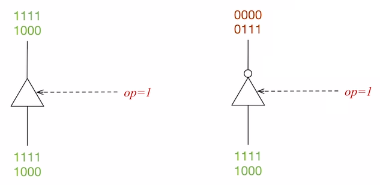

# 多路选择器和三态门

### 多路选择器

主要的作用是通过控制信号来选择哪一个输入进行输出(一般情况下, 用 op 来表示控制信号)

需要补充的是: 输入信号和输出信号的字长为计算机字长, 而控制信号的位数最少应该满足 $$m \ge \left \lceil \log_2 k  \right \rceil$$
> 有些时候, 会预留出一位控制信号来表示所有的输入都不接受, 所以位数应该满足 $$m \ge \left \lceil \log_2 (k+ 1)  \right \rceil$$

### 三态门

用来控制该信号是否要输出, 如果 `op = 1` , 那么将允许通过这个信号, 否则不允许通过, 此时电路处在断路的效果

如果三态门前面有一个小圆圈, 代表对信号按位取反