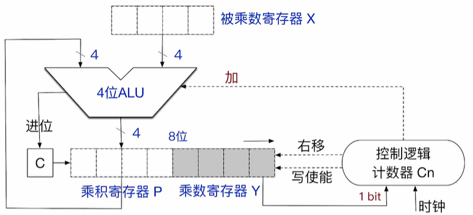
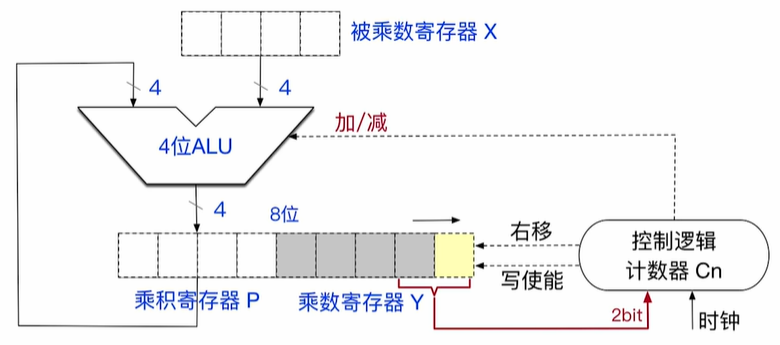
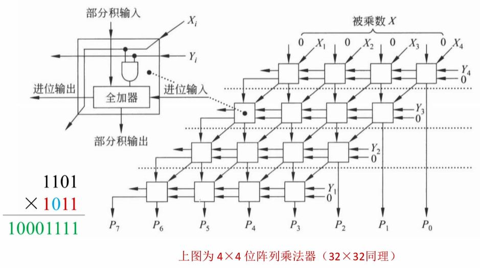

# 定点数的乘法运算

### 无符号整数的乘法操作

当我们正常列竖式的时候, 我们可以把乘法拆成一个个部分积, 然后不断的累计部分积就可以得到乘积了

无符号整数的操作过程以及电路如下

控制逻辑计数器 Cn 存放的当前进行乘法的两个数字的位数, 通常情况下是计算机的字长, 被乘数寄存器中存放一个乘数, 同房时乘数寄存器存放另一个乘数

设立乘积寄存器用来暂存部分积, 设立进位寄存器(只能记录一位) 来存储进位信息

进行乘法的过程如下:
1. 初始化: 初始化两个乘数寄存器, 同时将乘积寄存器,进位寄存器设置为 $$0$$, 同时初始化控制逻辑寄存器
2. 如果控制逻辑寄存器不为 $$0$$ , 则循环执行下面的步骤
    1. 如果乘数寄存器的最后一位为 $$0$$, 则什么都不做, 如果最后一位为 $$1$$ , 则让则让乘积寄存器里面的值与被乘数寄存器里的值相加
    2. 逻辑控制计数器向乘积寄存器发送写使能信号(Write Enable), 将刚刚计算的结果写回到乘积寄存器中, 同时, 如果刚刚的计算有最高位进位, 会让进位寄存器设置为 $$1$$
    3. 逻辑控制计数器会发出右移信号, 将进位寄存器, 乘积寄存器, 乘数寄存器看成一个整体, 逻辑右移一位
    4. 逻辑控制计数器减一

> 如果初始的时候, 两个乘数有任何一个数字为 $$0$$, 直接输出结果 $$0$$, 不需要计算

这种方法是串行的, 所以没进行一次乘法, 可能需要很多个时钟周期

乘法的结果用 $$2n$$ 位的寄存器暂存, 但是通常仅保留低 $$n$$ 位, 所以会有溢出情况, 判断溢出的方法是:

如果高 $$n$$ 位寄存器中的内容不全为 $$0$$, 则发生了溢出:
> $$0000\mid 0101$$  无溢出     ; $$0010\mid 0101$$ 发生溢出

发生溢出后, CPU 会将 `OF` 置为 $$1$$

溢出的处理:
1. 可以不做任何处理, 直接忽略溢出
2. 在执行乘法指令之后, 执行一条溢出自陷指令(trap `INTO`) , 该指令会检查 `OF` 标志位, 如果溢出, 会进行对应的异常处理程序

因为一次只能进行一个比特乘法, 所以一种典型的优化是一次性处理两个比特, 这样时钟周期减半

### 有符号数的乘法操作 (布斯(Booth) 乘法)

电路图原理如下 :

有符号乘法没有设置进位寄存器了, 而是设置了一个辅助寄存器在最低位, 同时一次性给控制逻辑计数器输入两个bit, LRU 也会进行加减法操作了

基本的操作步骤如下:

1. 初始化: 初始化两个乘数寄存器, 同时将乘积寄存器,辅助寄存器设置为 $$0$$, 同时初始化控制逻辑寄存器
2. 如果控制逻辑寄存器不为 $$0$$ , 则循环执行下面的步骤
    1. 将乘数寄存器中的最后一位以及辅助寄存器中的值传入控制逻辑计数器, 控制逻辑计数器根据不同的输入进行不同的操作: 如 : $$0000\mid 1001 \mid 0$$ , 此时会传给逻辑控制寄存器 $$10$$
        > `00` 执行 $$+0$$ 操作 ; `01` 执行 $$+[x]_{\text{补}}$$
        >
        > `10` 执行 $$-[x]_{\text{补}}$$ ; `11` 执行 $$+0$$ 操作
        >
        > 逻辑控制计数器会根据不同的内容向LRU传输加法指令和减法指令
    2. 逻辑控制计数器向乘积寄存器发送写使能信号(Write Enable), 将刚刚计算的结果写回到乘积寄存器中
    3. 逻辑控制计数器会发出右移信号, 将乘积寄存器, 乘数寄存器, 辅助寄存器看成一个整体, 逻辑右移一位
    4. 逻辑控制计数器减一

同理: 也会发生溢出的情况, 判断溢出的条件如下:

如果 高 $$n+1$$ 位不全相同, 那么发生溢出, 否则没有发生溢出, 我们拿 $$n=4$$ 举例

$$0000\mid01011$$; $$1111\mid1011$$ 这两个没发生溢出, $$1011\mid 1000$$; $$1111\mid0001$$ 发生了溢出

同理, 如果发生溢出, CPU 会将 `OF` 置为1, 同时应对溢出的方法和无符号整数一样

应为是串行执行, 所以需要多个时钟周期

### 计算机实现乘法的三种方法

**由 ALU, 移位器, 寄存器, 控制逻辑组成的乘法电路**

这种就是我们最开始介绍的乘法器原理

**列阵乘法器(快速乘法器中的一种)**

只需要知道, 只需要一个时钟周期就可以知道乘法的结果

**由移位操作, 加减法实现的软件操作**

$$x \cdot 14 \Rightarrow (x << 3) + (x << 2) + (x << 1) \Rightarrow (x << 4) - (x<< 1)$$

将乘法操作通过软件的方式实现, 需要多个时钟周期

