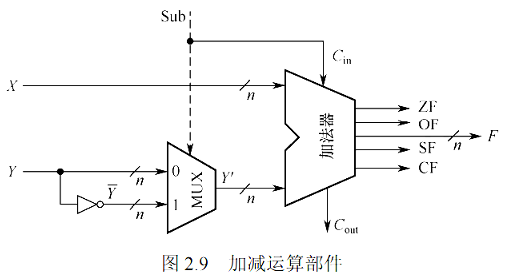

# 定点数的加减运算

### 补码的加减法运算

1. 如果进行加减法的两个数字都是正数, 那么直接进行加法即可
2. 如果进行的是减法, 那么将会对减去的数字转换位他的相反数, 之后再进行加法运算

**判断溢出的方式**

1. 如果采用单符号位:

我们不难发现, 只有正数加正数以及负数加负数才会发生溢出, 并且溢出之后符号位一点会发生改变, 所以, 有一个简单的判断方式

$$OF = A_n B_n \overline{C_n} + \overline{A_n}\overline{B_n} C_n$$

2. 采用双符号制度

如果两个符号位不一样, 那么就发生了溢出

00：表示结果为正数，无溢出。 01：表示结果正溢出。10：表示结果负溢出. 11：表示结果为负数，无溢出

3. 采用进位判断

最高数位的进位异或上最高数值位的进位  $$C_n \otimes C_{n - 1}$$

**加法器电路**

补码取相反数的操作位: 每一位按位取反, 之后最后一位加 $$1$$, 观察图片发现,. 如果给多路选择器发出的信号位减法信号, 那么在多路选择器中将按位取反, 末尾加 $$1$$ 的操作在加法器中实现, 让 $$C_{in} = 1$$ 即可, 即默认初始位有一个进位

### 无符号数的加减法

无符号数的加法很简单, 我们重点关注一下减法, 假设我们要计算 $$A - B$$

我们应该对 $$B$$ 按位取反得到 $$C$$ 之后将 $$A-B$$ 转化位 $$A + C + 1$$ 

> 原理如下: 假设我们操作数是有 $$k$$ 位的, 那么我们能得出 $$B + C = 2^k - 1$$, 所以有 $$B + C + 1 = 2^k$$
>
> 所以 $$-B = C + 1 - 2^k$$ , 所以 $$A - B = A + C + 1 - 2^k$$ , 因为一共就 $$k$$ 位, 所以 $$2
^k$$ 会给模运算忽略掉, 所以 $$A- B = A + C + 1$$

所以无符号加减法的电路和有符号加减大的电路一样

**判断溢出的方式**

发现如果是正数加正数, 那么最高位一定会进位, 此时最低位的进位为 $$0$$, 
如果是正数加负数, 那么最低为进位为 $$1$$, 最高位的进位为 $$0$$

所以判断的标志为 $$C_n \otimes C_0$$

