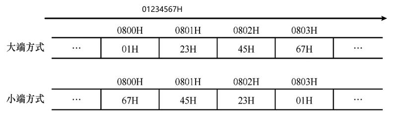
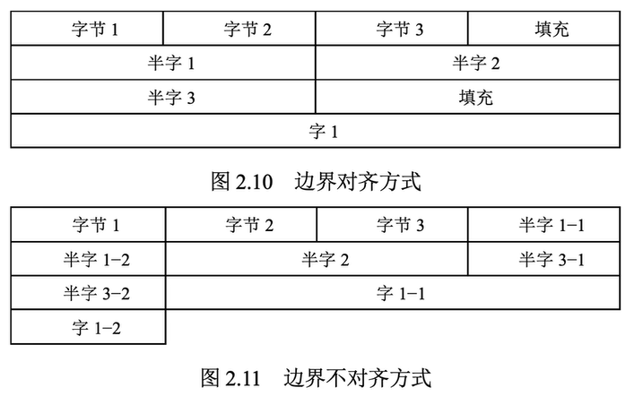

# 数据的存储和排列

### 大端法和小端法

* **大端**：是指数据的高字节保存在内存的低地址中，而**数据的低字节保存在内存的高地址**中，这样的存储模式有点儿类似于把数据当作字符串顺序处理：地址由小向大增加，而数据从高位往低位放。
* **小端**：是指数据的高字节保存在内存的高地址中，而**数据的低字节保存在内存的低地址**中，这种存储模式将地址的高低和数据位权有效地结合起来，高地址部分权值高，低地址部分权值低，和我们的逻辑方法一致。

### 边界对齐

现代计算机一般是使用字节编址， 但是寻址可以使用字节， 半字， 字来寻址， 但是计算机只能读写一个字

也就是说， 如果计算机的字长是 $$32$$ 位, 那么读写的最小单元就是四个字节

于是有边界对齐和边界不对齐两种方式:

边界对齐: 如果当前内容在这个字里面以及放不下了, 那么便舍弃剩余空间, 在新的字中存储

边界不对齐: 如果当前内容在这个字里面以及放不下了, 那么拆成两半分别存储

边界对齐是以空间换时间, 舍弃空间来换取更快的访存

边界不对齐的话, 如果访问的内容被拆成了两个字, 那么就需要进行两个访存,读取两个字内容,之后再拼接在一起