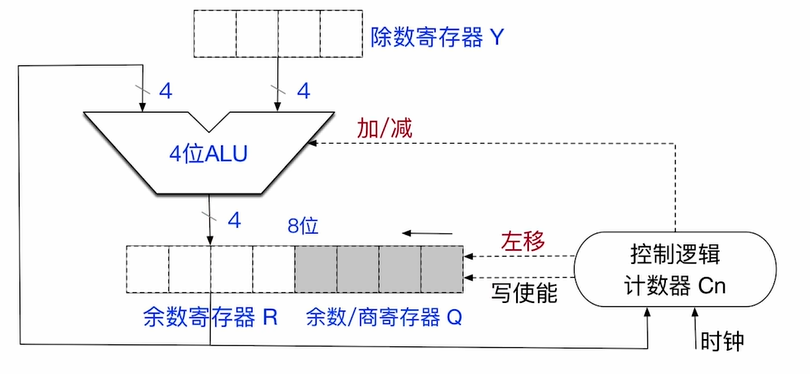

# 无符号数的除法

除法的核心也和我们人手算的过程是差不多的， 所以我们直接使用电路模拟下面的过程：

我们的除法器支持 $$2n$$ 位的背除数以及 $$n$$ 位的除数, 如果使用低于 $$2n$$ 位的除数, 我们需要零拓展至 $$2n$$ 位
> 值得注意的是, 如果是 $$2n$$位的被除数, 那么这次除法是双精度除法, 如果被除数是 $$n$$ 位的, 那么就是单精度除法

我们用 $$1111$$ 除以 $$0010$$ 来作为模拟: 

首先我们要先进行初始化:

1. 我们先将除数放在除数寄存器中
2. 将被除数放在余数/商寄存器Q中, 注意:Q和R这两个寄存器看成一个整体, 一共有 $$2n$$ 位, 所以要将被除数零拓展至 $$2n$$ 位
3. 将控制逻辑计数器的值设置为 $$n$$
4. 进行特殊情况的检查
    1. 如果除数寄存器为 $$0$$, 那么就会触发除数为零的异常, 产生外中断, 从未转为执行异常处理程序
    2. 如果被除数小于除数, 那么不会进行除法操作,应为此时商为 $$0$$, 余数为被除数本身

注意: 除法进行的过程中会发生商溢出, 所以我们要进行判断

> $$2n$$ 位的被除数除以 $$n$$ 位的除数会产生 $$n+1$$ 位的商, 但是 CPU 只会保留低位的 $$n$$ 位, 最高位会直接被舍弃
>
> 所以我们要对最高位商进行判断, 如果商的最高位是 $$1$$, 那么发生了商溢出, 除法操作将会终止, 会产生商溢出的异常, 从而执行对应的异常处理程序
>
> 注意: 只有双精度除法会产生商溢出, 单精度除法不会产生商溢出

整个除法过程会进行 $$n+1$$ 次循环, 所以我们分开讨论:

1. 当进行第一次循环的时候:
    1. 控制逻辑计数器向 ALU 发出减法信号, 让除数寄存器Y的值减去余数寄存器R的值, 并将结果写回到余数寄存器R中
    2. 如果计算过程中发生了溢出(即 Y < R) , 那么说明本轮的商为 $$0$$ , 也就说明最高位的商为 $$0$$, 不会发生商溢出, 之后控制逻辑计数器向 ALU 发出加法指令,除数寄存器Y的值加上余数寄存器R的值, 目的是恢复原本余数寄存器的值(计算的过程为 R - Y + Y = R)
    3. 如果计算的过程中没有发生溢出(即 Y >= R), 那么说明本轮的商为 $$1$$ , 也就说明最高位的商为 $$1$$, 发生商溢出, 除法操作将会终止, 会产生商溢出的异常, 从而执行对应的异常处理程序
2. 之后的 $$n$$ 次循环(只要控制逻辑计数器的值不为 $$0$$)
    1. 将 R 和 Q 两个寄存器看成一个整体, 逻辑左移一位, 空出的最低位将用来存储商
    2. 控制逻辑计数器向 ALU 发出减法信号, 让除数寄存器Y的值减去余数寄存器R的值, 并将结果写回到余数寄存器R中
    3. 如果计算过程中发生了溢出(即 Y < R) , 那么说明本轮的商为 $$0$$, 写到刚刚空出的最低位中, 同时恢复原本 R 的内容(和第一次循环一致)
    4. 如果计算的过程中没有发生溢出(即 Y >= R), 那么说明本轮的商为 $$1$$, 写到刚刚空出的最低位中, 此时不需要恢复 R 的内容
    5. 将控制逻辑寄存器的值减一

> 关于恢复寄存器 R 中的值, 有恢复余数法和不恢复余数法,

> 除数为 $$0$$ , 商溢出都属于除法错异常, 也可以简称为除法异常
