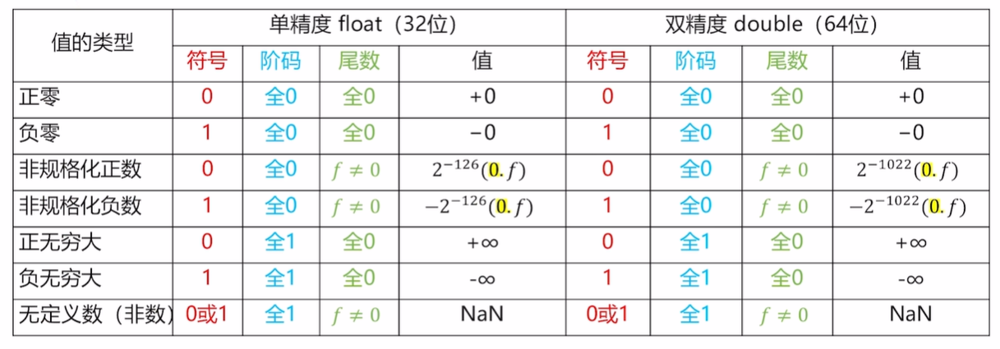
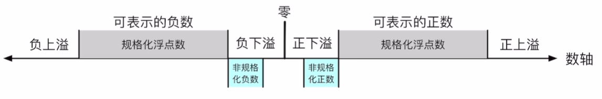

# 浮点数的表示(IEEE754)

IEEE浮点标准用 $$V = (-1)^s \times M \times 2^E$$ 来表示一个数

整个存储结构分为了三个部分

* 符号位 (sign) ： 决定这个数是正数还是负数， $$1$$ 表示负数， $$0$$ 表示正数 (是为了方便比较，我们可以直接使用补码的大小比较元件进行比较)
* 阶码（exponent）： 对浮点数加权，这个权重就是 $2^E$
* 尾数（significand）： 是一个二进制小数，实质的表示具体的值

我们用下面的例子来表示 IEEE754 的规格化数据的表示

将 $$426.41269$$ 用 IEEE 浮点表示法表示：

1. 先将这个数字以小数点为分割后用二进制表示： $$110101010.01101011001100110011001100110011$$

   这个数字同样可以表示为 ： $$1.10101010011010110011001100110011 \times 2^{8}$$

   > 关于小数部分的小数，我们对 $$0.41269$$ 求二进制的步骤如下：
   >
   > $$0.41269 \times 2 = 0.82538$$ ，取整数部分 $$0$$，余数 $$0.82538$$
   >
   > $$0.82538 \times 2 = 1.65076$$，取整数部分 $$1$$，余数 $$0.65076$$
   >
   > $$0.65076 \times 2 = 1.30152$$，取整数部分 $$1$$，余数 $$0.30152$$
   >
   > $$\ldots$$

2. 我们发现这个数是正数， 所以符号位为 $$0$$

3. 我们发现 $$E$$ 是 $$8$$ ，不过为了方便计算和比较，我们一般都会加上偏置然后再存储

   对于阶码为 $$k$$ 位的表示来说， 偏置值为 $$2^{k - 1} - 1$$

   对于一个 $$32$$ 位表示,来说， 这个偏置为 $$127$$ ， 所以我们要存储的十进制是 $$135$$, 二进制为： $$10000111$$

4. 对于典型的 float 来说，一共占 32 个位，所以最后表示为(我们用 `|` 来分割三个部分)

   $$0|10000111|10101010011010110011001$$

   对于规格化的小数， 我们隐含的表示最高位的 $$1$$ 不表示

单精度和双精度浮点数所占的字节数不同，

单精度浮点格式（float ）$$\Rightarrow$$ s、exp和frac字段分别为$$1$$位、$$k = 8$$位和$$n = 23$$位，得到一个$$32$$位表示

双精度浮点格式（double） $$\Rightarrow$$ s、exp和frac字段分别为$$1$$位、$$k = 11$$位和$$n = 52$$位，得到一个64位表示

除了规格化小数， 还有非规格化小数：

*  当 exp 的位模式不全为 $$0$$ （即数值不为 $$0$$）, 也不全为 $$1$$ （单精度数值为 $$255$$， 双精度为 $$2047$$） 的时候
    > 这个时候的浮点数称为规格化的值， 即一般情况下的小数, 这个时候， frac 实际上是隐藏了开头的 $$1$$ 的
* 当  exp 的位模式全为 $$0$$ （即数值为 $$0$$）的时候
  
    > 这个时候的浮点数被称为非规格化的值, 这个时候的 frac 不包括 $$1$$
    >
    > 此时再对尾数进行分类： 如果尾数全为 $$0$$ , 那么如果符号位为 $$1$$ 则表示 $$-0$$, 符号位为 $$0$$ 则表示 $$+0$$
    > 
    > 如果尾数不全为 $$0$$, 那么就是非规格化数, 此时阶码为固定的 $$2^{1 -\text{Bias}}$$

* 当  exp 的位模式全为 $$1$$ （单精度数值为 $$255$$， 双精度为 $$2047$$）的时候
  > 这类的浮点数叫做特殊值
  >
  > 当 $$frac = \{0,0,0,\ldots , 0\}$$ 的时候，即全是 $$0$$ , 这个时候代表无穷 $$\infty$$
  >
  > 当符号位为 $$1$$ 的时候代表 $$+\infty$$ ， 为 $$0$$ 代表 $$-\infty$$
  >
  > 当 frac 不全是 $$0$$ ， 也不全是 $$1$$ 的时候， 代表 $$\text{NAN}$$ （not a number）

### 各种边界值

规格化的正小数所能表示的最大值为: $$0\mid 1111110 \mid 111...111 = 1.1111... \times 2^{127} = (2 - 2^{-23}) \times 2^{127}$$ 

规格化的负小数所能表示的最小值为: $$1\mid 1111110 \mid 111...111 = -1.1111... \times 2^{127} = -(2 - 2^{-23}) \times 2^{127}$$ 

规格化的正小数所能表示的最小值为： $$0\mid 00000001 \mid 000...000 = 1.00 \times 2^{-126}$$

规格化的负小数所能表示的最大值为: $$1\mid 00000001 \mid 000...000 = -1.00 \times 2^{-126}$$

非规格化的正小数所能表示的最大值为: $$0\mid 00000000 \mid 111...111 = 0.111...111 \times 2^{-126} = (1 - 2^{-23}) \times 2^{-126}$$

非规格化的正小数所能表示的最小值为: $$0\mid 00000000 \mid 000 ... 001 = 0.000...001 \times 2^{-126} = 2^{-23} \times 2^{-126}$$

非规格化的负小数所能表示的最小值为: $$1\mid 00000000 \mid 111...111 = -0.111...111 \times 2^{-126} = -(1 - 2^{-23}) \times 2^{-126}$$

非规格化的负小数所能表示的最大值为: $$1\mid 00000000 \mid 000 ... 001 = -0.000...001 \times 2^{-126} = -2^{-23} \times 2^{-126}$$

**注意事项**

如果是浮点小数除法除以 $$0.00$$, 那么得到的结果是 无穷(具体哪个无穷看正负)

$$0 / 0 \quad \sqrt{-1} \quad \infty -\infty$$ 这些才是结果为 $$\text{NAN}$$

当值越过了靠近 $$0$$ 的边界的时候, 会直接变成 $$0$$, 正负取决于从哪边越过
如果超出了外边界,则变成无穷

### 阶码加上偏置的原因

对浮点数进行比较时，使用偏置阶码可以直接按位比较两个浮点数的二进制表示，就像比较无符号整数一样

便于处理次正规数和零, 如果阶码不使用偏置，直接表示真值，那么最小的正数（非零）可能需要一个负的阶码，这会使得对零和次正规数的特殊处理变得复杂

可以很方便地通过检查阶码的特殊模式来检测浮点数的下溢（underflow） 或溢出（overflow）

### 浮点数的舍入规则

浮点数的舍入规则其实还算比较简单，我们称这种方法为 **偶数舍入法**

首先偶数舍入法实际上是向上舍入和向下舍入的延深：

1. 如果当前数值更靠近向上舍入的数值， 那么我们就向上舍入
2. 如果当前数值更加靠经向下舍入的结果，我们就向下舍入
3. 如果刚好是在最中间，我们就舍入到尾数尾偶数的结果

我们举一些简单的例子大家就明白了：我们考虑的情况全是四位小数舍入到两位小数的结果：

> $$10.00011_2$$ 会舍入到 $$10.00_2$$
>
> $$10.00110_2$$ 会舍入到 $$10.01_2$$
>
> $$10.11100_2$$ 会舍入到 $$11.00_2$$
>
> > 向上舍入的结果为 $$11.00_2$$ ， 向下舍入的结果为 $$10.11_2$$,  他们的中间值刚好是 $$10.111_2$$
> >
> > 因为希望尾数为偶数， 所以舍入到 $$11.00_2$$
>
> $$10.10100_2$$ 会舍入到 $$10.10_2$$
>
> > 向上舍入的结果为 $$10.11_2$$ ， 向下舍入的结果为 $$10.10_2$$,  他们的中间值刚好是 $$10.101_2$$ 
> >
> > 因为希望尾数为偶数， 所以舍入到 $$10.10_2$$
