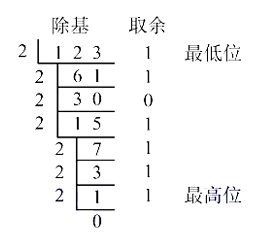
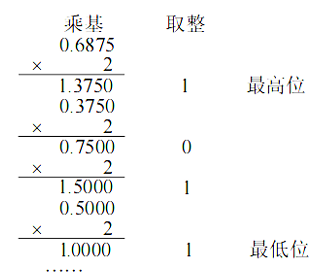

# 进位计数制及其相互转换

计算机中通常使用二进制来存储数据指令，因为二进制只包含两种情况， 所以很方便使用高电平和低电平来表示， 但是二进制不便于人类阅读， 所以我们看的时候，更多时候使用十进制或者十六进制

二进制，十进制等等进制数都属于 **进位计数制** ， 不同位数用到的不同数码的个数叫做**基数**（如二进制的基数是 $$2$$, 十六进制数的基数是 $$16$$）, 这个数码表示的数值为 这个数码本身乘上一个常数, 这个常数叫做**位权**

我们假设一个 $$r$$ 进制数 $$K_n K_{n - 1}K_{n - 2} .... K_0$$ , 那么这个数为:

$$
\text{num} = \sum_{i= 0}^{n} K_i r^i
$$

 其中 $$r$$ 为基数, $$r^i$$ 为位权

 ## 不同进制数可以相互转化

 本人通常使用的方法是: 如果是二倍数制相互转化, 比如八进制转十六进制等等, 我会先转化为二进制在转为目标进制

 否则使用十进制转化:

## 十进制转二进制的方法:

将十进制数1236875转换成二进制数。

除基取余法（整数部分）：整数部分除基取余，最先取得的余数为数的最低位，最后取得的 余数为数的最高位（除基取余，先余为低，后余为高），商为0时结束。

乘基取整法（小数部分）：小数部分乘基取整，最先取得的整数为数的最高位，最后取得的整数为数的最低位（乘基取整，先整为高，后整为低），乘积为1.0（或满足精度要求）时结束。

