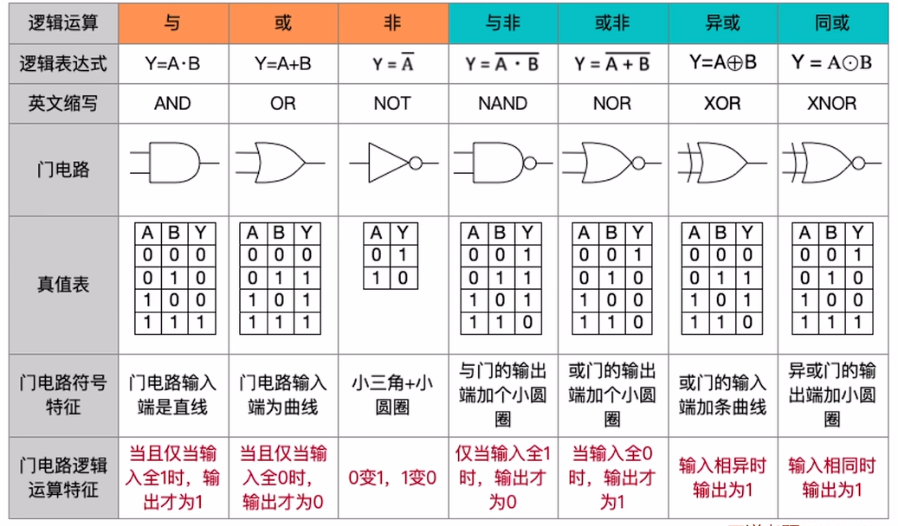
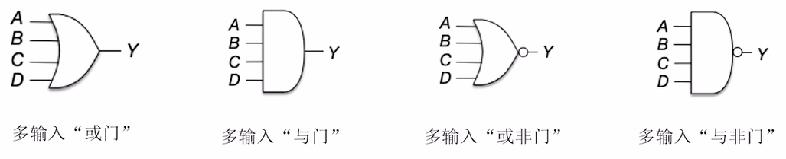

# 逻辑门电路

逻辑运算分为基本逻辑运算（与 或 非）和复合逻辑（与非， 或非， 异或， 同或【异或非门】）运算两种， 

门电路有多输入的画法， 拿多异或来表示代表 $$A \otimes  B \otimes  C \otimes  ....$$

三种逻辑运算的优先级：

非 $$>$$ 与 $$>$$ 非  有括号优先计算括号

逻辑运算的常见公式

$$A(C + D) = AC + AD$$   $$(AB)C = A(BC)$$   $$A + B + C = A + ( B +  C)$$

德摩根率: $$\overline{A + B} = \overline{A} \overline{B}$$   $$\overline{AB} = \overline{A} + \overline{B}$$