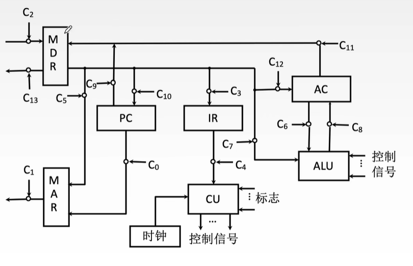

# 专用数据通路结构

---

## 核心概念

**专用数据通路结构**是指在需要进行数据交换的 CPU 部件之间，建立**独立的、点对点的连接通路**。与单总线结构相比，这种结构的主要优势在于**能够支持多部件并行传输数据**，显著提高数据传输效率。

* **控制方式**：数据在专用通路上的流动通过**控制信号**（如 `PCout`、`MARin` 等）来精确控制各通路开关的状态。当某个控制信号有效时，对应的通路就被打开，允许数据流动。

---

## 1. 上节回顾 (00:08)

* **单总线局限**：在单总线结构中，所有 CPU 内部部件共享同一条总线。这意味着在**同一时刻，仅允许两个部件之间进行数据传输**，无法支持多部件的并行数据交换，导致效率瓶颈。
* **改进方案**：为了克服单总线的局限性，可以采用以下两种改进方案：
    * **多总线结构**：通过增加内部总线的数量（如两总线、三总线）来实现多组数据并行传输，提高吞吐量。
    * **专用通路结构**：为每对需要频繁进行数据交互的部件之间建立独立的连接通路，进一步消除总线竞争，实现高度并行。

---

## 2. 专用数据通路方式 (00:58)

### 2.1 取指周期 (01:34)

在专用数据通路结构下，取指周期的数据流和控制信号更加直接：

1.  **PC → MAR**:
    * **PC 内容**直接通过专用通路传送到 **MAR**。
    * **控制信号**：`PCout` (PC 输出使能), `MARin` (MAR 输入使能)。
2.  **地址输出**:
    * `MAR` 中的地址内容通过专用通路接通**外部地址总线**，送往主存。
    * **控制信号**：通常是 `MARout` 或一个控制 `MAR` 连接地址总线的信号有效。
3.  **读命令**:
    * **控制单元 (CU)** 向主存发送**读控制信号**（`MemR`）。
4.  **数据输入**:
    * 主存根据地址总线上的地址，将指令数据通过**外部数据总线**传送到 **MDR**。
    * **控制信号**：`MDRinE` (MDR 外部输入使能)。
5.  **指令存储**:
    * `MDR` 中的指令数据通过专用通路转存到 **IR** (指令寄存器)。
    * **控制信号**：`MDRout` (MDR 输出使能), `IRin` (IR 输入使能)。
6.  **PC 更新**:
    * **PC 自动加 1**（通常由 PC 内部的自增逻辑或一个独立的加法器实现，在很多图示中被视为**隐式操作**，无专用控制信号显式标出）。
7.  **指令译码**:
    * `IR` 中的**操作码**部分被送往 **CU** 的指令译码器进行译码（在某些题目中，此步骤的控制信号可能省略，被视为自动行为）。

### 2.2 应用案例 (03:45)

#### 2.2.1 例题: 加法指令执行控制信号

假设指令为 `ADD (R0), R1` (即 `R1 = MEM[R0] + R1`)：

* **解题要点**：
    * **操作数 1** (来自 `R1`) 准备：直接送往 ALU 的一个输入端。
    * **操作数 2** (来自 `MEM[R0]`) 准备：
        * `R0` 的内容首先送给 `MAR`。
        * `MAR` 发出地址，`CU` 发出读命令。
        * 主存数据读入 `MDR`。
        * `MDR` 内容送往 ALU 的另一个输入端。
    * **ALU 输入端**：在专用通路中，`ALU` 的两个输入端可以同时直接连接到 `R1` (或其临时寄存器) 和 `MDR` (或其临时寄存器)，实现并行数据输入。
    * **运算结果**：`ALU` 的运算结果通过专用输出通路传回 `R1`。

#### 2.2.2 例题: CPU 与主存连接结构 (04:41)

通常通过一个简化图示来识别寄存器和数据通路：

* **寄存器识别**：
    * `d → PC`：唯一具有 "+1" 功能的寄存器，用于存储下一条指令地址。
    * `c → MAR`：接收 `PC` 或其他地址来源（如 `IR` 的地址码、通用寄存器）输出的地址数据，连接地址总线。
    * `b → IR`：直接连接指令译码器和微操作发生器，用于存放当前指令。
    * `a → MDR`：与主存进行双向数据交互，用于暂存读写的数据。

* **取指通路 (典型)**：
    * `PC → MAR` (地址传送)
    * `MAR → 主存`（通过地址总线进行读操作寻址）
    * `主存 → MDR` (数据经数据总线读入)
    * `MDR → IR` (指令存入指令寄存器)
    * （可选）`IR` 操作码 → 微操作发生器 (指令译码)
    * （可选）`PC + 1 → PC` (PC 自增更新)

* **运算器存取通路 (示例)**：
    * **读取操作数**：例如 `MDR → ALU → ACC`（如果 `ALU` 具有直通功能，即数据可以直接穿过 `ALU` 而不做运算）。
    * **存储结果**：`ACC → MDR`（将累加器内容送入 `MDR`），然后 `MDR → 主存`（需 `MAR` 提前存好存储地址）。

---

## 二、内容回顾 (19:07)

* **结构对比**：
    * **单总线**：成本低但效率低，同一时刻只能传输一对数据，在 `ALU` 需要双操作数输入时，必须配合**暂存寄存器** (如 Y 寄存器) 使用。
    * **专用通路**：成本高但效率高，支持**多部件并行数据传输**，通常无需额外的暂存寄存器来解决 `ALU` 双输入问题。
* **实现技术**：
    * **多路选择器 (MUX)**：用于解决多输入部件的信号选择问题，从多个输入中选择一个作为输出。
    * **三态门**：通过控制信号（高电平、低电平、高阻态）来导通或阻断通路，实现对数据流的精确控制。
* **考察重点**：
    * **指令执行各阶段的微操作序列**：详细列出每个阶段的原子操作。
    * **控制信号与数据通路的对应关系**：为每个微操作标明相应的控制信号。
    * **不同结构下数据流动路径分析**：理解单总线和专用通路在数据传输效率和方式上的差异。

---

## 三、知识小结

| 知识点              | 核心内容                                                     | 考试重点/易混淆点                                           | 难度系数 |
| :------------------ | :----------------------------------------------------------- | :---------------------------------------------------------- | :------- |
| 数据通路结构        | **单总线结构**同一时刻仅允许两个部件间数据传输；**专用数据通路**通过独立线路实现多部件并行传输。 | **单总线与专用通路的效率与成本对比**（专用通路效率高但成本高）。 | ⭐⭐⭐     |
| 取指令流程          | 1. `PC → MAR` (`PCout, MARin`)   2. `MAR → 主存地址总线`   3. `主存读信号 → MDR` (`MemR, MDRinE`)   4. `MDR → IR` (`MDRout, IRin`)   5. `PC + 1` (隐式)   6. `IR` 操作码 → `CU` (可选)。 | **控制信号顺序**（如 `PCout, MARin` 的激活时序）与 **PC+1 的隐式操作**。 | ⭐⭐       |
| 加法指令执行        | 1. 取操作数 x (如 `ACC`)；2. 取操作数 y (如 `MEM[R0]`)：`MAR` ← `R0` → 主存 → `MDR` → `ALU`；3. `ACC` 与 `MDR` 数经 `ALU` 相加 → `ACC`。 | **数据流向的“迷宫问题”**：例如在单总线中，`MDR → ACC` 可能需**经 `ALU` 绕行**。 | ⭐⭐⭐⭐   |
| 存数指令执行        | 1. `ACC → MDR`   2. `MAR` ← `z`（指令地址码或运算结果地址）  3. `MDR → 主存` (`MemW`)。 | **双向数据通路**（`MDR` 与主存交互）与**地址传递逻辑**。 | ⭐⭐⭐     |
| 多路选择器/三态门   | 专用通路中解决多输入冲突：**多路选择器**选择输入信号；**三态门**控制通路导通/阻断。 | **硬件实现差异**（多路选择器 vs 三态门）。                | ⭐⭐       |
| 课后习题解析        | 1. **寄存器推断**（根据数据流向判断，如 `PC → MAR → IR → MDR` 间的关系）；2. **取指令数据流**（详细描述 `PC → MAR → 主存 → MDR → IR`）；3. **ACC 与主存数据通路**（需注意是否经 `ALU` 中转）。 | **连线图逆向推理**（如根据箭头方向判断寄存器类型和数据流向）。 | ⭐⭐⭐⭐   |