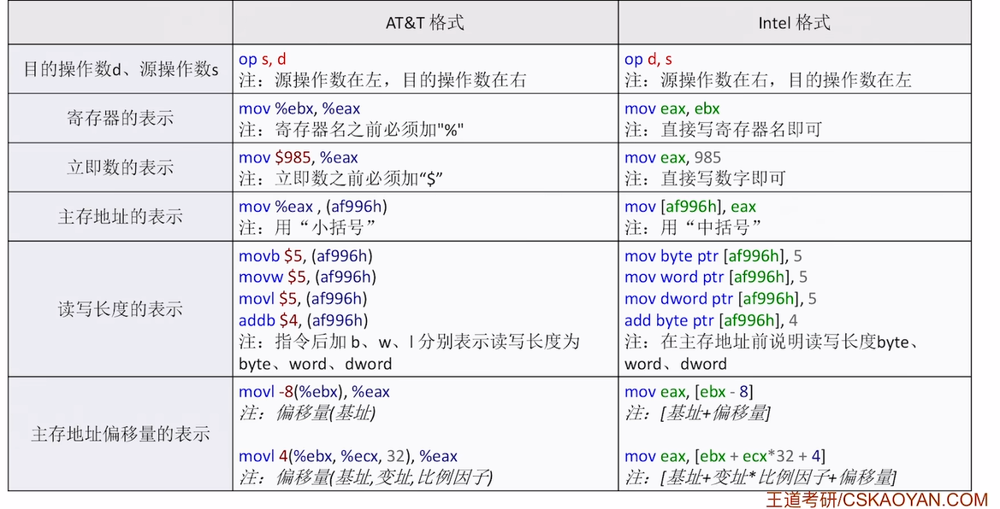

# 汇编指令快速入门

### x86 汇编语言基础

* **x86 架构起源**：
    * 始于 1978 年 Intel 发布的 **8086 处理器**。
    * 后续型号（如 80286、80386 等）都保持了指令集的**向下兼容性**。
    * “x86”这个名称就是源于处理器型号中传统的“86”后缀。

### 汇编语言指令基础

* **以 `mov` 指令为例**：
    * **`mov` 指令的作用与表示方法**：
        * **基本功能**：将源操作数 (`s`) 的值**复制**到目的操作数 (`d`) 所指的位置。
        * **格式**：通常为 **`mov d, s`**。
        * **操作数表示**：源操作数用 `s` (Source) 表示，目的操作数用 `d` (Destination) 表示。
        * **典型特征**：在 `mov` 指令中，**逗号前**是目的操作数的位置，**逗号后**是源操作数的内容。

    * **寄存器、立即数与内存地址的标识**：
        * **蓝色标注**：表示**寄存器**（如 `eax`, `ebx`）。
        * **紫色标注**：表示**立即数**（如 `5`）。
        * **绿色带中括号**：表示**内存地址**（如 `[af996h]`）。

    * **内存地址前缀的含义与数据长度**：
        * 内存地址前通常有数据长度前缀（如 `dword ptr`）。
        * **三种前缀类型**：
            * `dword ptr`：表示**双字** (Double Word)，即 **32 比特**。
            * `word ptr`：表示**单字** (Word)，即 **16 比特**。
            * `byte ptr`：表示**字节** (Byte)，即 **8 比特**。
        * **固定格式**：前缀必须包含 `ptr`，例如 `dword ptr [地址]`。

    * **具体 `mov` 指令的解析**：
        * **寄存器间传输**：`mov eax, ebx` → 将 `ebx` 寄存器中的值复制到 `eax` 寄存器。
        * **立即数传输**：`mov eax, 5` → 将立即数 `5` 存入 `eax` 寄存器。
        * **内存到寄存器**：`mov eax, dword ptr [af996h]` → 将内存地址 `af996h` 处的 32 位（双字）数据复制到 `eax` 寄存器。
        * **立即数到内存**：`mov byte ptr [af996h], 5` → 将立即数 `5` 存入内存地址 `af996h` 处的 1 字节（字节）空间。

    * **汇编语言中数据表示的特征**：
        * **内存地址特征**：
            * **必有中括号 `[]`**。
            * **前有数据长度说明**（`dword ptr`, `word ptr`, `byte ptr`）。
            * 十六进制常以 `h` 结尾。
        * **立即数特征**：直接包含在指令中的十进制或十六进制数值。

* **x86 架构 CPU 寄存器**：
    * **寄存器的命名与特点**：
        * **命名规则**：以 `e` 开头（`Extended`），表示是 **32 位寄存器**。
        * **共同特点**：所有以 `e` 开头的寄存器均为 32 位长度。
    * **通用寄存器**：
        * **寄存器列表**：`EAX`、`EBX`、`ECX`、`EDX`。
        * **命名含义**：`X` 表示未知（可存储任意数据），这些寄存器可用于各种通用数据操作。
    * **变址寄存器**：
        * **寄存器列表**：`ESI`、`EDI`。
        * **命名含义**：`S` = Source (源)，`D` = Destination (目的)，`I` = Index (索引)。
        * **主要用途**：常用于处理线性表、字符串等数据结构，进行数据的移动和遍历。
    * **堆栈寄存器**：
        * **寄存器列表**：
            * `EBP`：**堆栈基指针** (Base Pointer)。
            * `ESP`：**堆栈顶指针** (Stack Pointer)。
        * **特殊用途**：专门用于实现函数调用时的**堆栈管理**，维护函数的栈帧。
    * **寄存器的灵活使用**：
        * **16 位模式**：去掉 `e` 前缀（如 `AX`、`BX`），表示使用该寄存器值的低 16 位。
        * **8 位模式**：对于 `AX`, `BX`, `CX`, `DX` 等 16 位寄存器，还可以进一步分为高 8 位和低 8 位：
            * `AH`：高 8 位。
            * `AL`：低 8 位。
        * **考试重点**：考研中**32 位模式**（`e` 前缀）最常见。
    * **寄存器在考试中的识别**：
        * **识别技巧**：以 `e` 开头的名称（如 `eax`, `ebx`, `esp` 等）**必定是寄存器**。
        * **考试特点**：在 408 考研中，基本上只会出现 32 位寄存器。

# 常用 x86 汇编指令

## 常用的算术运算指令

算术运算指令执行数学计算。

* **操作数表示**：
    * `d` (destination，目的操作数)：运算结果的存放位置，**只能是寄存器或主存地址**。
    * `s` (source，源操作数)：提供数据进行运算，可以是**寄存器、主存地址或常量**。
* **指令特点**：
    * 运算结果总是**存回 `d` 所指向的位置**。
    * **不允许**两个操作数同时来自主存（这是为了提高效率，避免一次指令执行中进行多次内存访问）。

让我们看看具体的算术指令：

* **加法指令**：
    * `add d, s`：执行 $d \leftarrow d + s$，源自英文 "addition"。
* **减法指令**：
    * `sub d, s`：执行 $d \leftarrow d - s$，源自英文 "subtract"。
* **乘法指令**：
    * `mul s`：**无符号乘法**。被乘数隐含在 `eax` 中（对于 32 位操作），64 位结果存放在 `edx:eax` 中（高 32 位在 `edx`，低 32 位在 `eax`）。
    * `imul s`：**有符号乘法**（`i` 表示 integer）。操作数处理方式与 `mul` 类似。
* **除法指令**：
    * `div s`：**无符号除法**。64 位被除数隐含在 `edx:eax` 中。除法完成后，商在 `eax`，余数在 `edx`。
    * `idiv s`：**有符号除法**。操作数处理方式与 `div` 类似。
* **其他运算**：
    * `neg d`：取负数，执行 $$d \leftarrow -d$$。
    * `inc d`：自增，执行 $$d \leftarrow d + 1$$。
    * `dec d`：自减，执行 $$d \leftarrow d - 1$$。

**操作数表示法**：
* `<reg>`：表示**寄存器**操作数。
* `<mem>`：表示**内存**操作数。
* `<con>`：表示**常量**（立即数）操作数。

不允许两个操作数都是内存操作数， 是为了减少访存数目

---

## 三、常用的逻辑运算指令

逻辑运算指令对数据的位进行操作。

* **与运算**：`and d, s`：位与运算，$d \leftarrow d \land s$。
* **或运算**：`or d, s`：位或运算，$d \leftarrow d \lor s$。
* **非运算**：`not d`：位取反运算，$d \leftarrow \neg d$。
* **异或运算**：`xor d, s`：位异或运算，源自 "exclusive or"。
* **移位运算**：
    * `shl d, s`：**逻辑左移** (shift left)。
    * `shr d, s`：**逻辑右移** (shift right)。

---

## 四、其他常用指令

除了算术和逻辑运算，还有一些关键的指令类别：

* **流程控制指令**：
    * `cmp` (compare)：比较操作数。
    * `test`：位测试操作。
    * `jmp` (jump)：无条件跳转。
    * `jxxx` (conditional jump)：各种条件跳转指令（如 `je` 相等则跳转，`jg` 大于则跳转等），用于实现分支和循环结构。
* **函数调用指令**：
    * `push`：将数据压入堆栈。
    * `pop`：从堆栈弹出数据。
    * `call`：调用子程序或函数。
    * `ret`：从子程序或函数返回。
* **数据转移指令**：
    * `mov` (move)：最基本的数据传送指令。

## AT&T 与 Intel 格式区别

