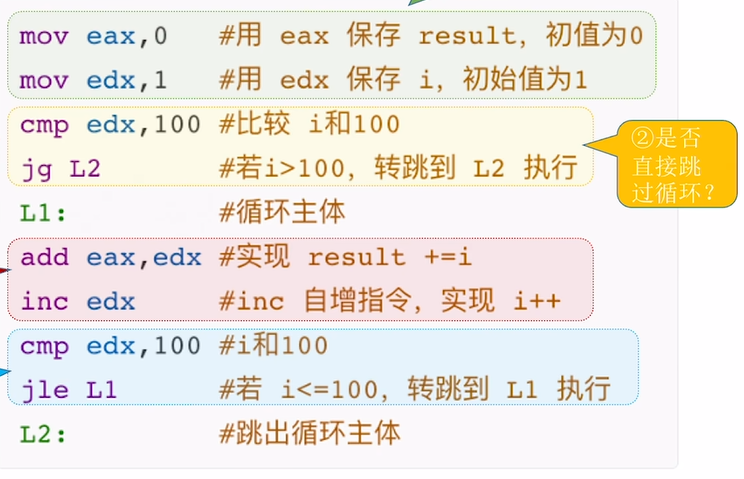
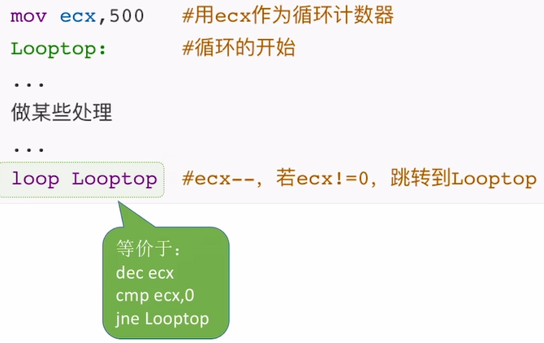

# 跳转指令的机器代码


## 一、选择语句的机器级表示

### 1. 程序中的选择语句

#### 1) 无条件转移指令

* **PC 寄存器作用**：**程序计数器 (PC)** 用于指向下一条即将执行的指令地址。在 x86 处理器中，它通常被称为 **IP (Instruction Pointer) 寄存器**。

#### 无条件转移指令的灵活使用

* **基本格式**：`jmp <地址>`，使 PC 无条件跳转到指定地址执行。
* **地址参数形式**：
    * **常数直接给出**：如 `jmp 128`。
    * **来自寄存器**：如 `jmp eax` (当 `eax` 值为 128 时，等效于 `jmp 128`)。
    * **来自主存**：如 `jmp [999]` (当主存地址 999 处存储的值为 128 时，等效于 `jmp 128`)。
    * **使用标号锚定**：如 `jmp NEXT`，通过标号标记跳转位置。

#### 无条件转移指令的特征

* **标号语法**：标号以冒号结尾，如 `NEXT:`。名称可自定义（如 `L1`、`L2` 等）。
* **编程灵活性**：使用标号比直接使用地址更灵活，可以避免因程序存储位置变化导致的跳转错误。
* **类比 C 语言**：其功能类似于 `goto` 语句，会强制改变程序执行流程。

#### 2) 条件转移指令

* **基本格式**：`jxxx <地址>`，根据条件判断是否跳转。
* **常用指令**：
    * `je`：jump when equal (相等时跳转)
    * `jne`：jump when not equal (不等时跳转)
    * `jg`：jump when greater than (大于时跳转)
    * `jge`：jump when greater or equal (大于或等于时跳转)
    * `jl`：jump when less than (小于时跳转)
    * `jle`：jump when less or equal (小于或等于时跳转)
* **配合 `cmp` 指令**：条件转移前需先用 `cmp a,b` 比较两个数。实质是计算 `a-b` 并设置**标志位**，但**不保存结果**。

#### 3) 应用案例：`if-else` 语句的汇编语言实现

**例题**：`if-else` 语句的汇编语言实现

* **实现方式一**：使用 `jg` 指令。

    ```assembly
    ; 假设 eax 存储 a, ebx 存储 b
    cmp eax, ebx     ; 比较 a 和 b
    jg  IF_BLOCK     ; 如果 a > b, 跳转到 IF_BLOCK
    ; else 代码块开始
    ; ...
    jmp END_IF       ; 跳过 IF_BLOCK
    IF_BLOCK:
    ; if 代码块开始
    ; ...
    END_IF:
    ```

    这种方式将 `else` 代码块放在前面，`if` 代码块放在后面。
* **寄存器分配**：通常用 `eax` 存储 `a`，`ebx` 存储 `b`，`ecx` 存储 `c`。

#### `cmp` 指令的底层原理

* **运算本质**：`cmp a,b` 实际执行 `a - b` 运算，但**不保存结果**，只根据运算结果设置**标志位**。
* **标志寄存器**：
    * **OF (Overflow Flag - 溢出标志)**：运算溢出时置 1。
    * **SF (Sign Flag - 符号标志)**：结果为负时置 1 (最高位为 1)。
    * **ZF (Zero Flag - 零标志)**：结果为零时置 1。
    * **CF (Carry/Borrow Flag - 进位/借位标志)**：无符号数运算有进位/借位时置 1。
* **条件判断依据**：
    * `je`：检查 `ZF == 1`
    * `jne`：检查 `ZF == 0`
    * `jg`：检查 `ZF == 0 && SF == OF`
    * `jge`：检查 `SF == OF`
    * `jl`：检查 `SF != OF`
    * `jle`：检查 `SF != OF || ZF == 1`

---

## 二、循环语句的机器级表示

### 1. 用条件转移指令实现循环

#### 1) 例题：`for` 循环求和

**实现框架**：用条件转移指令实现循环通常需要以下四个部分构成：

1.  **循环前的初始化**：对循环变量进行初始赋值。例如，`mov eax, 0` 初始化 `result` (结果变量)，`mov edx, 1` 初始化 `i` (循环变量)。
2.  **是否直接跳过循环**：首次进入循环前，需要判断循环条件。例如，`cmp edx, 100` 比较 `i` 和 `100`，`jg L2`（如果 `i > 100`，则跳到 `L2`，即跳过循环）。
3.  **循环主体处理**：执行循环的核心逻辑。例如，`add eax, edx` 实现 `result += i`。
4.  **是否继续循环**：每轮循环结束后，更新循环变量并再次判断条件。例如，`inc edx` 实现 `i++`，然后 `cmp edx, 100` 和 `jle L1` 判断是否继续循环（如果 `i <= 100`，则跳回 `L1` 继续循环）。

**寄存器选择**：通常用 **`eax`** 存储结果变量，**`edx`** 存储循环变量（如 `i`）。但具体的寄存器选择需要根据实际情况灵活调整。

**条件转移特点**：通过 **`cmp`** 比较指令配合 **`jg`/`jle`** 等条件跳转指令实现循环控制。跳转目标需要用**标号**标记（如 `L1`、`L2`）。



### 2. 用 `loop` 指令实现循环

#### 1) 例题：循环计数

**基本语法**：`loop 标号`。这条指令会自动执行以下操作：

1.  **`ecx` 寄存器值减 1** (`dec ecx`)。
2.  判断 `ecx` 是否为 0。
3.  如果 `ecx ≠ 0`，则跳转到指定标号处执行。

**寄存器限制**：必须使用 **`ecx`** 作为计数器，这是 x86 架构的规定。例如，`mov ecx, 500` 初始化循环次数。

**等价实现**：`loop` 指令等价于以下三条指令组合：



loopnz (Loop Not Zero)：在 ecx ≠ 0 且 ZF = 0 (上次运算结果非零) 时循环。

loopz (Loop Zero)：在 ecx ≠ 0 且 ZF = 1 (上次运算结果为零) 时循环

---

### 1. 高级语言的函数调用

* **调用栈结构：**
    * 程序运行时系统分配的内存区域，用于实现函数调用，其作用类似一摞盘子。
    * **栈底**：存储硬件和系统信息。
    * **栈顶**：存储当前正在执行函数的**栈帧** (Stack Frame)。
* **栈帧变化过程：**
    * 程序从 `main` 函数开始执行，首先创建 `main` 函数的栈帧。
    * 当 `main` 函数调用 `P` 函数时，`P` 的栈帧被**压入栈顶**。
    * 当 `P` 函数进一步调用 `Q` 函数时，`Q` 的栈帧再次被**压入栈顶**。
    * 当函数执行完毕返回时，其栈帧会从栈顶**弹出**。
* **栈帧内容：**
    * 包含**局部变量**（例如 `caller` 函数中的 `temp1`、`temp2`、`sum`）。
    * 包含**函数调用相关信息**（例如传递给 `add` 函数的参数）。

### 2. x86 汇编语言的函数调用

* **关键指令：**
    * **`call` 指令**：实现函数调用，语法为 `call 标号` (例如 `call add`)。
    * **`ret` 指令**：实现函数返回。
* **IP 寄存器作用：**
    * 即**程序计数器 (PC)**，它始终指向**下一条要执行的指令**的地址。
    * `call` 和 `ret` 指令都会改变 `IP` 寄存器的值。
* **调用机制 (call 执行过程)：**
    1.  将**当前 `IP` 值**（即 `call` 指令**下一条指令的地址**，也就是函数的**返回地址**）**压入栈中保存**。
    2.  将 `IP` 寄存器的值修改为被调用函数（如 `add`）的**第一条指令的地址**，从而实现跳转。
* **返回机制 (ret 执行过程)：**
    1.  从栈顶**取出之前保存的 `IP` 旧值**（即返回地址）。
    2.  将 `IP` 寄存器**恢复为该值**，使程序流回到调用方函数的下一条指令继续执行。
* **核心问题解决：**
    * **"过得去"**：通过 `call` 指令**保存返回地址**并**跳转**到目标函数。
    * **"回得来"**：通过 `ret` 指令**恢复返回地址**，使程序返回到调用点。

### 3. 函数调用的机器级表示的总结 (07:18)

* **调用者行为：**
    1.  执行 `call` 指令。
    2.  `call` 指令将返回地址（`call` 下一条指令的地址）压入栈顶。
    3.  `call` 指令跳转到被调用函数的第一条指令。
* **被调用者行为：**
    1.  执行一系列处理逻辑。
    2.  执行 `ret` 指令。
    3.  `ret` 指令从栈顶找到并取出返回地址，出栈并恢复 `IP` 寄存器的值。
* **指令作用总结：**
    * `call` 指令：将 `IP` 旧值压栈保存（保存在**函数栈帧顶部**）。
    * `ret` 指令：从**函数栈帧顶部**找到 `IP` 旧值，将其出栈并恢复 `IP` 寄存器。

### 4. 问题答疑

* **待解决问题：**
    * 参数传递机制：`call/ret` 指令本身不直接带参数，具体如何传递？
    * 返回值传递机制：函数执行完毕如何将结果返回给调用方？
    * 栈帧数据访问方式：如何通过指针或寄存器访问栈帧中的数据？
    * 栈帧具体内容组成：除了局部变量和返回地址，还有哪些信息？
    * 栈帧排列顺序问题（图示中 `add` 栈帧在 `caller` 上方）：栈在内存中是如何增长的？


### 1. 为什么栈底画在上面，栈顶画在下面？

* **地址空间分配：**
    * 在 32 位系统中，每个进程被分配 4GB 的虚拟地址空间。
    * 其中，**高地址 1GB** 通常保留给**内核区**使用。
    * **低地址 3GB** 则分配给**用户区**。
* **栈的位置特性：**
    * 函数调用栈位于**用户区**。
    * **栈底**处于**高地址**（靠近内核区）。
    * **栈顶**则向**低地址**方向**增长**（向用户区底部扩展）。
* **图示惯例：**
    * 教材将栈底画在上方，栈顶画在下方，是为了**直观表示地址的高低关系**。
    * 这与在数据结构课程中，栈通常被画成从下往上增长的图示方向**相反**。

### 2. 用汇编语言指令操作栈帧里的数据

#### 2.1 标记栈帧范围

* **关键寄存器：**
    * **`EBP` (Extended Base Pointer)**：32 位扩展基址指针寄存器，通常**指向当前栈帧的底部**（高地址端）。它提供了一个稳定的基准点来访问栈帧中的数据。
    * **`ESP` (Extended Stack Pointer)**：32 位扩展栈指针寄存器，始终**指向当前栈帧的顶部**（低地址端）。它是栈的实际操作指针。
* **操作单位：**
    * x86 系统默认以**4 字节（DWORD）**为单位进行栈操作（如 `push` 和 `pop`）。
* **动态调整：**
    * 函数调用和返回时，`EBP` 和 `ESP` 会同步更新，以指向新栈帧的边界，从而维护栈的结构。

#### 2.2 访问栈帧数据 (04:14)

##### `push`、`pop` 指令

* **操作特性：**
    * `push 操作数`：先将 `ESP` 寄存器的值**减去 4**（即向下移动 4 字节），然后将 `操作数` 的值**写入** `ESP` 指向的内存地址。
    * `pop 目标位置`：先将 `ESP` 指向的内存地址中的值**读取**到 `目标位置`，然后将 `ESP` 寄存器的值**加上 4**（即向上移动 4 字节）。
* **操作数类型：**
    * `push` 支持**立即数**、**寄存器值**或**内存数据**。
    * `pop` 的结果可存入**寄存器**或**内存地址**。
* **例题: `push`/`pop` 指令应用 (05:24)**
    * **执行过程分析：**
        * `push eax` (假设 `eax = 211`)：`ESP` 下移 4 字节，然后将 211 写入新的栈顶位置。
        * `push 985`：`ESP` 再下移 4 字节，然后将立即数 985 写入新的栈顶位置。
        * `push [ebp+8]`：读取 `ebp` 上方 8 字节处的值（假设为 666），然后将其压栈（`ESP` 下移 4 字节，写入 666）。
        * `pop eax`：将当前栈顶值（666）弹出到 `eax` 寄存器，`ESP` 上移 4 字节。
        * `pop [ebp+8]`：将新的栈顶值（985）写入 `ebp+8` 的内存位置，`ESP` 上移 4 字节。

##### `mov` 指令

* **灵活访问：**
    * 通过 `EBP`/`ESP` 寄存器加上或减去**偏移量**，可以直接访问栈中**任意位置**的数据，实现随机存取。
* **指针调整：**
    * 使用 `sub` 或 `add` 指令直接修改 `ESP` 寄存器的值，可以**扩展或收缩栈空间**，为局部变量预留空间或释放空间。
* **例题: `mov` 指令应用 (08:17)**
    * **典型操作序列：**
        * `sub esp, 12`：将 `ESP` 减去 12，**扩展 12 字节的栈空间**，通常用于为局部变量分配空间。
        * `mov [esp+8], eax`：将 `eax` 寄存器中的值写入到 `ESP` 当前指向地址**向上偏移 8 字节**的栈中位置。
        * `mov [esp+4], 985`：将立即数 985 写入到 `ESP` 当前指向地址**向上偏移 4 字节**的栈中位置。
        * `mov eax, [ebp+8]`：从 `EBP` 寄存器指向地址**向上偏移 8 字节**的栈中位置（通常是函数参数）读取值到 `eax` 寄存器。
        * `add esp, 8`：将 `ESP` 加上 8，**回收 8 字节的栈空间**，通常在函数返回前清理局部变量空间。

### 1. 标记栈帧范围

* **寄存器作用：** 在 x86 架构中，CPU 内部的 **`EBP`** (Extended Base Pointer) 和 **`ESP`** (Extended Stack Pointer) 两个寄存器共同标记了当前正在执行函数的**栈帧范围**。
    * **`EBP` 功能**：它始终指向当前栈帧的**底部**（也称为**基地址**或**帧指针**），通常是栈帧中地址**较高**的一端。
    * **`ESP` 功能**：它始终指向当前栈帧的**顶部**（也称为**栈顶指针**），是栈帧中地址**较低**的一端，所有新的数据操作（如 `push`）都会从这里开始。
* **栈操作单位**：x86 系统默认以**4 字节（DWORD）**为基本操作单位进行栈操作（例如 `push` 和 `pop`）。

### 2. 函数调用时，如何切换栈帧

当一个函数调用另一个函数时，需要建立新的栈帧：

* **`call` 指令的双重作用**：
    1.  将**返回地址**（即 `call` 指令**下一条指令的 IP 旧值**）**压入栈中保存**。这相当于执行了一条 `push IP` 指令。
    2.  设置 `IP` 寄存器的新值，使其跳转到被调用函数的**第一条指令**的地址。这相当于执行了一条 `jump` 指令。
* **栈帧建立步骤**：被调用函数通常会在其开头执行以下操作来建立自己的栈帧：
    1.  `push ebp`：将**上一层函数（调用者）的栈帧基址**（即旧的 `EBP` 值）压栈保存。这是为了在函数返回时能恢复到调用者的栈帧。
    2.  `mov ebp, esp`：将当前 `ESP` 的值赋给 `EBP`。此时，`ESP` 指向的是新栈帧的顶部（因为 `call` 指令和 `push ebp` 已经移动了 `ESP`），将这个地址设置为当前函数的**栈帧基址**（新的 `EBP` 值）。
* **`enter` 指令**：这个指令可以替代上述的 `push ebp` 和 `mov ebp, esp` 两条指令，实现相同的功能，用于更简洁地建立栈帧。
* **栈帧链结构**：由于每个栈帧的底部都必然存储了**上一层函数的基地址**（通过 `push ebp` 保存），因此所有的栈帧会形成一个**链式结构**，使得程序可以沿着这个链条回溯到之前的调用者。

### 3. 函数返回时，如何切换栈帧

当一个函数执行完毕并准备返回给调用者时，需要恢复到调用者的栈帧：

* **恢复步骤**：被调用函数通常在其返回前执行以下操作来恢复栈帧：
    1.  `mov esp, ebp`：将 `ESP` 寄存器的值设置为 `EBP` 的值。这会使 `ESP` 指向当前栈帧的底部，即**清除当前函数的所有局部变量和参数**（因为它们都在 `EBP` 和旧 `ESP` 之间）。
    2.  `pop ebp`：从栈顶弹出元素并写入 `EBP` 寄存器。此时栈顶存放的是之前保存的**上一层函数的 `EBP` 旧值**，通过 `pop` 操作将其恢复到 `EBP` 中。
* **`leave` 指令**：这个指令等价于上述的 `mov esp, ebp` 和 `pop ebp` 两条指令，用于更简洁地恢复栈帧。
* **`ret` 指令机制**：在栈帧恢复之后，`ret` 指令会从栈顶获取之前 `call` 指令压入的**返回地址**，并将其恢复到 `IP` 寄存器中，从而实现程序流的返回。
* **例行处理**：**所有非 `main` 函数**在返回前**必须**执行 `leave` 指令（或其等效操作：`mov esp, ebp` 和 `pop ebp`），以正确恢复调用者的栈帧。

### 4. 函数调用的机器级表示的总结

* **调用者流程**：
    * 执行 `call` 指令：它负责**压入返回地址**并**跳转**到被调用函数的入口。
* **被调用者流程**：
    * **开头**：通常是 `enter` 指令或 `push ebp` + `mov ebp, esp` 来**建立新栈帧**。
    * **中间**：执行函数的**核心功能代码**。
    * **结尾**：通常是 `leave` 指令（或 `mov esp, ebp` + `pop ebp`）来**恢复旧栈帧**，紧接着是 `ret` 指令来**返回**到调用者。
* **关键特征**：所有被调用函数的汇编结构都遵循这个**固定的模式**，形成一个标准的函数调用框架。

### 5. 一个函数的汇编代码框架

#### 5.1 例题: 函数汇编代码分析

* **题目解析**：
    * 函数**开头必现指令**：`push ebp` (其后通常会隐含 `mov ebp, esp`)。
    * 函数**返回前必现指令**：通常会隐含 `leave` 操作（可能在代码中被省略表示，但逻辑上必须存在）。
* **结构验证**：一个标准的函数汇编代码框架应**完全符合**上述“开头保存基址 + 结尾恢复基址”的结构。
* **递归特征**：在分析中可能会发现函数内部再次 `call` 自身（例如在 `00401025` 处的指令），这是**递归函数**的典型特征。

### 1. 一个栈帧内可能包含哪些内容

一个函数调用在运行时，会在**栈上创建并维护一个独立的区域，称为栈帧**（Stack Frame）。一个典型的栈帧从底部（高地址）到顶部（低地址）可能包含以下内容：

* **底部固定区域：**
    * 每个栈帧的底部 4 字节必定保存了**上一层栈帧的基址**（即调用者的 `EBP` 值）。这使得函数返回时能恢复到调用方的栈帧状态，形成一个栈帧链。
* **局部变量区：**
    * 紧接着 `EBP`（但地址更低）是当前函数定义的**局部变量**。
    * 在 C 语言中，通常**越早定义的变量越靠近栈底（高地址）**，而**越晚定义的变量越靠近栈顶（低地址）**。
* **空闲区域（Padding）：**
    * 由于 **GCC 编译器**要求非叶子函数的栈帧大小必须是 **16 字节的整数倍**，可能会产生未使用的“零头”区域来满足对齐要求。
    * 正在运行的函数（例如mian函数，即不调用其他函数的函数）可以不受 16 字节对齐的限制。
* **参数传递区：**
    * 靠近栈顶（但地址更高）存储了调用下层函数时传递的**参数**。
    * 参数列表中**越靠前的参数越靠近栈顶（低地址）**。
* **返回地址：**
    * 栈顶（最低地址）必定保存着 `call` 指令压入的 **`IP` 寄存器值**，即**函数的返回地址**。这是函数执行完毕后程序流应该返回的位置。

* **访问规则：**
    * **局部变量访问**：通常通过 `EBP - n` 的偏移量来访问，其中 `n` 是相对于 `EBP` 的负偏移量。例如，`[ebp-4]` 可能对应于 C 语言中最后定义的局部变量。
    * **参数访问**：被调用函数通常通过 `EBP + n` 的偏移量来访问传递进来的参数。例如，`[ebp+8]` 可能对应于传递给该函数的第一个参数（因为 `[ebp]` 是旧 `EBP`，`[ebp+4]` 是返回地址）。
    * **返回值传递**：在 x86 体系结构中，单个返回值通常通过 **`EAX` 寄存器**传递。

#### 1.1 例题: `caller` 函数汇编代码 (08:35)

* **代码解析：**
    * **栈帧建立**：
        * `push ebp`：保存上一层（例如 `main` 函数）的栈帧基址。
        * `mov ebp, esp`：设置当前 `caller` 函数的栈帧基址。
        * `sub esp, 24`：为 `caller` 函数的局部变量和可能的临时数据**分配 24 字节的栈空间**（24 = 16 × 1 + 8，满足 16 字节对齐要求）。
    * **局部变量初始化：**
        * `mov [ebp-12], 125`：将 125 写入 `ebp` 偏移 `-12` 的位置，对应 `temp1 = 125`（在 C 语言中，`temp1` 可能是最后定义的变量，因为它的地址最低）。
        * `mov [ebp-8], 80`：将 80 写入 `ebp` 偏移 `-8` 的位置，对应 `temp2 = 80`。
        * `sum` 变量的存储位置也位于局部变量区，但在这里未显式初始化。
    * **参数传递过程（给 `add` 函数）：**
        * 参数传递通过**寄存器中转**（因为 `mov` 指令限制不能直接从内存到内存）。
        * `mov eax, [ebp-8]`：读取 `temp2` 的值到 `eax`。
        * `mov [esp+4], eax`：将 `eax` 的值（`temp2`）作为**第二个参数 `y`** 写入当前栈帧顶部上方 4 字节处（即 `esp+4`）。
        * `mov eax, [ebp-12]`：读取 `temp1` 的值到 `eax`。
        * `mov [esp], eax`：将 `eax` 的值（`temp1`）作为**第一个参数 `x`** 写入当前栈帧的顶部（即 `esp`）。
    * **函数调用与返回：**
        * `call add`：自动将返回地址压栈，并跳转到 `add` 函数。
        * `add` 函数通过 **`[ebp+8]` 和 `[ebp+12]`** 访问这两个参数。
        * `add` 函数的**返回值通过 `eax` 寄存器**传递回 `caller` 函数。
        * `caller` 函数会将 `eax` 的值存入其自身的局部变量 `sum`。
* **关键观察：**
    * **局部变量存储顺序**与 C 语言定义顺序**相反**（后定义的变量地址更低）。
    * **参数传递**有时必须通过**寄存器中转**（例如，不能直接 `mov [mem1], [mem2]`）。
    * **返回值机制**统一使用 **`EAX` 寄存器**。
    * **栈帧大小设计**通常需要满足 **16 字节对齐**要求。

### 2. 函数调用的机器级表示的总结

* **核心指令**：函数调用涉及两个关键指令：**`call`** 和 **`ret`**，它们会改变程序的执行流。
* **参数传递**：在 `call` 指令前，调用参数需要被**写入当前栈帧的顶部区域**。这可以通过 `push` 指令或 `mov` 指令配合 `ESP` 偏移量来实现。
* **返回地址处理**：`call` 指令会自动将**返回地址压栈保存**，并跳转到被调用函数的第一条指令。
* **局部变量存储**：函数内部的局部变量通常存储在 `EBP` 的**负偏移量**处，例如 `[ebp-4]`、`[ebp-8]` 等位置。
* **返回值传递**：被调用函数通过 **`EAX` 寄存器**向上层函数传递返回值。调用者通过 `EAX` 寄存器获取并使用这个返回值。
* **寄存器保护**：如果调用前某些寄存器（如 `EAX`、`EDX`、`ECX`）存有重要数据，**且被调用函数可能会修改这些寄存器**，那么调用者需要先将它们**压栈保存**，在调用返回后再从栈中**恢复**。

### 3. 函数调用栈的总结

#### 3.1 栈帧的概念与结构

* **基本概念**：一个栈帧对应一次函数调用，存储了该函数执行所需的所有相关信息。
* **地址方向**：在 x86 体系中，栈的**底部在高地址方向**，**栈顶在低地址方向**，并且以 4 字节为单位进行操作。
* **寄存器标记**：
    * **`EBP`** 指向当前栈帧的底部 4 字节（调用者的 `EBP` 值）。
    * **`ESP`** 指向当前栈帧的顶部 4 字节（返回地址）。
* **典型结构（从底向顶，高地址到低地址）**：
    1.  **上一层栈帧基址** (`EBP` 旧值)
    2.  若干个**局部变量**
    3.  **未使用区域**（因栈帧大小需为 16 字节整数倍而产生的填充）
    4.  部分**寄存器值**（非必须，视函数和编译器情况保存）
    5.  若干个**调用参数**
    6.  **返回地址** (`IP` 旧值)

#### 3.2 栈帧的切换

* **进入函数**：在函数开头，需要执行 `enter` 指令（等价于 `push ebp` + `mov ebp, esp`）来建立新的栈帧。
* **离开函数**：在函数返回前，需要执行 `leave` 指令（等价于 `mov esp, ebp` + `pop ebp`）来恢复上一层的栈帧。
* **栈操作指令**：
    * `push`：数据压栈，`ESP` 值**减 4**。
    * `pop`：数据出栈，`ESP` 值**加 4**。
* **寄存器保护**：必要时，需要手动保存 `EAX`、`EDX`、`ECX` 等通用寄存器的值到栈中，以防止它们在函数调用过程中被修改而导致中间结果丢失。

#### 3.3 函数调用的过程

* **调用前准备**：
    * 将函数参数写入当前栈帧的顶部区域（通过 `push` 或 `mov [esp+offset]`）。
    * 保存可能被被调用函数修改的、且调用者后续仍需使用的必要寄存器值。
* **`call` 指令执行**：
    * 将 `IP` 旧值（返回地址）压栈保存。
    * 设置 `IP` 新值，跳转到被调用函数的入口。
* **返回处理**：
    * 被调用函数将返回值写入 `EAX` 寄存器。
    * `ret` 指令从栈顶恢复 `IP` 旧值，程序流回到调用者。

#### 3.4 栈帧内部数据的访问

* **局部变量访问**：通常通过 `[ebp-offset]`，例如 `[ebp-4]`、`[ebp-8]` 等地址来访问。
* **参数访问**：通过 `[ebp+offset]`，例如 `[ebp+8]`、`[ebp+12]` 等地址来访问上一层函数传递的参数。
* **数据操作方式**：
    * 使用 `push`/`pop` 指令结合 `ESP` 操作栈顶数据。
    * 使用 `mov` 指令结合 `EBP`/`ESP` 加上偏移量来访问栈中任意特定位置的数据。


