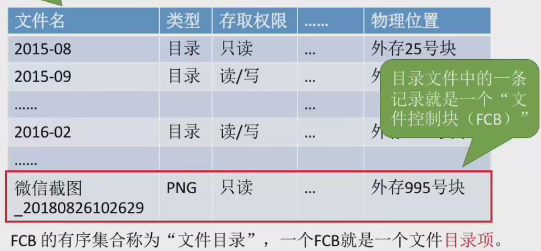
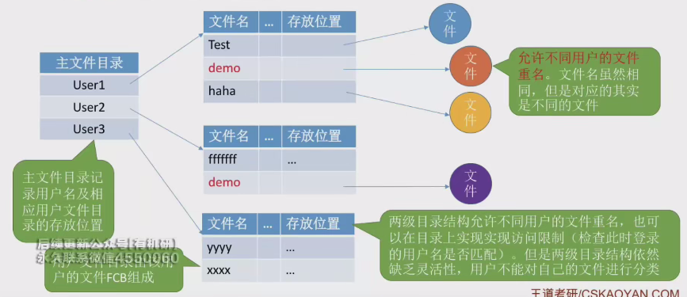
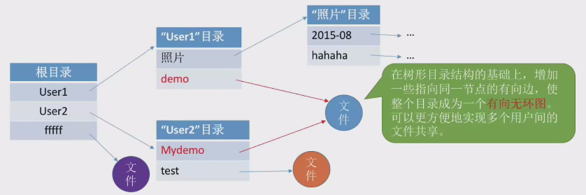

# 文件目录

* 文件目录的结构使得文件的存放和组织更加清晰，易于查找
* 文件控制块（FCB）
    * 文件控制块（FCB）是文件目录的基本单位，包含文件名、物理地址、文件逻辑结构和物理结构等信息
    * FCB还包含文件的存取权限、使用信息等，如建立时间、上次修改时间等。
    * FCB的最重要作用是建立文件名到文件实际存放物理地址的映射关系
    * 每一个文件都有一个FCB
    * 
* 目录结构
    * 单级目录结构
        * 单级目录结构只建立一张目录表，每个文件占用一个目录表的目录项。
        * 单级目录结构支持按名存取，但不允许文件重名。
        * 单级目录结构适用于简单系统，但不适用于多用户操作系统
    * 两级目录结构
        * 两级目录结构将目录分为主文件目录（MFD）和用户文件目录（UFD）。
        * 主文件目录记录用户名和用户文件目录的位置，用户文件目录包含用户的文件对应的FCB。
        * 两级目录结构允许不同用户的文件重名，并通过目录实现访问限制。
        * 缺点是用户不可以将自己的文件进行分类
        * 
    * 树形目录结构(最常用)
        * 树形目录结构允许每个目录下有更低一级的目录，不同目录下的文件可以重名。
        * 用户通过文件的绝对路径或相对路径访问文件，系统根据路径一层一层地查找下一级目录。
        * 设置当前目录和相对路径可以减少磁盘IO次数，提高访问效率。
        * 树形目录结构层次清晰，便于管理和保护文件，但**不便于实现文件共享**
    * 无环图目录结构
        * 无环图目录结构在树形目录结构基础上增加了有向边，形成了有向无环图。
        * 无环图目录结构实现了多个用户间的文件共享，可以通过不同的文件名访问同一个文件或目录。
        * 共享节点设置共享计数器，只有当共享计数器为零时才删除共享文件。
        * 
* 索引节点
    * 索引节点是对FCB的一种优化，将除文件名外的其他信息放到索引节点中。
    * 索引节点简化了目录表的结构，减少了磁盘块的占用，提高了搜索效率。
    * 采用索引节点机制后，目录表只包含文件名和指向索引节点的指针