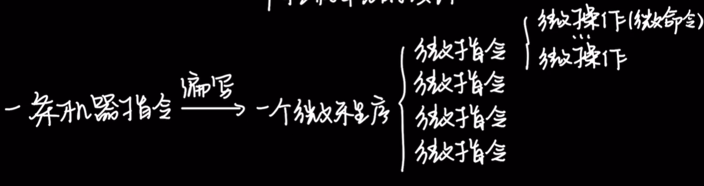

# 一、微程序控制器的基本原理

## 1. 课前回顾

* **硬布线控制器特点**：采用纯硬件方式实现，设计复杂但执行速度快。课程难点但不是考试重点。
* **微程序控制器特点**：考察频率更高（可能出现在大题），采用软件思想实现，将指令分解为多个微指令序列。

---

## 2. 微程序控制器的设计思路

### 1) 程序与指令序列

* **程序本质**：由机器指令序列组成，高级语言代码最终被翻译为等价的机器指令集合。
* **执行层次**：程序 → 指令序列 → 微操作序列，形成三级执行结构。

### 2) 指令与微操作序列

* **微操作定义**：每条指令的执行可分解为时序相关的微操作序列。
* **类比关系**：微操作序列之于指令 ≈ 指令序列之于程序，形成"执行套娃"结构。

### 3) 微程序的概念

* **微指令定义**：将同一时序内可并行执行的微操作打包成一条微指令。
* **微程序组成**：由微指令序列构成，例如：
    * 微指令A：执行微操作1和2
    * 微指令B：执行微操作3
    * 微指令D：执行微操作5和2（可重复出现）

### 4) 微程序与微指令 (03:40)

* **对应关系**：每种机器指令对应唯一微程序，因为不同指令需要不同的微操作序列。
* **存储思想**：借鉴存储程序思想，CPU出厂前将所有指令对应的微程序存入控制器专用存储器。

### 5) 微程序控制器的设计思想 (04:33)

* **执行流程**：CPU根据当前指令类型查找对应微程序，顺序执行其中的微指令序列。
* **软件特性**：用微指令描述机器指令执行过程，实现"用软件定义硬件"的思想。

### 6) 微命令、微操作与微指令的关系 (05:29)

* **微命令与微操作**：一一对应关系（上节内容），微命令是控制信号，微操作是具体动作。
* **微指令扩展**：一条微指令可包含多个微命令，实现多个微操作的并行执行。
* **层级关系**：机器指令 → 微程序 → 微指令 → 微命令 → 微操作。

### 7) 微指令的格式 (06:47)

* **操作控制字段**：用n位二进制表示当前微指令对应的微操作组合。
* **顺序控制字段**：用m位二进制指示下条微指令的存储地址（称为"下地址"）。

---

## 3. 微程序控制器的基本结构 (07:27)

### 1) 控制存储器（CM）的作用与构成 (07:33)

* **英文缩写**：CM（Control Memory），控制器内部专用存储器。
* **命名来源**：C代表Controller，M代表Memory。

### 2) 微程序与微指令序列的存储方式 (07:55)

* **存储规则**：各指令的微程序在CM中顺序存放，例如：
    * 指令1微程序：从地址P开始连续存放。
    * 指令2微程序：从地址K开始连续存放。

### 3) 控制存储器（控存）的特性 (08:31)

* **硬件构成**：采用ROM芯片实现，具有非易失性。
* **设计特点**：由CPU厂商预先写入，断电不丢失，读取速度快于RAM。

### 4) 微指令地址寄存器（CMAR）与VPC (09:57)

* **双重功能**：兼具PC和MAR功能，别称**微程序计数器（VPC）**。
* **工作原理**：存储当前/下条微指令在CM中的地址。

### 5) 地址译码器在微程序控制器中的作用 (11:01)

* **转换功能**：将CMAR中的地址信息转换为CM存储单元的存取控制信号。
* **类比说明**：功能类似主存系统中的地址译码器。

### 6) 微指令寄存器（CMDR）与VIR (11:38)

* **数据通路**：从CM取出的微指令先暂存于CMDR（别称**VIR**）。
* **位宽要求**：寄存器位数与微指令字长严格一致。

### 7) 微地址形成部件的功能 (12:03)

* **核心作用**：根据机器指令操作码生成对应微程序的首地址。
* **初始定位**：确定指令对应微指令序列的起始位置。

### 8) 顺序逻辑的作用与微指令执行流程 (12:50)

* **流程控制**：调整微指令执行顺序（处理中断等情况）。
* **工作过程**：结合机器标志和下地址信息，确定下条微指令位置。

### 9) 微指令的执行过程与控制信号发出 (13:18)

* **控制字段解析**：根据微指令控制码部分生成具体控制信号（如PCout、MARin等）。
* **总线操作**：通过系统总线向主存发送读/写控制信号。

### 10) 微程序段共享与特定指令微程序 (15:37)

* **共享机制**：**取指周期**、**间址周期**、**中断周期**的微程序可被所有指令共享。
* **独有特性**：只有**执行周期**的微程序需要为每条指令单独设计。

---

## 4. 微指令控制器的工作原理 (16:09)

* **地址映射关系**：最左侧数字列（0-18）表示控存地址，每个地址存放一条微指令，如0号地址存放第一条微指令。
* **周期标注方式**：取指周期用绿色标注，间址周期用黄色，中断周期用紫色，执行周期用蓝色。
* **下地址字段**：每条微指令包含"下地址"字段，指明下一条要执行的微指令存放地址。

### 1) 微指令存放地址与执行顺序 (16:28)

* **地址分配规则**：取指周期的微指令序列固定从控存0号单元开始存放（0→1→2）。
* **LDA指令流程**：
    * 0号微指令：PC→MAR，发送主存读信号。
    * 1号微指令：主存数据→MDR。
    * 2号微指令：MDR→IR。
* **周期转换机制**：执行完2号微指令后，根据指令特征决定跳转到间址周期(3)或执行周期(13)。

### 2) 取数指令LDA的微指令序列 (17:13)

* **完整执行路径**：取指周期(0-2) → 执行周期(13-15) → 取指周期(0)。
* **执行周期细节**：
    * 13号：启动指令对应操作。
    * 14号：从主存读取数据。
    * 15号：数据存入ACC。
* **周期结束处理**：15号微指令的下地址为0，表示返回取指周期，除非检测到中断信号。

### 3) 寻址方式与微指令跳转 (18:33)

* **寻址判断**：指令地址码的标志位送给顺序逻辑，判断是否需要间址周期。
* **跳转机制**：
    * 直接寻址：跳过间址周期，直接跳转到执行周期首地址(13)。
    * 间接寻址：进入间址周期(3号地址)。
* **地址形成**：微地址形成部件根据操作码确定执行周期首地址（如LDA为13）。

### 4) 微程序执行过程中的地址变化 (19:55)

* **异常处理流程**：
    * 中断信号触发：从15跳转到中断周期(12)而非0。
    * 中断结束后：12号微指令下地址为0，返回取指周期。
    * 间址周期结束：标明"转执行周期"，跳转到当前指令的执行周期首地址。
    * 中断周期结束：标明"转取指周期"，返回0号地址。

### 5) 微程序控制器的工作流程总结 (21:22)

* **核心部件**：
    * **微地址形成部件**：确定执行周期首地址。
    * **顺序逻辑**：处理跳转逻辑。
    * **CMAR(μPC)**：存放下一条微指令地址。
    * **控存(CM)**：存储微指令的ROM。
    * **CMDR(μIR)**：暂存当前微指令。

### 6) 微程序段数量与指令关系 (22:19)

* **数量计算**：
    * 取指周期：1个公用微程序段。
    * 执行周期：n条指令对应n个不同微程序段。
    * 最少总数：n+1个（不含间址和中断）。
* **特殊情况**：
    * 无间址功能的CPU：可不包含间址周期微程序。
    * 无中断功能的CPU：可不包含中断周期微程序。

### 7) 微程序的整体性与部分性理解 (23:40)

* **两种视角**：
    * 物理视角：各周期微程序段独立存储。
    * 逻辑视角：所有周期微程序段组成完整微程序。
* **正确表述**：
    * "一条指令对应一个微程序"（逻辑整体）。
    * "控存中微程序段至少n+1个"（物理存储）。

---

## 5. 微程序控制器知识总结 (26:37)

* **核心概念对比**：
    * **程序 vs 微程序**：机器指令序列 vs 微指令序列。
    * **主存 vs 控存**：存储指令 vs 存储微指令。
    * **MAR vs CMAR**：内存地址寄存器 vs 微地址寄存器。
    * **MDR vs CMDR**：内存数据寄存器 vs 微指令寄存器。
    * **PC vs μPC**：程序计数器 vs 微程序计数器。

* **执行时间概念**：
    * **指令周期**：取指+执行一条指令的时间。
    * **微周期**：取出一条微指令并执行的时间。

* **层次关系**：
    * **微命令 ↔ 微操作**：一一对应。
    * **微指令 → 微命令**：一对多。
    * **微程序 → 微指令**：一对多。
    * **机器指令 ↔ 微程序**：一对一。

---

# 二、知识小结

| 知识点            | 核心内容                                     | 考试重点/易混淆点                           | 难度系数 |
| :---------------- | :------------------------------------------- | :------------------------------------------ | :------- |
| 微程序控制器基本原理 | 用软件思想实现控制器，通过微指令序列描述机器指令执行过程 | 微程序 vs 硬布线控制器实现方式对比            | ⭐⭐⭐⭐   |
| 微指令组成结构    | 包含操作控制字段(微操作编码) + 顺序控制字段(下地址信息) | 微命令/微操作/微指令的层级关系              | ⭐⭐⭐     |
| 控存(CM)特性      | 用ROM存储所有指令对应的微程序，非易失性，CPU出厂前写入 | 控存物理结构 vs 逻辑程序段的关系              | ⭐⭐⭐⭐   |
| 微程序执行流程    | 取指周期(公用)→间址周期(可选)→执行周期(指令专用)→中断周期(可选) | 地址跳转逻辑（顺序逻辑的作用）                | ⭐⭐⭐⭐   |
| 关键部件对比      | CMAR(微PC) / CMDR(微IR) / 微地址形成部件 / 顺序逻辑 | CMAR≠MAR / CMDR≠MDR 的功能区分            | ⭐⭐⭐⭐   |
| 微程序数量计算    | n条指令至少需要n+1个微程序段（n个执行周期+1个取指周期） | 是否计入间址/中断周期的争议                 | ⭐⭐⭐⭐   |
| 时序概念对比      | 指令周期（机器指令） vs 微指令周期（控制信号产生） | 时间粒度差异（1指令周期=多个微周期）        | ⭐⭐⭐     |
| 设计思想对比      | 硬布线(纯硬件) vs 微程序(软硬结合)             | 速度 vs 灵活性的权衡                        | ⭐⭐⭐⭐   |